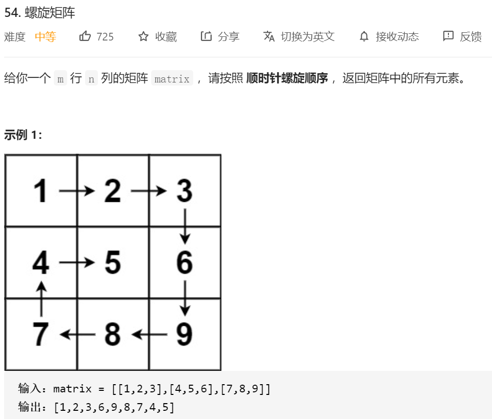
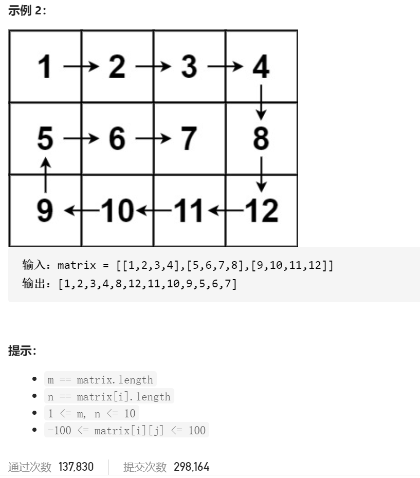

思路：就是按照这种螺旋的思路去解题。

```java
class Solution {
    public List<Integer> spiralOrder(int[][] matrix) {
        List<Integer> res=new ArrayList<>();


        int width=matrix.length;
        int length=matrix[0].length;
        int n=0;

        while (true)
        {
            if(0+n>=length-n)
            {
                break;
            }
            for(int i=0+n;i<length-n;i++)
            {
                res.add(matrix[length-length+n][i]);
            }
            if(1+n>=width-n)
            {
                break;
            }

            for(int i=1+n;i<width-n;i++)
            {
                res.add(matrix[i][length-1-n]);
            }

            if(length-2-n<0+n)//这边这些break就是为了 在奇数行的时候，会出现一种很奇怪的错误
            {
                break;
            }

            for(int i=length-2-n;i>=0+n;i--)
            {
                res.add(matrix[width-1-n][i]);
            }
            if(width-2-n<1+n)
            {
                break;
            }

            for(int i=width-2-n;i>=1+n;i--)
            {
                res.add(matrix[i][0+n]);
            }
            n++;
        }
        return res;

    }
}
```


更好理解的转圈遍历

```java
private static List<Integer> spiralOrder(int[][] matrix) {
        LinkedList<Integer> result = new LinkedList<>();
        if(matrix==null||matrix.length==0) return result;
        int left = 0;//外层 left
        int right = matrix[0].length - 1;//外层right
        int top = 0;//外层top
        int bottom = matrix.length - 1;//外层buttom
        int numEle = matrix.length * matrix[0].length;//总元素个数
  			//开始遍历
        while (numEle >= 1) {//当还有元素没有被遍历到的时候
          //遍历上层
            for (int i = left; i <= right && numEle >= 1; i++) {
                result.add(matrix[top][i]);//顶层top不变  列数发生变化
                numEle--;
            }
          //上层遍历完之后 top需要++
            top++;
          //然后遍历右边的的列 
            for (int i = top; i <= bottom && numEle >= 1; i++) {
                result.add(matrix[i][right]);//列数不变 行数发生变化
                numEle--;
            }
          //右边的列遍历完之后 右边得--
            right--;
          
          //然后是下面那行
            for (int i = right; i >= left && numEle >= 1; i--) {
                result.add(matrix[bottom][i]);//行数发生不变 列数发生变化
                numEle--;
            }
          //遍历完之后层数--
            bottom--;
          
          //最后是左边那一列 
            for (int i = bottom; i >= top && numEle >= 1; i--) {
                result.add(matrix[i][left]);//列数不变 行数变化
                numEle--;
            }
            left++;//然后 left 最左边那行++
        }
        return result;
    }
```

