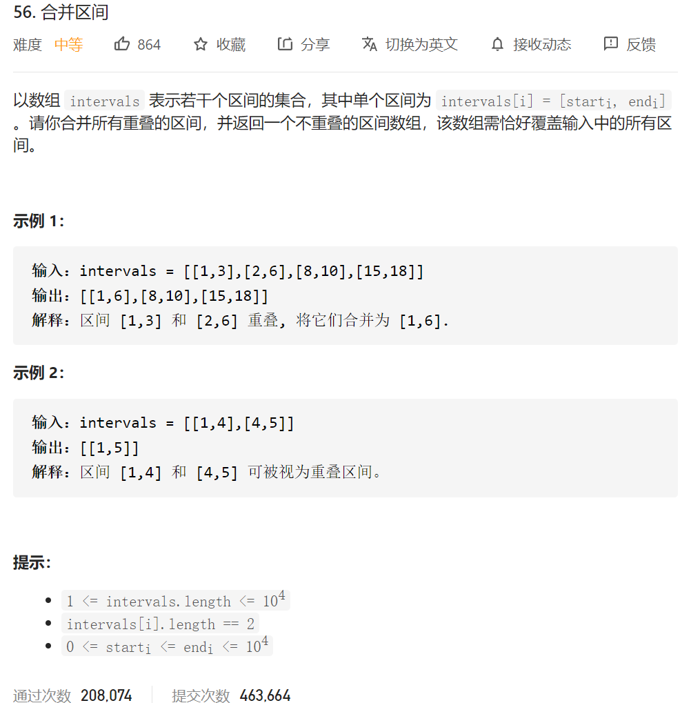

思路，按照数组的**首位**进行排序，然后一个个判断有没有区间重叠，有重叠的话，合并两个区间，合并操作有要注意的几个特殊样例。然后总结一下坑点：

1.合并区间的坑点：

合并区间条件 lastRight>=left

【0，4】【1，4】

这里要判断

```java
if(lastLeft>left)//判斷0是不是大於1 这边始终选择小的作为left
{
   resTemp[count][0]=left;
}
```

【1，10】【2，3】

这里要判断

```
 if(lastRight<right)//要选大的那个作为右边
{
   resTemp[count][1]=right;
}
```

结论 ：

```java
class Solution {
    public int[][] merge(int[][] intervals) {
        Arrays.sort(intervals, new Comparator<int[]>() {
            @Override
            public int compare(int[] o1, int[] o2) {
                if(o1[0]<o2[0])//直接相减会产生越界的问题
                {
                    return -1;
                }
                else if(o1[0]>o2[0])
                {
                    return 1;
                }else
                {
                    return 0;
                }
            }
        });
        // printArr(intervals);
        // System.out.println();;

        if(intervals.length==1)
        {
            return intervals;
        }

        int [][] resTemp=new int[intervals.length][2];
        int count=0;
        resTemp[0]=intervals[0];

        for(int i=1;i<intervals.length;i++)
        {
            int tempIntervals[]=intervals[i];
            int left=tempIntervals[0];
            int right=tempIntervals[1];

            int lastLeft=resTemp[count][0];
            int lastRight=resTemp[count][1];


            if(lastRight>=left)
            {
                //合并区间
               //
                if(lastLeft>left)
                {
                    resTemp[count][0]=left;
                }
                if(lastRight<right)
                {
                    resTemp[count][1]=right;
                }
                continue;
            }else
            {
                //添加一个新的区间
                count++;
                resTemp[count][0]=left;
                resTemp[count][1]=right;
            }
        }
        // printArr(resTemp);
        // System.out.println(count);

        int res[][]=new int[count+1][2];
        for(int i=0;i<=count;i++)
        {
            res[i]=resTemp[i];
        }

        return res;
    }
}
```

别人的题解：

```
class Solution {
    public int[][] merge(int[][] intervals) {
        // 先按照区间起始位置排序
        Arrays.sort(intervals, (v1, v2) -> v1[0] - v2[0]);
        // 遍历区间
        int[][] res = new int[intervals.length][2];
        int idx = -1;
        for (int[] interval: intervals) {
            // 如果结果数组是空的，或者当前区间的起始位置 > 结果数组中最后区间的终止位置，
            // 则不合并，直接将当前区间加入结果数组。
            if (idx == -1 || interval[0] > res[idx][1]) {
                res[++idx] = interval;
            } else {
                // 反之将当前区间合并至结果数组的最后区间
                res[idx][1] = Math.max(res[idx][1], interval[1]);
            }
        }
        return Arrays.copyOf(res, idx + 1);
    }
}

作者：sweetiee
链接：https://leetcode-cn.com/problems/merge-intervals/solution/chi-jing-ran-yi-yan-miao-dong-by-sweetiee/
来源：力扣（LeetCode）
著作权归作者所有。商业转载请联系作者获得授权，非商业转载请注明出处。
```

```
class Solution {
    public int[][] merge(int[][] intervals) {
        if (intervals.length == 0) {
            return new int[0][2];
        }
        Arrays.sort(intervals, new Comparator<int[]>() {
            public int compare(int[] interval1, int[] interval2) {
                return interval1[0] - interval2[0];
            }
        });
        List<int[]> merged = new ArrayList<int[]>();
        for (int i = 0; i < intervals.length; ++i) {
            int L = intervals[i][0], R = intervals[i][1];
            if (merged.size() == 0 || merged.get(merged.size() - 1)[1] < L) {
                merged.add(new int[]{L, R});
            } else {
                merged.get(merged.size() - 1)[1] = Math.max(merged.get(merged.size() - 1)[1], R);
            }
        }
        return merged.toArray(new int[merged.size()][]);
    }
}

作者：LeetCode-Solution
链接：https://leetcode-cn.com/problems/merge-intervals/solution/he-bing-qu-jian-by-leetcode-solution/
来源：力扣（LeetCode）
著作权归作者所有。商业转载请联系作者获得授权，非商业转载请注明出处。
```

