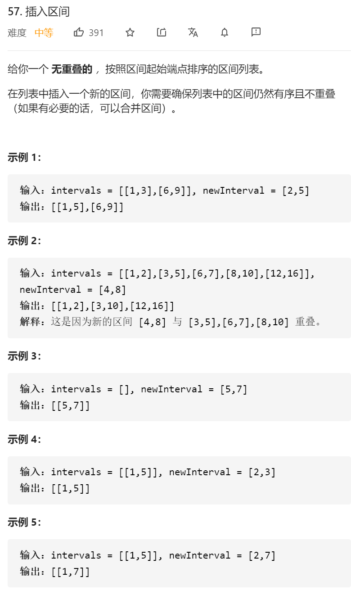

思路：和上题类似

1.先遍历数组，把不可能和新插入数组产生交集的左半边区间给放到结果里

2.如果遍历完了数组，都没找到相交的，那就把这个数组插到结果的后面。

3.如果找到了相交的，那就先把这个插入数组放到结果数组里，然后遍历其它剩下的原数组，如果有交集，相交，如果没有交集，直接插入新的区间。

```java
class Solution {
     public static void printArr(int[][] nums) {
        for (int i = 0; i < nums.length; i++) {
            System.out.println(Arrays.toString(nums[i]));
        }
    }
    public int[][] insert(int[][] intervals, int[] newInterval) {
         
        int[][]resTemp=new int[intervals.length+1][2];
       //如果是个空集合 那直接插
         if(intervals.length==0)
       {
            int[][]resTemp2=new int[1][2];
            resTemp2[0]=newInterval;
           return resTemp2;
       }
       

    
		 //第一步 先将不可能和输入发生交集的部分放进结果集合
        int count=0;
        for(int i=0;i<intervals.length;i++)
        {
            if(intervals[i][1]<newInterval[0])//如果这个的右边小于我插入的左边 是不可能有交集的
            {
                resTemp[count]=intervals[i];
                count++;
            }else
            {//如果发现有交集 那就先把我们新插入的集合放到结果中 然后就是求交集操作了
                resTemp[count]=newInterval;
//                count++;
                break;
            }
        }
        //如果这边把所有的结果都遍历了 发现都没有交集 这个时候就直接把新的这个集合插到最后面
          if(count>=intervals.length)
        {
            resTemp[count]=newInterval;
        }


    //    printArr(resTemp);
    //    System.out.println(count);

        //如果发现有交集 那之后的就是经典的求交集操作了
        int tempCount=count;
        for(int i=tempCount;i<intervals.length;i++)
        {
            int tempIntervals[]=intervals[i];
            int left=tempIntervals[0];
            int right=tempIntervals[1];

            int lastLeft=resTemp[count][0];
            int lastRight=resTemp[count][1];

            if(lastRight>=left)
            {
                //合并区间
                if( resTemp[count][1]<right)
                {
                    resTemp[count][1]=right;
                }
                if(lastLeft>left)
                {
                    resTemp[count][0]=left;
                }
            }else
            {
                //添加一个新的区间
                count++;
                // System.out.println("23333");
                resTemp[count][0]=left;
                resTemp[count][1]=right;
            }
        }
//        printArr(resTemp);
//        System.out.println(count);

        int res[][]=new int[count+1][2];
        for(int i=0;i<=count;i++)
        {
            res[i]=resTemp[i];
        }
//        printArr(res);

        return res;


    }
}
```


大神们的代码：

```java
class Solution {
    public int[][] insert(int[][] intervals, int[] newInterval) {
        int[][] res = new int[intervals.length + 1][2];
        int idx = 0;
        // 遍历区间列表：
        // 首先将新区间左边且相离的区间加入结果集
        int i = 0;
        while (i < intervals.length && intervals[i][1] < newInterval[0]) {
            res[idx++] = intervals[i++];
        }
        // 接着判断当前区间是否与新区间重叠，重叠的话就进行合并，直到遍历到当前区间在新区间的右边且相离，
        // 将最终合并后的新区间加入结果集
        while (i < intervals.length && intervals[i][0] <= newInterval[1]) {
            newInterval[0] = Math.min(intervals[i][0], newInterval[0]);
            newInterval[1] = Math.max(intervals[i][1], newInterval[1]);
            i++;
        }
        res[idx++] = newInterval;
        // 最后将新区间右边且相离的区间加入结果集
        while (i < intervals.length) {
            res[idx++] = intervals[i++];
        }

        return Arrays.copyOf(res, idx);
    }
}
```

