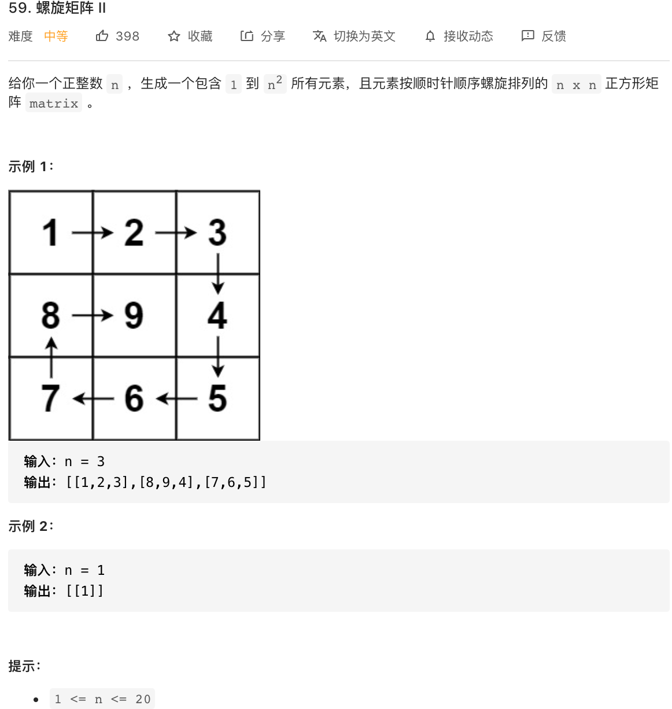

题目思路：

模仿大佬写的代码，设定 left right top button 然后 按照54题的大佬写法来做。详细题解写在了54 了。然后，其实直接写代码吧！

```java
class Solution {
    public int[][] generateMatrix(int n) {


        int martix[][]=new int[n][n];
        int allNum=n*n;

        int left=0;
        int right=n-1;
        int top=0;
        int buttom=n-1;
        int count=0;

        while (allNum>=1)
        {
            //先遍历顶层
            for(int i=left;i<=right&&allNum>=1;i++)
            {
                //横轴不变 纵轴变化
                count++;
                martix[top][i]=count;
                allNum--;

            }
            top++;

            //遍历右边
            for(int i=top;i<=buttom&&allNum>=1;i++)
            {
                //纵轴不变 横轴变化
                count++;
                martix[i][right]=count;
                allNum--;

            }
            right--;

            //遍历 底部

            for(int i=right;i>=left&&allNum>=1;i--)
            {
                //横轴不变 纵轴变化
                count++;
                martix[buttom][i]=count;
                allNum--;
            }
            buttom--;


            //遍历 左边

            for(int i=buttom;i>=top&&allNum>=1;i--)
            {
                count++;
                //纵轴不变 横轴变化
                martix[i][left]=count;
                allNum--;
            }
            left++;
        }

        return martix;

    }
}
```

