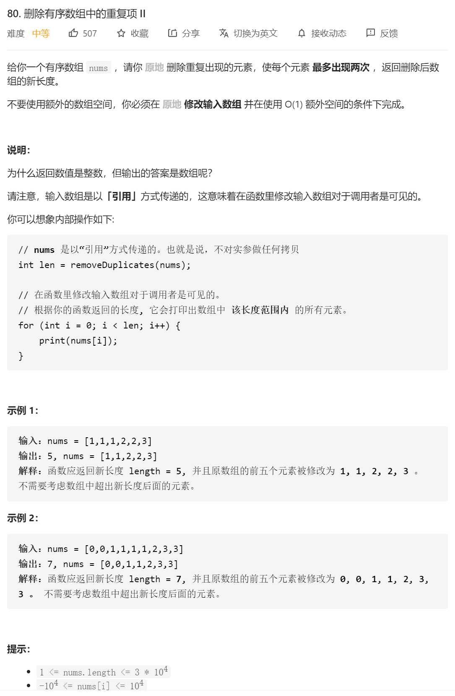

正经思路1：快慢指针

读完题目之后，我们应该注意到：nums数组是有序的！这意味着：相同元素必然连续。
我们可以设置快慢两个指针：fast和slow，运用for循环进行遍历，判断哪些元素应该保留，哪些应该剔除。
具体而言，slow指针表示处理出的数组的长度，fast指针表示已经检查过的数组的长度。即nums[fast]表示待检查的第一个元素，nums[slow − 1]为上一个应该被保留的元素所移动到的指定位置。
因为本题要求相同元素最多出现两次，所以我们需要检查上上个应该被保留的元素nums[slow − 2]是否和当前待检查元素nums[fast]相同。当且仅当nums[slow − 2] == nums[fast]时，当前待检查元素nums[fast]不应该被保留（因为此时必然有nums[slow − 2] == nums[slow − 1] == nums[fast]）。
最后，slow即为处理好的数组的长度。
特别地，数组的前两个数必然可以被保留，因此对于长度不超过2的数组，我们无需进行任何处理，对于长度超过2的数组，我们直接将双指针的初始值设为2即可。

```java
class Solution {
public:
    int removeDuplicates(vector<int>& nums) {
        int n = nums.size();
        if (n <= 2) { // 特殊判断，如果nums长度小于2，直接输出长度n即可
            return n;
        }
        int slow = 2, fast = 2; // 因为上面已经做过特殊判别，所以这里快慢指针从2开始
        while (fast < n) {
            if (nums[slow - 2] != nums[fast]) { // 因为题目要求最多两个数相同，所以这么判断
            // 如果nums[slow - 2] == nums[fast]，代表已经有两个数相等，此时nums[fast]
            // 对应的数值不能放进结果之中。反之，如果nums[slow - 2] != nums[fast]，
            // 那么nums[fast]可以放进nums[slow]中，并且slow++，记录结果的长度。
                nums[slow] = nums[fast]; 
                slow++;
            }
            fast++; // 不管怎么样，快指针都是要向前遍历各个元素的
        }
        return slow; // 返回结果的长度，即slow
    }
};


```

正经思路2：

类似快慢指针思路，但不完全是快慢指针

对于此类问题，我们应该进行如下考虑：

由于是保留 k 个相同数字，对于前 k 个数字，我们可以直接保留
对于后面的任意数字，能够保留的前提是：与当前写入的位置前面的第 k 个元素进行比较，不相同则保留

举个🌰，我们令 `k=2`，假设有如下样例

[1,1,1,1,1,1,2,2,2,2,2,2,3]

1.首先我们先让前 2 位直接保留，得到 1,1
2.对后面的每一位进行继续遍历，能够保留的前提是与当前位置的前面 k 个元素不同（答案中的第一个 1），因此我们会跳过剩余的 1，将第一个 2 追加，得到 1,1,2
3.继续这个过程，这时候是和答案中的第 2 个 1 进行对比，因此可以得到 1,1,2,2
4.这时候和答案中的第 1 个 2 比较，只有与其不同的元素能追加到答案，因此剩余的 2 被跳过，3 被追加到答案：1,1,2,2,3

```java
class Solution {
    public int removeDuplicates(int[] nums) {   
        return process(nums, 2);
    }
    int process(int[] nums, int k) {
        int u = 0; 
        for (int x : nums) {//其实这个u就是 慢指针
            if (u < k || nums[u - k] != x) nums[u++] = x;
        }
        return u;
    }
}

作者：AC_OIer
链接：https://leetcode-cn.com/problems/remove-duplicates-from-sorted-array-ii/solution/gong-shui-san-xie-guan-yu-shan-chu-you-x-glnq/
来源：力扣（LeetCode）
著作权归作者所有。商业转载请联系作者获得授权，非商业转载请注明出处。
```


自己的憨批思路：

如果遇到了相同的，且cnt超过了3的，直接往前覆盖，然后最后一位变100001. length--

然后覆盖了之后，循环判断这个覆盖了的位置是不是还是和原来相同的，相同，继续覆盖 length--

然后 遇到了不一样的 cnt置为1

然后 憨批代码：

```java
class Solution {
    public static void move(int nums[], int id) {
        //对应id后面的所有数字往前移动一位

        if (id == nums.length - 1) {
            //
            nums[nums.length - 1]=100001;
            return;
        }
        for (int i = id + 1; i < nums.length; i++) {
            nums[i - 1] = nums[i];
        }
        nums[nums.length - 1]=100001;

    }


    public int removeDuplicates(int[] nums) {
        int length = nums.length;
        int cnt = 1;//cnt初始化为1

        for(int i=0;i<nums.length&&nums[i]!=100001;i++)
        {
//            System.out.println(nums[i]);
            if(i==0)
            {
                continue;
            }

            if(nums[i]==nums[i-1])
            {
                cnt++;
                if(cnt==3)
                {
                    move(nums,i);
                    length--;
                    while (nums[i]==nums[i-1])//只要当前覆盖位置还和前面的一样 那就接着往前覆盖 知道遇到了不一样的
                    {
                        move(nums,i);
                        length--;
                    }
                    cnt=1;//那遇到不一样的了 cnt就重新变为1
                }
            }else
            {
                cnt=1;
            }
        }

        return length;


    }
}
```

