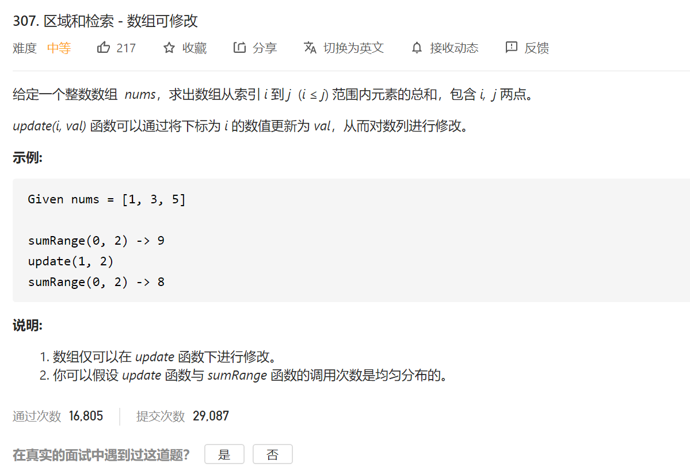
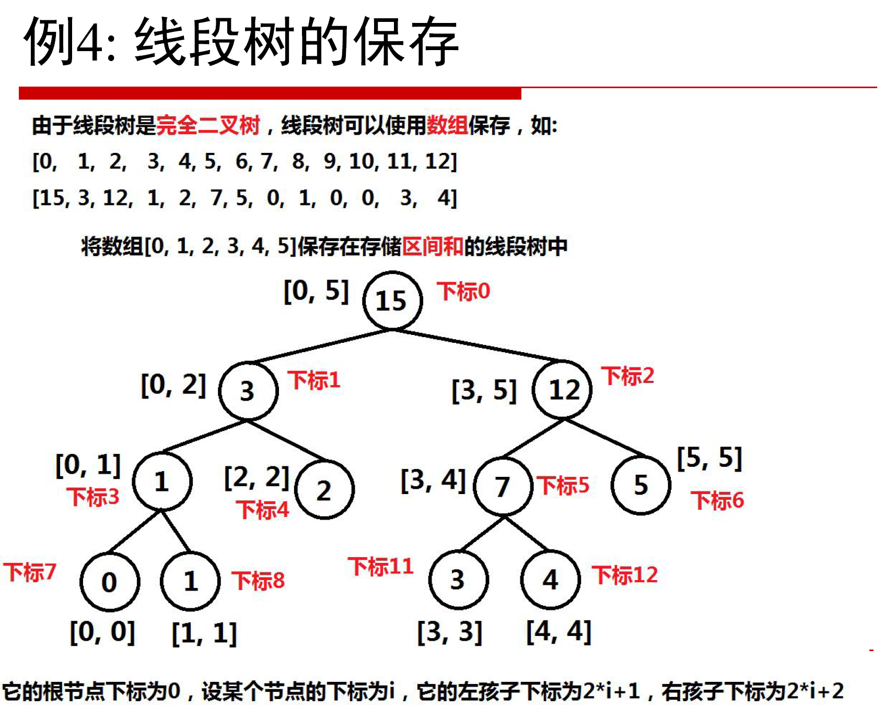
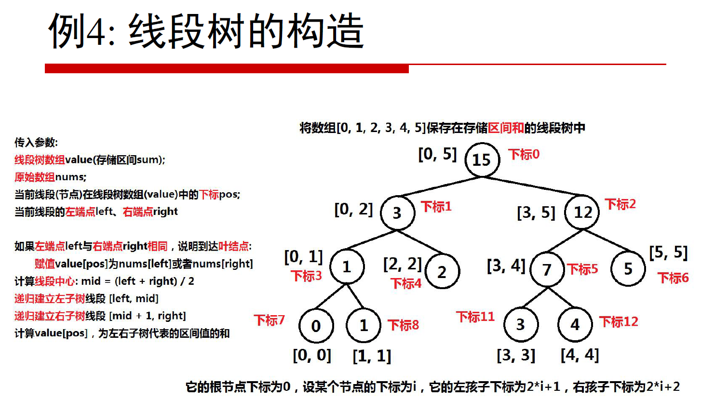
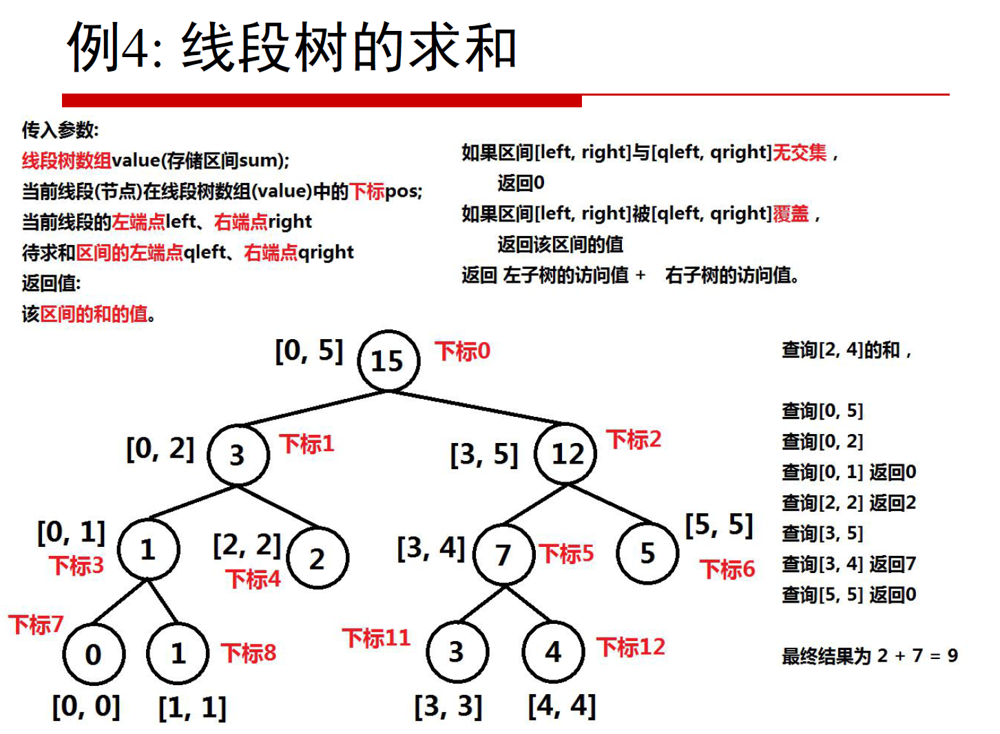
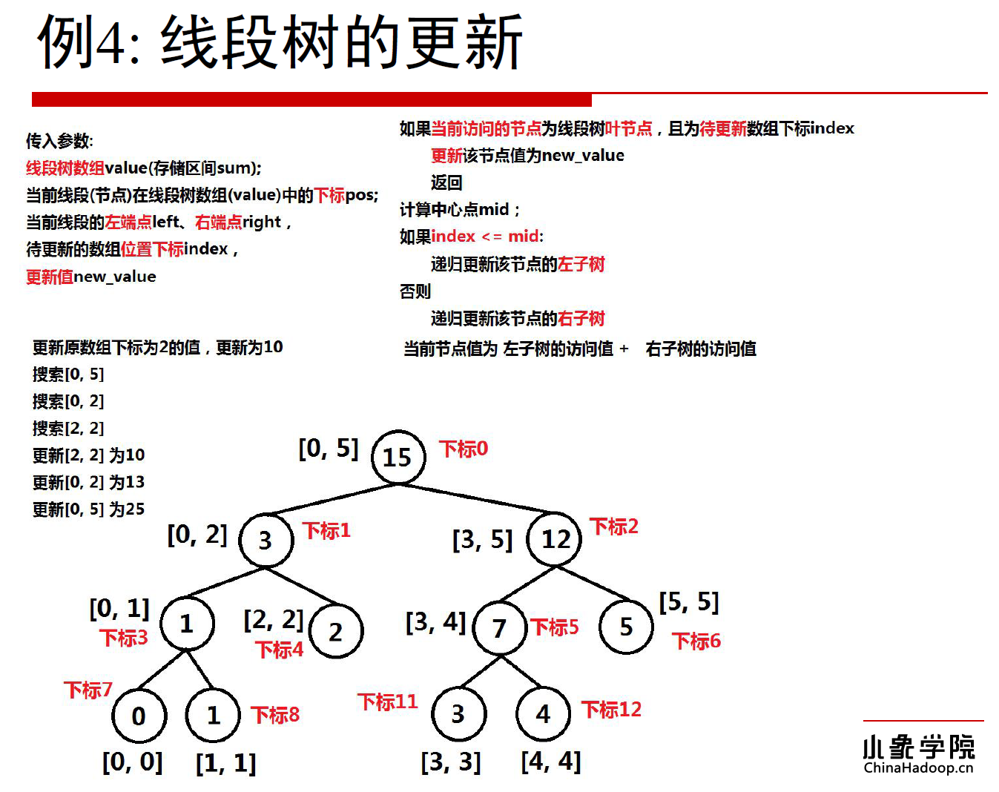

相关知识：线段树 （不需要太在意）





代码：

```java
public void buildSegmentTree(int []value,int nums[],int pos,int left,int right)
    {
        //传入： 线段树数组 value  原始数组nums 当前节点再线段树组中的下标pos
        //要知道当前节点 就得先知道当前节点左端点left 右端点 right
        //如果左右端点相同了，说明到达了叶子节点： 进行赋值就行了  value【pos】=nums[left]/nums[right]
        //左子树线段 left mid  右子树线段 mid+1 right
        //计算value[pos] 为左右子树的区间和 自底向上递归完成
        if(left==right)
        {
            value[pos]=nums[left];
            return;
        }
        int mid=left+(right-left)/2;//
        buildSegmentTree(value,nums,pos*2+1,left,mid);////当前node左孩子节点
        buildSegmentTree(value,nums,pos*2+2,mid+1,right);////当前node右边孩子节点
        value[pos]=value[pos*2+1]+value[pos*2+2];
    }
```




代码：

```java
//线段树求和
    int sumRangeSegmentTree(int value[],int pos,int left,int right,int qleft,int qright)
    {
        //传入参数 value 挡前节点再线段树组中的下标的pos   求当前节点的所需要的 left 和 right
        //待求和区间的左端点qleft 右边断电 qright
        //最后返回求和
        //如果区间left right 与 qleft qright 没有交集 返回0
        //如果 区间left right 被 qleft qright 覆盖 则返回该区间的值
        //最后返回 左子树的访问值 + 右子树的访问的值
        if(qleft>right||qright<left)
        {
            ////如果区间left right 与 qleft qright 没有交集 返回0
            return 0;
        }
        if(qleft<=left&&qright>=right)
        {
            ////如果 区间left right 被 qleft qright 覆盖 则返回该区间的值
            return value[pos];
        }
        int mid=left+(right-left)/2;//
        return sumRangeSegmentTree(value,pos*2+1,left,mid,qleft,qright)+
                sumRangeSegmentTree(value,pos*2+2,mid+1,right,qleft,qright);
    }
```



```java
//线段树的跟新
    void updateSegmentTree(int value[],int pos,int left,int right,int index,int newValue)
    {
        //传入参数 线段树的数组 当前节点在线段树中的下标 当前节点的左端点和右端点下标
        //待更新数组的位置下标 index 更新的值 newValue
        // 如果当前访问的节点为线段树的 叶子节点，而且是待更新数组下标 index
        //跟新该节点的值 为new value 返回
        //计算中心店mid
        //如果 mid》=index 递归跟新左子树  否则跟新右边子树
        //当前节点的值 为左子树的值+右子树的值
        if(left==right&&left==index)
        {
            // 如果当前访问的节点为线段树的 叶子节点，而且是待更新数组下标 index
            //跟新该节点的值 为new value 返回
            value[pos]=newValue;
            return;
        }

        int mid=left+(right-left)/2;//

        if(index<=mid)
        {
            // //如果 mid》=index 递归跟新左子树
            updateSegmentTree(value,pos*2+1,left,mid,index,newValue);
        }else
        {
            updateSegmentTree(value,pos*2+2,mid+1,right,index,newValue);
        }

        value[pos]=value[pos*2+1]+value[pos*2+2];

    }
```


//最后的答案：

```java
class NumArray {

   int value[];
    int rightEnd;

    public NumArray(int[] nums) {
        if(nums.length==0)
        {
            return;
        }

        int n=nums.length*4;
        value=new int[n];
        buildSegmentTree(value,nums,0,0, nums.length-1);
        rightEnd=nums.length-1;
    }

    public void update(int i, int val) {
        updateSegmentTree(value,0,0,rightEnd,i,val);
    }

    public int sumRange(int i, int j) {
        return sumRangeSegmentTree(value,0,0,rightEnd,i,j);
    }

    public void buildSegmentTree(int []value,int nums[],int pos,int left,int right)
    {
        //传入： 线段树数组 value  原始数组nums 当前节点再线段树组中的下标pos
        //当前线段左端点left 右端点 right
        //如果左右端点相同了，说明到达了叶子节点： 进行赋值就行了  value【pos】=nums[left]/nums[right]
        //左子树线段 left mid  右子树线段 mid+1 right
        //计算value[pos] 为左右子树的区间和 自底向上递归完成
        if(left==right)
        {
            value[pos]=nums[left];
            return;
        }
        int mid=left+(right-left)/2;//
        buildSegmentTree(value,nums,pos*2+1,left,mid);////当前node左孩子节点
        buildSegmentTree(value,nums,pos*2+2,mid+1,right);////当前node右边孩子节点
        value[pos]=value[pos*2+1]+value[pos*2+2];
    }

    //线段树求和
    int sumRangeSegmentTree(int value[],int pos,int left,int right,int qleft,int qright)
    {
        //传入参数 value 挡前节点再线段树组中的下标的pos   求当前节点的所需要的 left 和 right
        //待求和区间的左端点qleft 右边断电 qright
        //最后返回求和
        //如果区间left right 与 qleft qright 没有交集 返回0
        //如果 区间left right 被 qleft qright 覆盖 则返回该区间的值
        //最后返回 左子树的访问值 + 右子树的访问的值
        if(qleft>right||qright<left)
        {
            return 0;
        }
        if(qleft<=left&&qright>=right)
        {
            return value[pos];
        }
        int mid=left+(right-left)/2;//
        return sumRangeSegmentTree(value,pos*2+1,left,mid,qleft,qright)+
                sumRangeSegmentTree(value,pos*2+2,mid+1,right,qleft,qright);
    }

    //线段树的跟新
    void updateSegmentTree(int value[],int pos,int left,int right,int index,int newValue)
    {
        //传入参数 线段树的数组 当前节点在线段树中的下标 当前节点的左端点和右端点下标
        //待更新数组的位置下标 index 更新的值 newValue
        // 如果当前访问的节点为线段树的 叶子节点，而且是待更新数组下标 index
        //跟新该节点的值 为new value 返回
        //计算中心店mid
        //如果 mid》=index 递归跟新左子树  否则跟新右边子树
        //当前节点的值 为左子树的值+右子树的值
        if(left==right&&left==index)
        {
            // 如果当前访问的节点为线段树的 叶子节点，而且是待更新数组下标 index
            //跟新该节点的值 为new value 返回
            value[pos]=newValue;
            return;
        }

        int mid=left+(right-left)/2;//

        if(index<=mid)
        {
            // //如果 mid》=index 递归跟新左子树
            updateSegmentTree(value,pos*2+1,left,mid,index,newValue);
        }else
        {
            updateSegmentTree(value,pos*2+2,mid+1,right,index,newValue);
        }

        value[pos]=value[pos*2+1]+value[pos*2+2];

    }

}

/**
 * Your NumArray object will be instantiated and called as such:
 * NumArray obj = new NumArray(nums);
 * obj.update(i,val);
 * int param_2 = obj.sumRange(i,j);
 */
```

