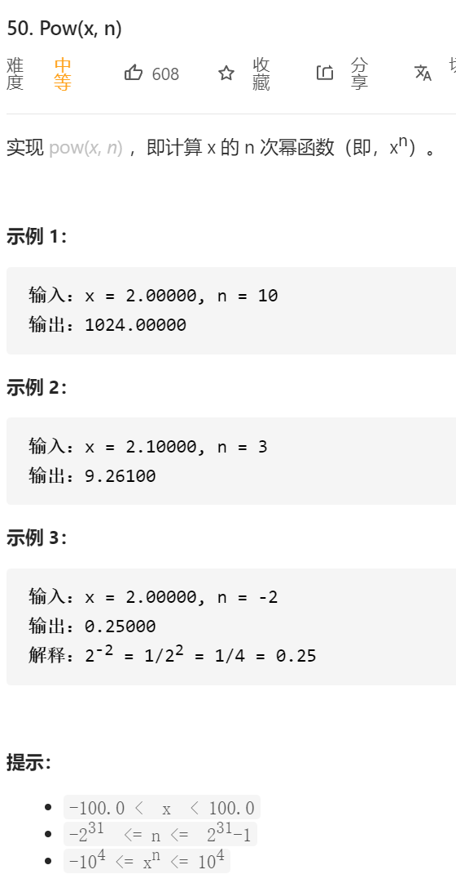
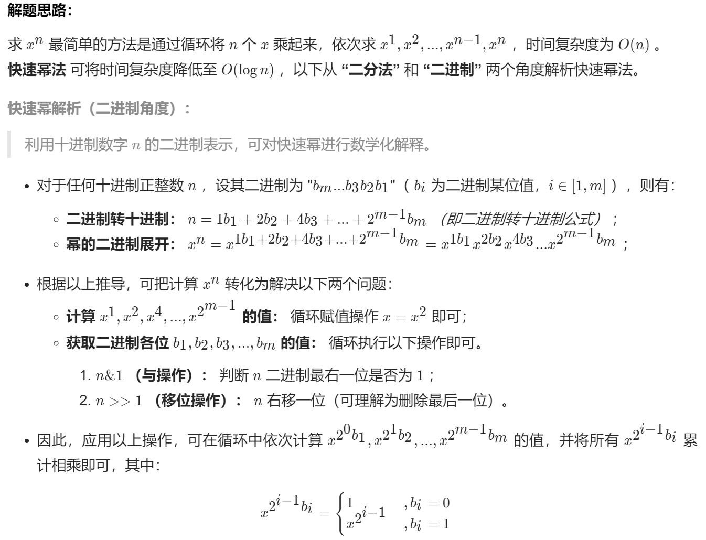
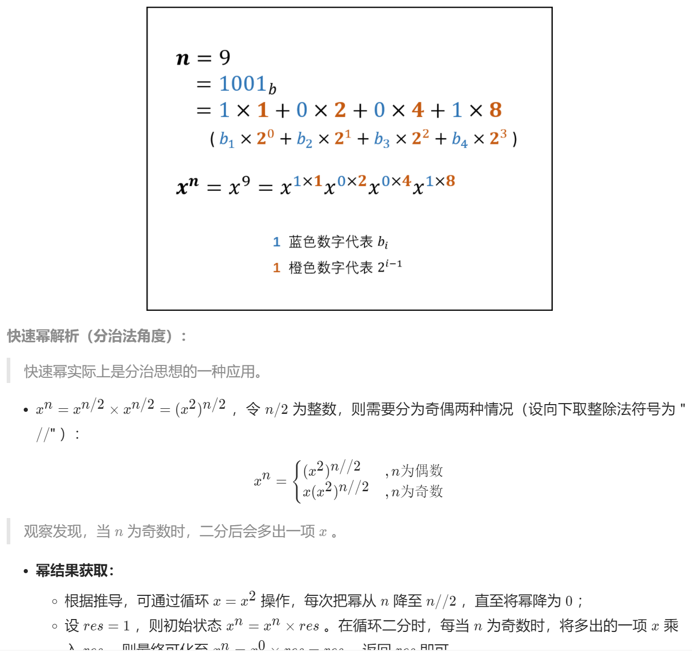
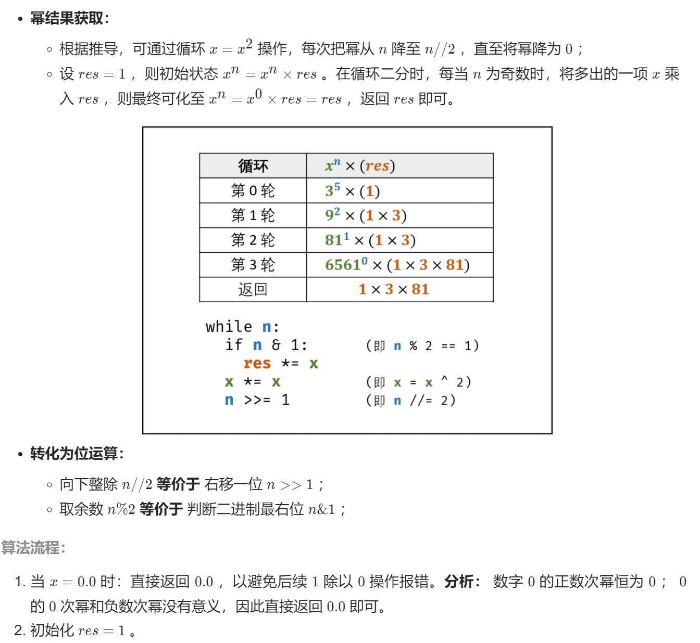
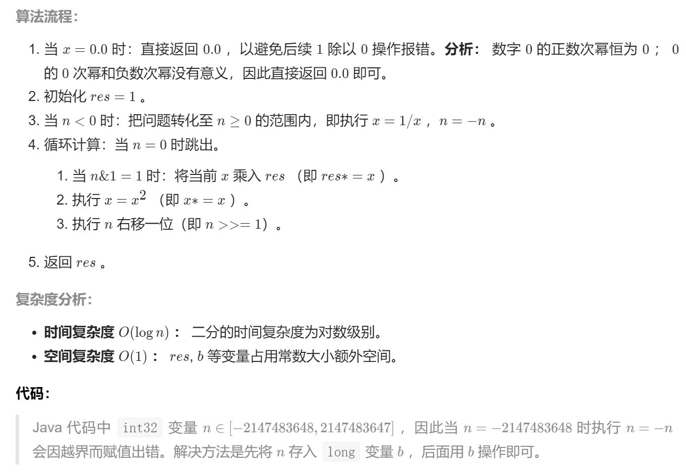

```java
class Solution {
    public double myPow(double x, int n) {
        if(x == 0.0f) return 0.0d;
        long b = n;
        double res = 1.0;
        if(b < 0) {
            x = 1 / x;
            b = -b;
        }
        while(b > 0) {
            if((b & 1) == 1) res *= x;
            x *= x;
            b >>= 1;
        }
        return res;
    }
}

作者：jyd
链接：https://leetcode-cn.com/problems/powx-n/solution/50-powx-n-kuai-su-mi-qing-xi-tu-jie-by-jyd/
来源：力扣（LeetCode）
著作权归作者所有。商业转载请联系作者获得授权，非商业转载请注明出处。
```

