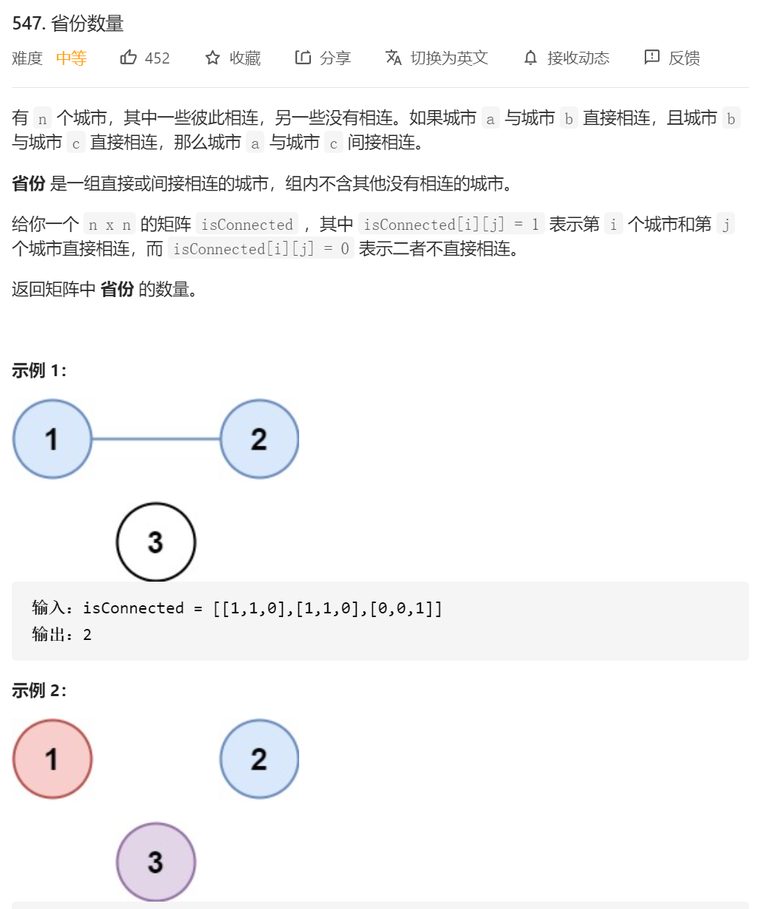

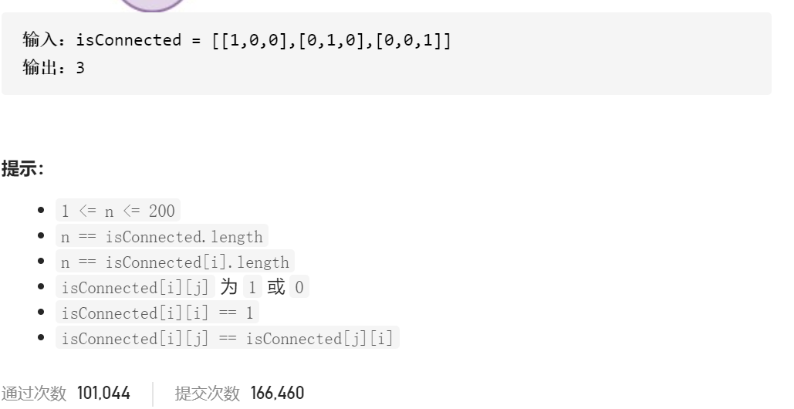

## 一、题目分析

**题意：** n 个城市，有直接/间接相连关系的城市属于同一个省份，求省份的数量。

分析： 即 求无向图中的连通域的个数，入参 int[][] isConnected 即为该无向图的邻接矩阵。常规做法可以对图进行深度优先搜索计数或使用广度优先搜索计数或者使用并查集。

## 二、解决方案

### 1、深度优先搜索 / 广度优先搜索

我们使用图搜索算法从各个连通域的任一顶点开始遍历整个连通域，遍历的过程中对 boolean[] visited 数组进行标记，遍历完当前连通域之后，若仍有顶点未被访问，说明又是一个新的连通域，使用 cnt 累计当前遍历过的连通域的数量。

这边小许给自己定一个要记住的点：

1.深度优先用递归或者堆栈。广度优先必须要使用队列

2.然后 深度优先搜索是访问一个元素，然后递归访问和它相邻的元素。可以理解为遍历的0元素的时候，下一个是遍历1元素，那我就把所有和1元素相邻的全部给先遍历了。（堆栈的思想）

3.广度优先搜索就是

#### 解法一：深度优先搜索

```java
class Solution {
    public int findCircleNum(int[][] isConnected) {
        // int[][] isConnected 是无向图的邻接矩阵，n 为无向图的顶点数量
        int n = isConnected.length;
        // 定义 boolean 数组标识顶点是否被访问
        boolean[] visited = new boolean[n];
        // 定义 cnt 来累计遍历过的连通域的数量
        int cnt = 0;
        for (int i = 0; i < n; i++) {
            // 若当前顶点 i 未被访问，说明又是一个新的连通域，则遍历新的连通域且cnt+=1.
            if (!visited[i]) { 
                cnt++;
                dfs(i, isConnected, visited);
            }
        }
        return cnt;
    }

    private void dfs(int i, int[][] isConnected, boolean[] visited) {
        // 对当前顶点 i 进行访问标记
        visited[i] = true;
        
        // 继续遍历与顶点 i 相邻的顶点（使用 visited 数组防止重复访问）
        for (int j = 0; j < isConnected.length; j++) {
            if (isConnected[i][j] == 1 && !visited[j]) {
                dfs(j, isConnected, visited);
            }
        }
    }
}

```

自己的代码：

```java
public void dfs(int[][] isConnected,int[] visited,int x)
    {
        //该点被访问
        visited[x]=1;
        //找邻接的点
        for(int y=0;y<isConnected[x].length;y++)//递归在这有退出条件
        {
            if(isConnected[x][y]==1&&visited[y]==0)//如果是和x相邻 且 相邻这个城市未被访问过
            {
                dfs(isConnected,visited,y);//去访问这个城市的那行

            }
        }

    }
```

#### 解法二：广度优先搜索

```
class Solution {
    public int findCircleNum(int[][] isConnected) {
        // int[][] isConnected 是无向图的邻接矩阵，n 为无向图的顶点数量
        int n = isConnected.length;
        // 定义 boolean 数组标识顶点是否被访问
        boolean[] visited = new boolean[n];
        
        // 定义 cnt 来累计遍历过的连通域的数量
        int cnt = 0;  
        Queue<Integer> queue = new LinkedList<>();
        for (int i = 0; i < n; i++) {
            // 若当前顶点 i 未被访问，说明又是一个新的连通域，则bfs新的连通域且cnt+=1.
            if (!visited[i]) {
                cnt++;
                queue.offer(i);
                visited[i] = true;
                while (!queue.isEmpty()) {
                    int v = queue.poll();
                    for (int w = 0; w < n; w++) {
                        if (isConnected[v][w] == 1 && !visited[w]) {
                            visited[w] = true;
                            queue.offer(w);
                        }
                    }
                }
            }
        }
        return cnt;
    }
} 
```


自己写的：

```java
class Solution {
    public int findCircleNum(int[][] isConnected) {
        int visited[]=new int[isConnected.length];
        int count=0;
        Queue<Integer> queue=new LinkedList<>();
         for(int x=0;x<isConnected.length;x++)
         {
             if(visited[x]==0)//若当前节点没有被访问过 直接入队
             {
                 queue.offer(x);//
                 visited[x]=1;
                 count++;
                 //cnt++;
                 while (!queue.isEmpty())//队伍中存放的是 已经访问过的节点  我们需要做到是去访问这些节点的临界节点
                 {
                     int xTemp=queue.poll();
                     for(int y=0;y<isConnected[xTemp].length;y++)
                     {
                         //将和x相邻的城市 且 没被访问过的城市 全部入队 准备访问
                         if(isConnected[xTemp][y]==1&&visited[y]==0)
                         {
                             visited[y]=1;
                             queue.offer(y);
                         }
                     }
                 }

             }
         }
        return count;
    }

   
}

```

解法三：并查集

### 基本概念

1. 并查集是一种**数据结构**
2. 并（Union），代表**合并**
3. 查（Find），代表**查找**
4. 集（Set），代表这是一个以**字典**为基础的数据结构，它的基本功能是合并集合中的元素，查找集合中的元素
5. 并查集的典型应用是有关**连通分量**的问题
6. 并查集解决单个问题（添加，合并，查找）的时间复杂度都是O(1)*O*(1)
7. 因此，并查集可以应用到**在线**算法中

### 并查集的实现

##### 数据结构

并查集跟树有些类似，只不过她跟树是相反的。在树这个数据结构里面，每个节点会记录它的子节点。在并查集里，每个节点会记录它的父节点。

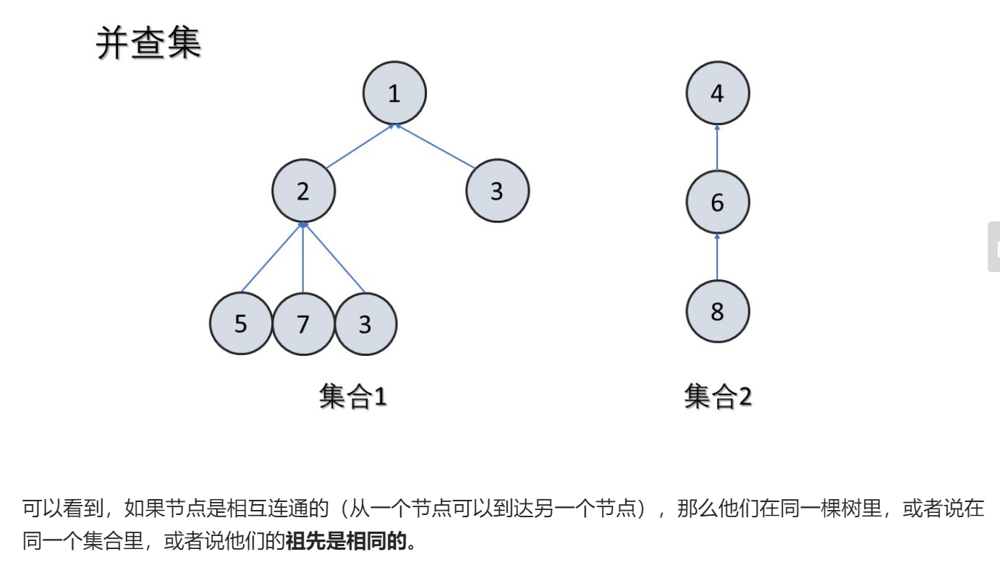

```java
class UnionFind {
    private Map<Integer,Integer> father;
}
```

##### 初始化

当把一个新节点添加到并查集中，它的父节点应该为空

```java
    public void add(int x) {
        if (!father.containsKey(x)) {
            father.put(x, null);
        }
    }
```

##### 合并两个节点

如果发现两个节点是连通的，那么就要把他们合并，也就是他们的祖先是相同的。这里究竟把谁当做父节点一般是没有区别的。

```java
    public void merge(int x, int y) {
        int rootX = find(x);
        int rootY = find(y);
        
        if (rootX != rootY){
            father.put(rootX,rootY);
        }
    }

```

##### 两节点是否连通

我们判断两个节点是否处于同一个连通分量的时候，就需要判断它们的祖先是否相同

```java
public boolean isConnected(int x, int y) {
        return find(x) == find(y);
    }
```

##### 查找祖先

查找祖先的方法是：如果节点的父节点不为空，那就不断迭代。

```java
    public int find(int x) {
        int root = x;
        
        while(father.get(root) != null){
            root = father.get(root);
        }
         
        return root;
    }

```

这里有一个优化的点：如果我们树很深，比如说退化成链表，那么每次查询的效率都会非常低。所以我们要做一下路径压缩。也就是把树的深度固定为二。

这么做可行的原因是，并查集只是记录了节点之间的连通关系，而节点相互连通只需要有一个相同的祖先就可以了。

路径压缩可以用递归，也可以迭代。这里用迭代的方法。

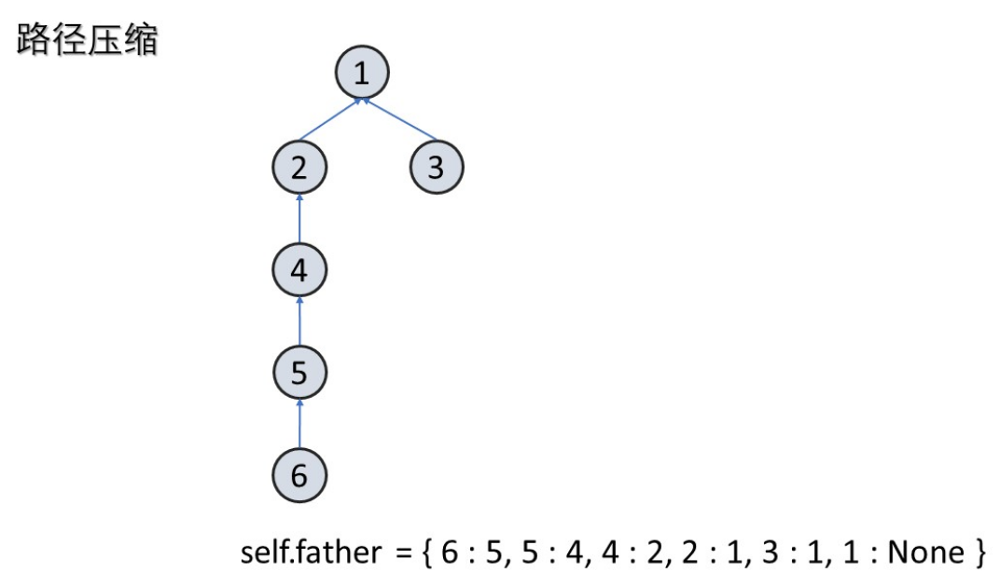

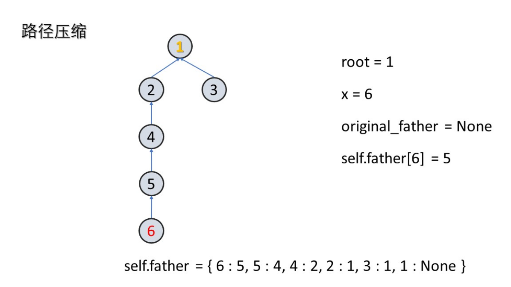

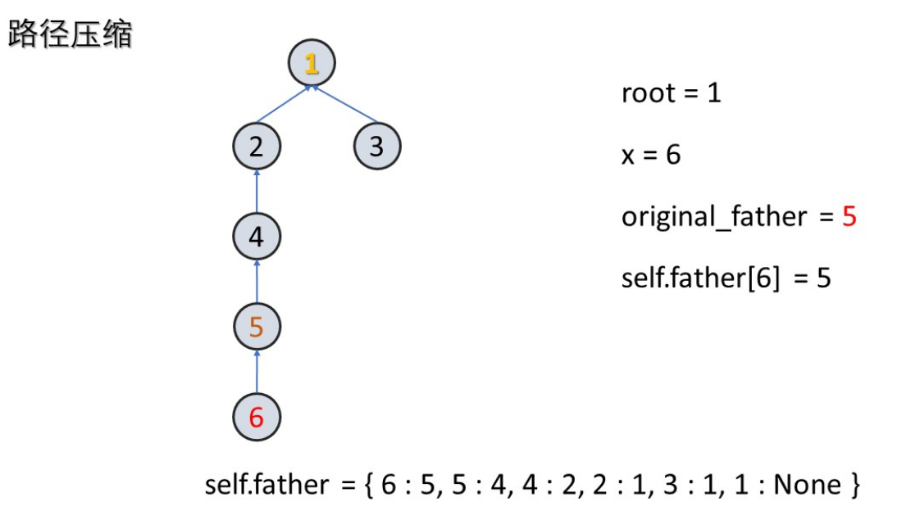

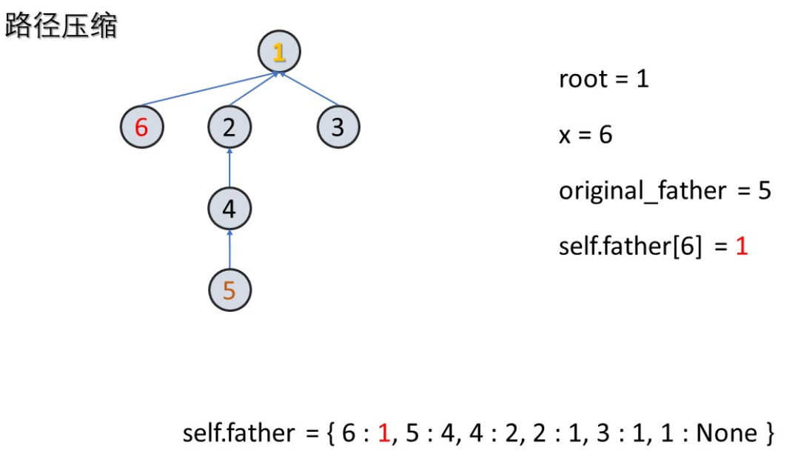

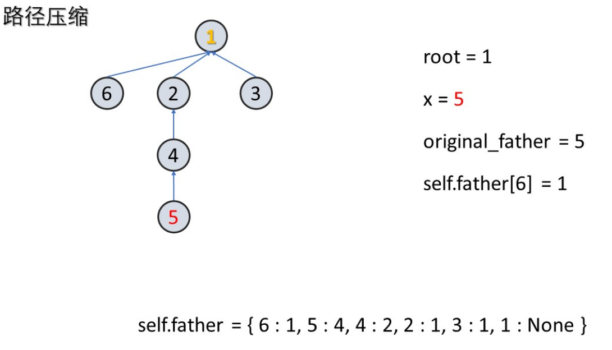

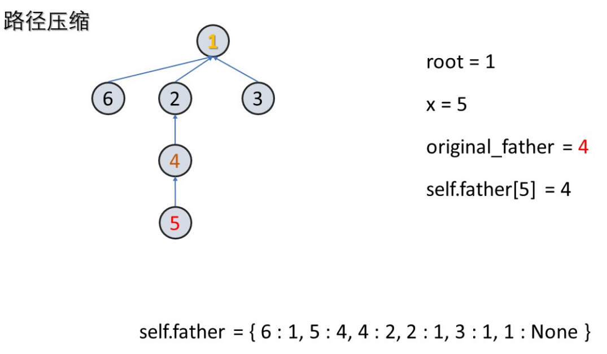

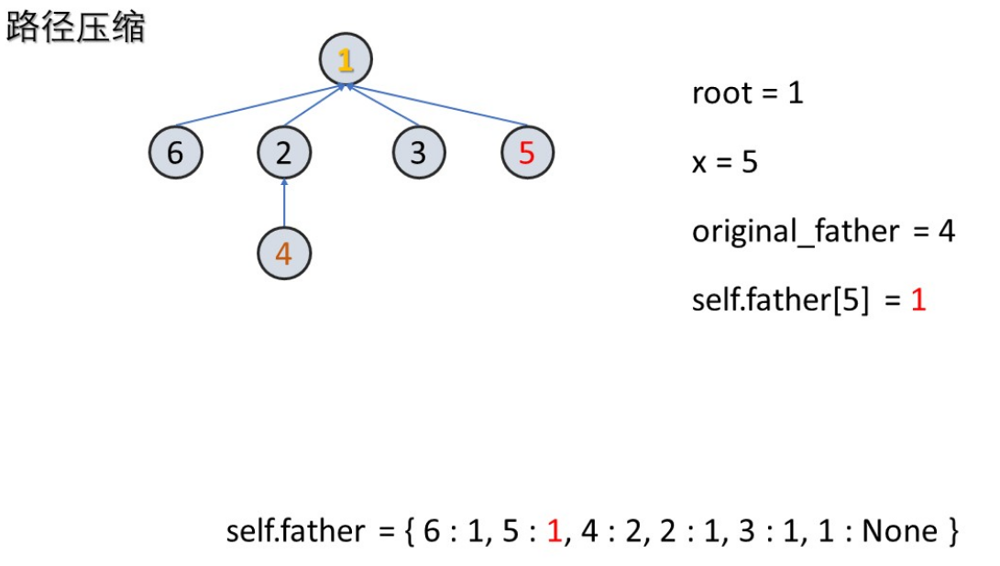

最后：

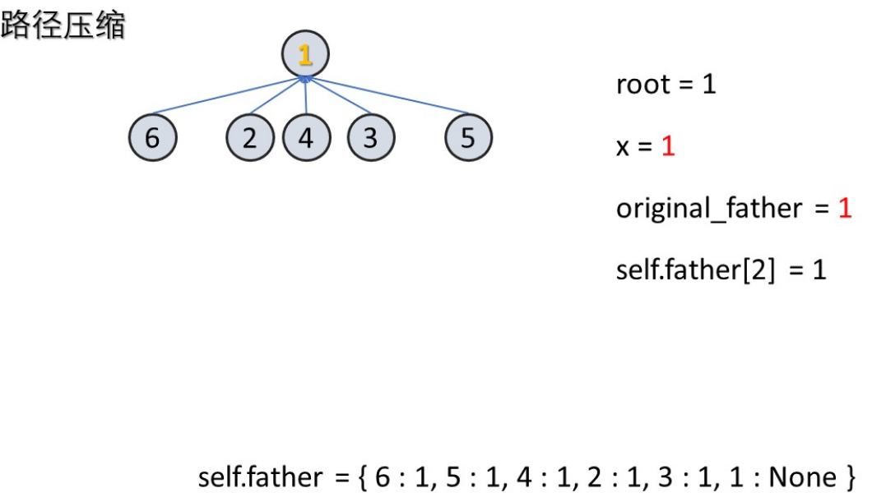

```java
    public int find(int x) {
        int root = x;
        
        while(father.get(root) != null){
            root = father.get(root);
        }
        
        while(x != root){
            int original_father = father.get(x);
            father.put(x,root);
            x = original_father;
        }
        
        return root;
    }

作者：MiloMusiala
链接：https://leetcode-cn.com/problems/number-of-provinces/solution/python-duo-tu-xiang-jie-bing-cha-ji-by-m-vjdr/
来源：力扣（LeetCode）
著作权归作者所有。商业转载请联系作者获得授权，非商业转载请注明出处。
```

完整：

```java
class UnionFind {
    private Map<Integer,Integer> father;
    
    public UnionFind() {
        father = new HashMap<Integer,Integer>();
    }
    
    public void add(int x) {
        if (!father.containsKey(x)) {
            father.put(x, null);
        }
    }
    
    public void merge(int x, int y) {
        int rootX = find(x);
        int rootY = find(y);
        
        if (rootX != rootY){
            father.put(rootX,rootY);
        }
    }
    
    public int find(int x) {
        int root = x;
        
        while(father.get(root) != null){
            root = father.get(root);
        }
        
        while(x != root){
            int original_father = father.get(x);
            father.put(x,root);
            x = original_father;
        }
        
        return root;
    }
    
    public boolean isConnected(int x, int y) {
        return find(x) == find(y);
    }
} 

作者：MiloMusiala
链接：https://leetcode-cn.com/problems/number-of-provinces/solution/python-duo-tu-xiang-jie-bing-cha-ji-by-m-vjdr/
来源：力扣（LeetCode）
著作权归作者所有。商业转载请联系作者获得授权，非商业转载请注明出处。
```

并查集小模板

```java
class Solution {
    public int findCircleNum(int[][] isConnected) {
        int n = isConnected.length;
        // 初始化并查集
        UnionFind uf = new UnionFind(n);
        // 遍历每个顶点，将当前顶点与其邻接点进行合并
        for (int i = 0; i < n; i++) {
            for (int j = i + 1; j < n; j++) {
                if (isConnected[i][j] == 1) {
                    uf.union(i, j);
                }
            }
        }
        // 返回最终合并后的集合的数量
        return uf.size;
    }
}

// 并查集
class UnionFind {
    int[] roots;
    int size; // 集合数量
    
    public UnionFind(int n) {
        roots = new int[n];
        for (int i = 0; i < n; i++) {
            roots[i] = i;
        }
        size = n;
    }

    public int find(int i) {
       if (i == roots[i]) {
           return i;
       }
       return roots[i] = find(roots[i]);
    }

    public void union(int p, int q) {
        int pRoot = find(p);
        int qRoot = find(q);
        if (pRoot != qRoot) {
            roots[pRoot] = qRoot;
            size--;
        }
    }
}


```


### 今天的题目

今天的题目就是在考察连通分量的数目，所以我们要在模板中额外添加一个变量去跟踪集合的数量（有多少棵树）

初始化的时候把集合数量加一

合并的时候让集合数量减一

```java
class UnionFind {
    // 记录父节点
    private Map<Integer,Integer> father;
    // 记录集合的数量
    private int numOfSets = 0;
    
    public UnionFind() {
        father = new HashMap<Integer,Integer>();
        numOfSets = 0;
    }
    
    public void add(int x) {
        if (!father.containsKey(x)) {
            father.put(x, null);
            numOfSets++;
        }
    }
    
    public void merge(int x, int y) {
        int rootX = find(x);
        int rootY = find(y);
        
        if (rootX != rootY){
            father.put(rootX,rootY);
            numOfSets--;
        }
    }
    
    public int find(int x) {
        int root = x;
        
        while(father.get(root) != null){
            root = father.get(root);
        }
        
        while(x != root){
            int original_father = father.get(x);
            father.put(x,root);
            x = original_father;
        }
        
        return root;
    }
    
    public boolean isConnected(int x, int y) {
        return find(x) == find(y);
    }
    
    public int getNumOfSets() {
        return numOfSets;
    }
}

class Solution {
    public int findCircleNum(int[][] isConnected) {
        UnionFind uf = new UnionFind();
        for(int i = 0;i < isConnected.length;i++){
            uf.add(i);
            for(int j = 0;j < i;j++){
                //不能这样往后 int j = i+1;j < isConnected[0].length;j++ 应该一个个add进去才行
                //不然的话 在i=0的时候 1 2 3这些节点都还没创建呢
                if(isConnected[i][j] == 1){
                    uf.merge(i,j);
                }
            }
        }
        
        return uf.getNumOfSets();
    }
}

```

