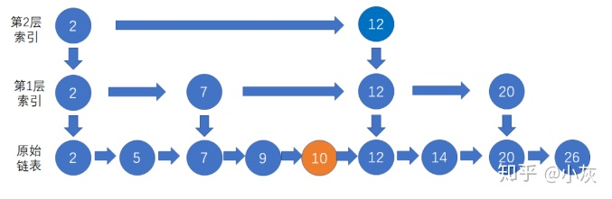

## 场景：设计魔兽的拍卖行

拍卖行的商品总数量有几十万件，对应数据库商品表的几十万条记录。

如果是按照商品名称精确查询还好办，可以直接从数据库查出来，最多也就上百条记录。

如果是没有商品名称的全量查询怎么办？总不可能把数据库里的所有记录全查出来吧，而且还要支持不同字段的排序。

所以，只能提前在内存中存储有序的全量商品集合，每一种排序方式都保存成独立的集合，每次请求的时候按照请求的排序种类，返回对应的集合。


## 数组问题：

​    拍卖行商品列表是线性的，最容易表达线性结构的自然是数组和链表。可是，无论是数组还是链表，在插入新商品的时候，都会存在性能问题。

按照商品等级排序的集合为例，如果使用数组，插入新商品的方式如下：


如果要插入一个等级是3的商品，首先要知道这个商品应该插入的位置。使用二分查找可以最快定位，这一步时间复杂度是O（logN）。

插入过程中，原数组中所有大于3的商品都要右移，这一步时间复杂度是O（N）。所以总体时间复杂度是O（N）。

## 链表问题

如果使用链表，插入新商品的方式如下：


如果要插入一个等级是3的商品，首先要知道这个商品应该插入的位置。链表无法使用二分查找，只能和原链表中的节点逐一比较大小来确定位置。这一步的时间复杂度是O（N）。

插入的过程倒是很容易，直接改变节点指针的目标，时间复杂度O（1）。因此总体的时间复杂度也是O（N）。

这对于拥有几十万商品的集合来说，这两种方法显然都太慢了。

## 跳跃表

### 核心思想：用类似索引的方法，提取出链表中的部分关键节点。


## 索引之上加索引

### 保证每一层是上一层节点数的一半

直到同一层只有两个节点的时候，因为一个节点没有比较的意义，这样的多层链表的结构，就是**跳跃表**。


## 1.跳表插入操作

### 1.1跳跃查找 找到区间

假设我们要插入的结点是10，首先我们按照跳表查找结点的方法，找到待插入结点的前置结点（仅小于待插入结点）：


### 1.2插入到这个节点的前驱节点

接下来，按照一般链表的插入方式，把结点10插入到结点9的下一个位置：



### 1.3开始晋升

这样是不是插入工作就完成了呢？并不是。随着原始链表的新结点越来越多，索引会渐渐变得不够用了，因此索引结点也需要相应作出调整。

如何调整索引呢？我们让新插入的结点随机“晋升”，也就是成为索引结点。新结点晋升成功的几率是50%。

假设第一次随机的结果是晋升成功，那么我们把结点10作为索引结点，插入到第1层索引的对应位置，并且向下指向原始链表的结点10：

新结点在成功晋升之后，仍然有机会继续向上一层索引晋升。我们再进行一次随机，假设随机的结果是晋升失败，那么插入操作就告一段落了。

### 1.4 晋升超过了最高索引范围怎么办？

再加一层

让我们看看下图，新结点10已经晋升到第2层索引，下一次随机的结果仍然是晋升成功，这时候该怎么办呢？


### 1.5总结时间复杂度

新节点和各层索引节点逐一比较，确定原链表的插入位置。O（logN）

把索引插入到原链表。O（1）

利用抛硬币的随机方式，决定新节点是否提升为上一级索引。结果为“正”则提升并继续抛硬币，结果为“负”则停止。O（logN）

总体上，跳跃表插入操作的时间复杂度是O（logN），而这种数据结构所占空间是2N，既空间复杂度是 O（N）。

## 2.跳表删除操作

#### 2.1 跳跃查找到对应的位置


#### 2.2删除对应节点 


#### 2.3顺藤摸瓜，把索引当中的对应结点也一一删除：


如果某一层的索引节点被删光了，直接把失去节点的那一层个给删除。

刚才的例子当中，第3层索引的结点已经没有了，因此我们把整个第3层删去：


最终删除结果如下：


#### 2.4时间复杂度

自上而下，查找第一次出现节点的索引，并逐层找到每一层对应的节点。O（logN）

删除每一层查找到的节点，如果该层只剩下1个节点，删除整个一层（原链表除外）。O（logN）

总体上，跳跃表删除操作的时间复杂度是O（logN）。

## 3.跳表和红黑树之间的的对比

总结：操作的时间复杂度和红黑树相同，但是实现简单且区间效率更高。

1 skiplist的复杂度和红黑树一样，而且实现起来更简单。
2 在并发环境下skiplist有另外一个优势，红黑树在插入和删除的时候可能需要做一些rebalance的操作，这样的操作可能会涉及到整个树的其他部分，而skiplist的操作显然更加局部性一些，锁需要盯住的节点更少，因此在这样的情况下性能好一些。


## 4.具体实现

3.1程序中跳表采用的是双向链表，无论前后结点还是上下结点，都各有两个指针相互指向彼此。

3.2程序中跳表的每一层首位各有一个空结点，左侧的空节点是负无穷大，右侧的空节点是正无穷大。


```java

public class SkipList{

    //结点“晋升”的概率
    private static final double PROMOTE_RATE = 0.5;
    private Node head,tail;
    private int maxLevel;

    public SkipList() {
        head = new Node(Integer.MIN_VALUE);
        tail = new Node(Integer.MAX_VALUE);
        head.right = tail;
        tail.left = head;
    }

    //查找结点
    public Node search(int data){
        Node p= findNode(data);
        if(p.data == data){
            System.out.println("找到结点：" + data);
            return p;
        }
        System.out.println("未找到结点：" + data);
        return null;
    }

    //找到值对应的前置结点
    private Node findNode(int data){
        Node node = head;
        while(true){
            while (node.right.data!=Integer.MAX_VALUE && node.right.data<=data) {
                node = node.right;
            }
            if (node.down == null) {
                break;
            }
            node = node.down;
        }
        return node;
    }

    //插入结点
    public void insert(int data){
        Node preNode= findNode(data);
        //如果data相同，直接返回
        if (preNode.data == data) {
            return;
        }
        Node node=new Node(data);
        appendNode(preNode, node);
        int currentLevel=0;
        //随机决定结点是否“晋升”
        Random random = new Random();
        while (random.nextDouble() < PROMOTE_RATE) {
            //如果当前层已经是最高层，需要增加一层
            if (currentLevel == maxLevel) {
                addLevel();
            }
            //找到上一层的前置节点
            while (preNode.up==null) {
                preNode=preNode.left;
            }
            preNode=preNode.up;
            //把“晋升”的新结点插入到上一层
            Node upperNode = new Node(data);
            appendNode(preNode, upperNode);
            upperNode.down = node;
            node.up = upperNode;
            node = upperNode;
            currentLevel++;
        }
    }

    //在前置结点后面添加新结点
    private void appendNode(Node preNode, Node newNode){
        newNode.left=preNode;
        newNode.right=preNode.right;
        preNode.right.left=newNode;
        preNode.right=newNode;
    }

    //增加一层
    private void addLevel(){
        maxLevel++;
        Node p1=new Node(Integer.MIN_VALUE);
        Node p2=new Node(Integer.MAX_VALUE);
        p1.right=p2;
        p2.left=p1;
        p1.down=head;
        head.up=p1;
        p2.down=tail;
        tail.up=p2;
        head=p1;
        tail=p2;
    }

    //删除结点
    public boolean remove(int data){
        Node removedNode = search(data);
        if(removedNode == null){
            return false;
        }

        int currentLevel=0;
        while (removedNode != null){
            removedNode.right.left = removedNode.left;
            removedNode.left.right = removedNode.right;
            //如果不是最底层，且只有无穷小和无穷大结点，删除该层
            if(currentLevel != 0 && removedNode.left.data == Integer.MIN_VALUE && removedNode.right.data == Integer.MAX_VALUE){
                removeLevel(removedNode.left);
            }else {
                currentLevel ++;
            }
            removedNode = removedNode.up;
        }

        return true;
    }

    //删除一层
    private void removeLevel(Node leftNode){
        Node rightNode = leftNode.right;
        //如果删除层是最高层
        if(leftNode.up == null){
            leftNode.down.up = null;
            rightNode.down.up = null;
        }else {
            leftNode.up.down = leftNode.down;
            leftNode.down.up = leftNode.up;
            rightNode.up.down = rightNode.down;
            rightNode.down.up = rightNode.up;
        }
        maxLevel --;
    }

    //输出底层链表
    public void printList() {
        Node node=head;
        while (node.down != null) {
            node = node.down;
        }
        while (node.right.data != Integer.MAX_VALUE) {
            System.out.print(node.right.data + " ");
            node = node.right;
        }
        System.out.println();
    }

    //链表结点类
    public class Node {
        public int data;
        //跳表结点的前后和上下都有指针
        public Node up, down, left, right;

        public Node(int data) {
            this.data = data;
        }
    }

    public static void main(String[] args) {
        SkipList list=new SkipList();
        list.insert(50);
        list.insert(15);
        list.insert(13);
        list.insert(20);
        list.insert(100);
        list.insert(75);
        list.insert(99);
        list.insert(76);
        list.insert(83);
        list.insert(65);
        list.printList();
        list.search(50);
        list.remove(50);
        list.search(50);
    }
}
```


## 如何提拔索引

#### 50%的概率提升为索引


#### 比如要插入9


#### 第一次抛硬币，看要不要提拔道 1 3 5  7 ，结果是正，那就提拔


第二次抛硬币，看要不要提拔到 1  5，结果是负。那就不提拔


### 原理：

#### 1.因为跳跃表的删除和添加节点是不可预测的，很难用一种有效的算法来保证跳表的索引部分始终是均匀的。

#### 2.随机抛硬币的方法虽然不能保证索引的绝对均匀分布，但是可以让大体趋于均匀分布。


