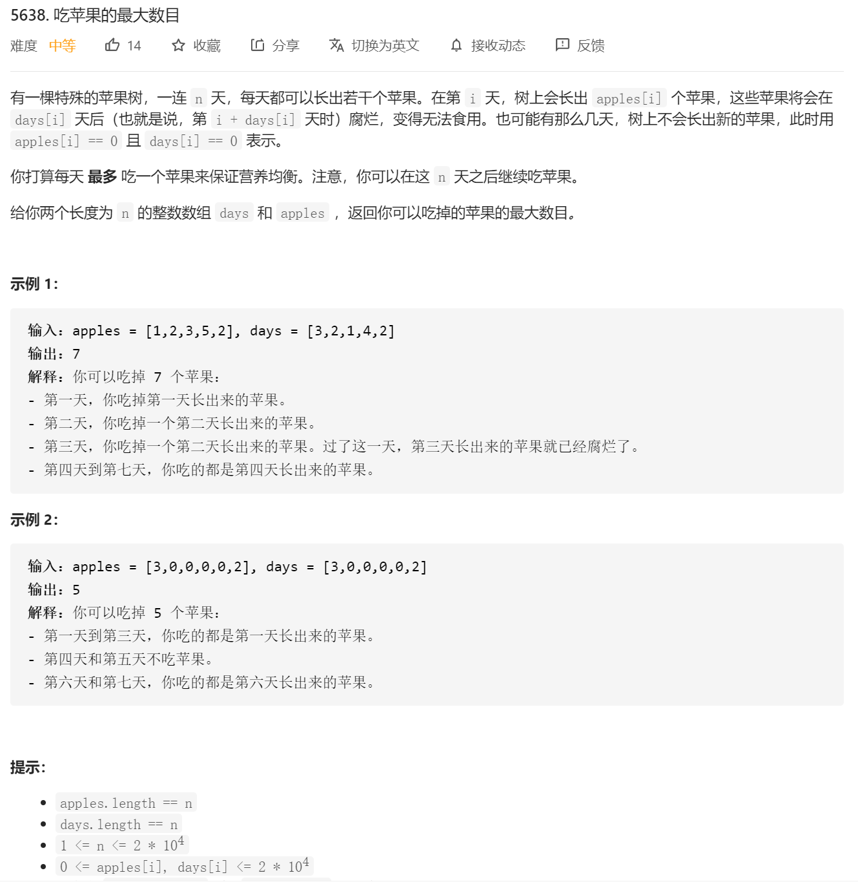

```java
class Solution {
    public int eatenApples(int[] apples, int[] days) {
         // 优先队列，队首是最早过期的  int[0]:苹果个数  int[1]:过期时间
        PriorityQueue<int[]> queue = new PriorityQueue<>((o1, o2) -> o1[1] < o2[1] ? -1 : 1);
        int eatNum=0;

        for(int i=0;i<apples.length||queue.size()>0;i++)//因为n天之后还可以吃苹果，所以迭代可以超过数组上限，直到队列里没有苹果可吃为止
        {
            //1.移除过期的苹果
            while(!queue.isEmpty())//判断队伍里面的元素
            {
                int [] apple=queue.peek();//取队伍头最容易过期的苹果
                if(apple[1]<=i)
                {
                    //如果days+i <=当前的i 就相当于过期了 比如 i=0 apple=32 day=1 那i=1的时候 就是过期了
                    queue.poll();//题目里面有 也就是说，第 i + days[i] 天时）腐烂
                }
                else
                {
                    //否则就得继续保留再队伍里面
                    break;
                }
            }

            //2.添加当天新长出来的苹果
            if(i<apples.length&&apples[i]>0)//当还在数组范围内的时候 且 当天的苹果量》0 天数也是大于0的
            {
                queue.add(new int[]{apples[i],i+days[i]});//题目：也就是说，第 i + days[i] 天时）腐烂
            }

            //准备开始吃苹果
            int[] apEat=queue.peek();
            if(apEat!=null&&apEat[0]>0)//如果当天是有苹果可吃
            {
                eatNum++;
                apEat[0]--;
                if(apEat[0]==0)
                {
                    //如果最早腐烂的吃完了
                    queue.poll();
                }
            }
        }

        return eatNum;

    }
}
```

