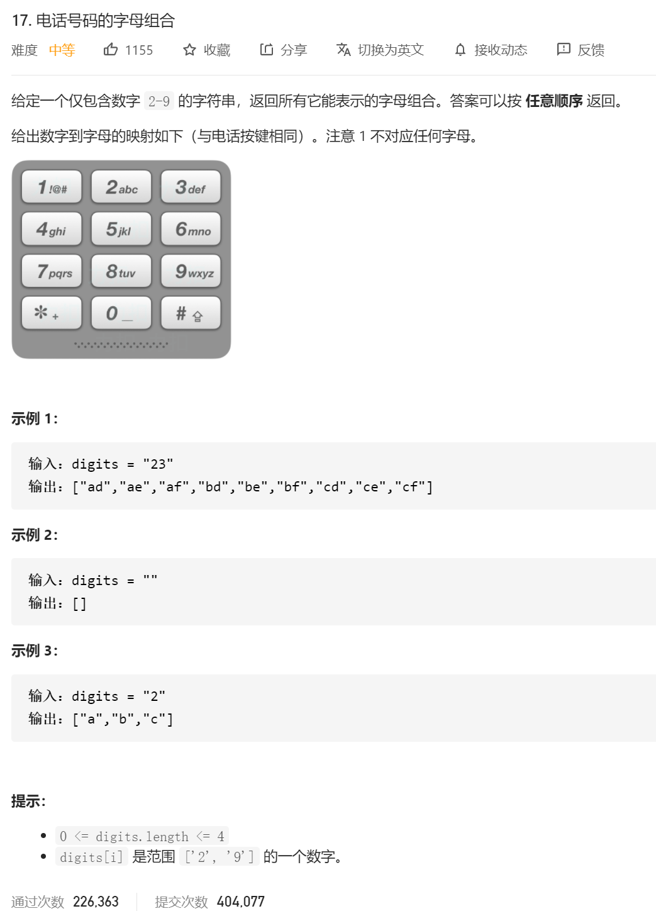
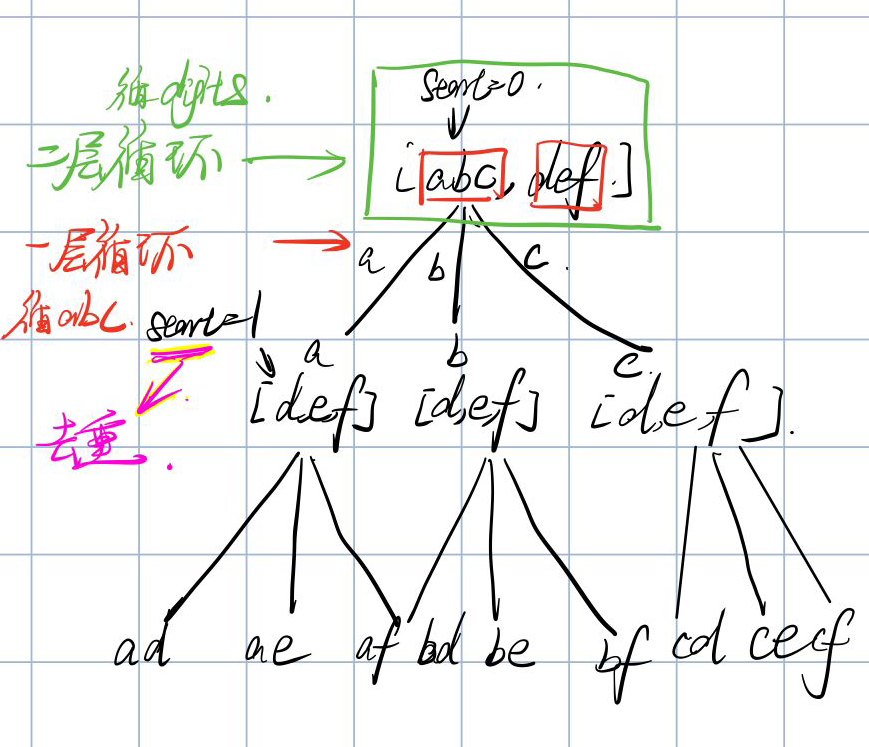

经典回溯问题。

这边判断一下，是不能有重复的，那就是要设定一个start的num，保证在下一层dfs的时候，不会再遍历到之前的数字。



这里可以简单分析一下 这里做dfs的思路：

1.确定dfs的回溯上去的条件：也就是 tempString.length==digits.length

2.假设只有一个字符，那就单纯只用一个循环，也就是 for(int i=0;i<String[index];i++) { dfs }

3.然后 考虑多个字符的情况，那就是要多一个for循环，for( for(int i=0;i<String[index];i++) { dfs })

4.在之后，就是考虑去重的情况，也就是我们要设定一个start，保证每次去重。

5.dfs里面的代码： dfs(res,sb.append(numString[digits.charAt(i)-'0'].charAt(j)),digits,i+1,numString);

6.记得撤销操作，sb.delete(sb.length()-1,sb.length());

最后代码：

```java
class Solution {
    public List<String> letterCombinations(String digits) {

        List<String> res=new LinkedList<>();
        String[] numString=new String[]{"","","abc","def","ghi","jkl","mno","pqrs","tuv","wxyz"};
        if(digits.length()==0)
        {
            return res;
        }

        StringBuilder sb=new StringBuilder();

        dfs(res,sb,digits,0,numString);


        return res;
    }

    public void dfs(List<String> res,StringBuilder sb,String digits,int start,String[] numString)
    {
        if(sb.length()==digits.length())
        {
            res.add(sb.toString());
            return;
        }

        for(int i=start;i<digits.length();i++)
        {
            for(int j=0;j<numString[digits.charAt(i)-'0'].length();j++)
            {
                dfs(res,sb.append(numString[digits.charAt(i)-'0'].charAt(j)),digits,i+1,numString);
                sb.delete(sb.length()-1,sb.length());//
            }

        }

    }
}
```


