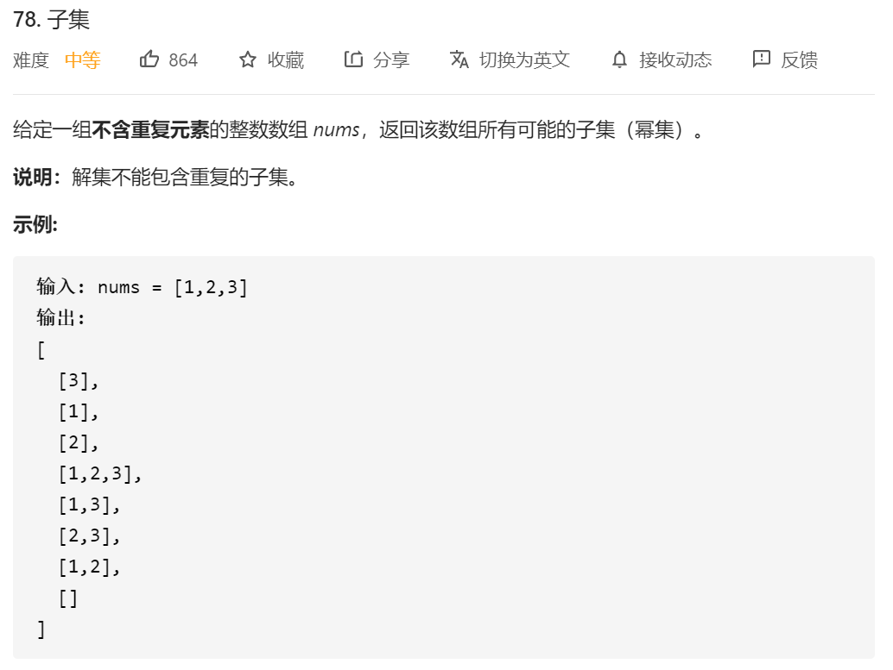
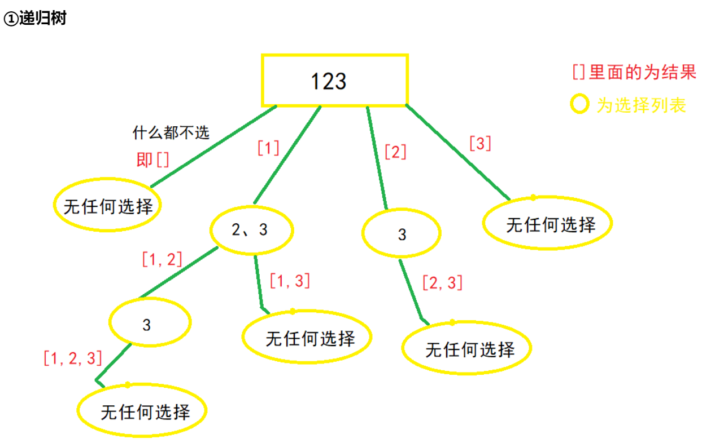
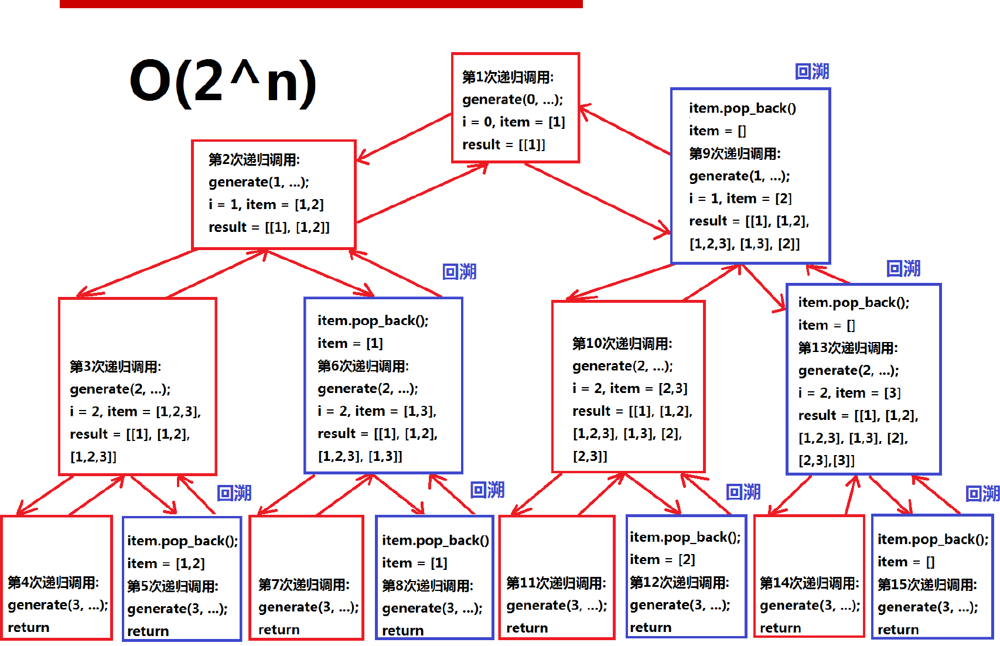
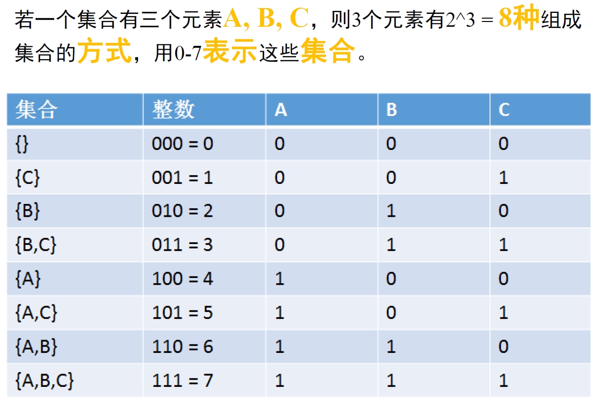
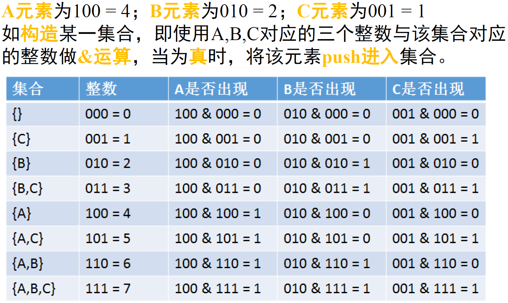
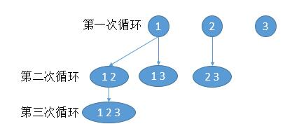

给一个数组，输出这个数组的所有子数组。

## 解法一 回溯法（最重要）

这篇有一篇回溯的总结写得非常的好：

https://leetcode-cn.com/problems/subsets/solution/c-zong-jie-liao-hui-su-wen-ti-lei-xing-dai-ni-gao-/

然后我参照的博客在：

https://leetcode.wang/leetCode-78-Subsets.html

根据经验，大佬（回溯总结的作者）总结了以下步骤：

①画出递归树，找到状态变量(回溯函数的参数)，这一步非常重要※
②根据题意，确立结束条件
③找准选择列表(与函数参数相关),与第一步紧密关联※
④判断是否需要剪枝
⑤作出选择，递归调用，进入下一层
⑥撤销选择

①所以本题的回溯树为：




观察上图可得，选择列表里的数，都是选择路径(红色框)后面的数，比如[1]这条路径，他后面的选择列表只有"2、3"，[2]这条路径后面只有"3"这个选择，那么这个时候，就应该使用一个参数start，来标识当前的选择列表的起始位置。也就是标识每一层的状态，因此被形象的称为"**状态变量**"（Start）,最终函数签名如下

```java
private void getAns(int[] nums, int start, ArrayList<Integer> temp, List<List<Integer>> ans)
```

②**找结束条件**
此题非常特殊，所有路径都应该加入结果集，所以不存在结束条件。或者说当 **start 参数越过数组边界的时候**，程序就自己跳过下一层递归了，因此不需要手写结束条件,直接加入结果集

```
**ans为结果集，是全局变量List<List<Integer>> ans,到时候要返回的
ans.add(temp);//把每一条路径加入结果集
```

③**找选择列表**
在①中已经提到过了，子集问题的选择列表，是上一条选择路径之后的数,即

```
for(int i=start;i<nums.size();i++)
```

④**判断是否需要剪枝**

从递归树中看到，路径没有重复的，也没有不符合条件的，所以不需要剪枝

**⑤做出选择(即for 循环里面的)**

```java
private void getAns(int[] nums, int start, ArrayList<Integer> temp, List<List<Integer>> ans) { 
    for (int i = start; i < nums.length; i++) {
        temp.add(nums[i]);//做出选择
        getAns(nums, i + 1, temp, ans);//递归进入下一层，注意i+1，标识下一个选择列表的开始位置，最重要的一步
    }
}
```

**⑤撤销选择**

```java
private void getAns(int[] nums, int start, ArrayList<Integer> temp, List<List<Integer>> ans) { 
    ans.add(new ArrayList<>(temp));
    for (int i = start; i < nums.length; i++) {
        temp.add(nums[i]);
        getAns(nums, i + 1, temp, ans);
        temp.remove(temp.size() - 1);//撤销选择 直接选择下一个
    }
}
```

总结代码：

```java
public List<List<Integer>> subsets(int[] nums) {
    List<List<Integer>> ans = new ArrayList<>();
    getAns(nums, 0, new ArrayList<>(), ans);
    return ans;
}

private void getAns(int[] nums, int start, ArrayList<Integer> temp, List<List<Integer>> ans) { 
    ans.add(new ArrayList<>(temp));
    for (int i = start; i < nums.length; i++) {
        temp.add(nums[i]);
        getAns(nums, i + 1, temp, ans);
        temp.remove(temp.size() - 1);
    }
}

```


## 解法二 递归法（换了一种递归）



如图的递归树所示

核心思想是：选一个数 或者不选一个数，然后向下进行回溯，我觉得没有之前那个代码来的好剪枝。

代码如下所示：

```java
class Solution {
    List<Integer> item = new ArrayList<Integer>();
    List<List<Integer>> res = new ArrayList<List<Integer>>();
    public List<List<Integer>> subsets(int[] nums) {
        res.add(new ArrayList<Integer>(item));
        // System.out.println(res);
        Generate(0,nums,item,res);
        return res;
    }


    public  void Generate(int i,int[] nums,List<Integer> item, List<List<Integer>>res)
    {
        if(i>=nums.length)
        {
            return;
        }
        item.add(nums[i]);
        // System.out.println(item);
        //注意 这边是得新建一个item对象的 不然会出现前面的数值也被更改的情况
        res.add(new ArrayList<Integer>(item));
        // System.out.println(res);

        Generate(i+1, nums,item,res);
        item.remove(item.size()-1);
        //这边递归 把前面的数给去掉之后 进行下一步递归 （也就是不取这个数，我直接取下一个）
        Generate(i+1, nums,item,res);
    }

}
```

## 解法三：位运算





```java
class Solution {
    public List<List<Integer>> subsets(int[] nums) {
         List<List<Integer>> res = new ArrayList<List<Integer>>();
        int AllSetNum= 1<<nums.length;

        for(int i=0;i<AllSetNum;i++)
        {
            List<Integer> item = new ArrayList<Integer>();
            for(int j=0;j< nums.length;j++)
            {
                if((i & (1 << j))!=0)
                {
                    item.add(nums[j]);
                }
            }
            res.add(new ArrayList<Integer>(item));
        }
        
        return res;
    }
}
```


## 解法四：循环解决（不是很好，感觉自己都写不出来）

和 [77 题](https://leetcode.windliang.cc/leetCode-77-Combinations.html)解法三一个思想，想找出数组长度 1 的所有解，然后再在长度为 1 的所有解上加 1 个数字变成长度为 2 的所有解，同样的直到 n。

假如 nums = [ 1, 2, 3 ]，参照下图。



```java
public List<List<Integer>> subsets(int[] nums) {
    List<List<Integer>> res = new ArrayList<List<Integer>>();
    List<List<Integer>> ans = new ArrayList<List<Integer>>();
    ans.add(new ArrayList<Integer>());
    res.add(new ArrayList<Integer>());
    int n = nums.length;
    // 第一层循环，子数组长度从 1 到 n
    for (int i = 1; i <= n; i++) {
        // 第二层循环，遍历上次的所有结果
        List<List<Integer>> tmp = new ArrayList<List<Integer>>();
        for (List<Integer> list : res) {
            // 第三次循环，对每个结果进行扩展
            for (int m = 0; m < n; m++) {
                //只添加比末尾数字大的数字，防止重复
                if (list.size() > 0 && list.get(list.size() - 1) >= nums[m])
                    continue;
                List<Integer> newList = new ArrayList<Integer>(list);
                newList.add(nums[m]);
                tmp.add(newList);
                ans.add(newList);
            }
        }
        res = tmp;
    }
    return ans;
}

```

