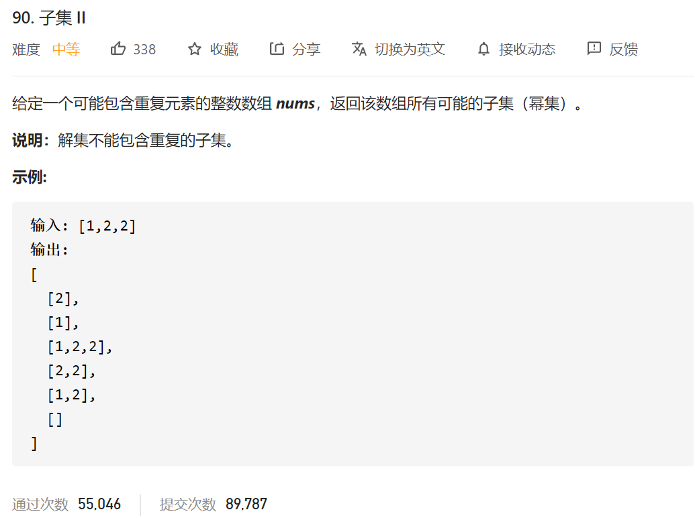
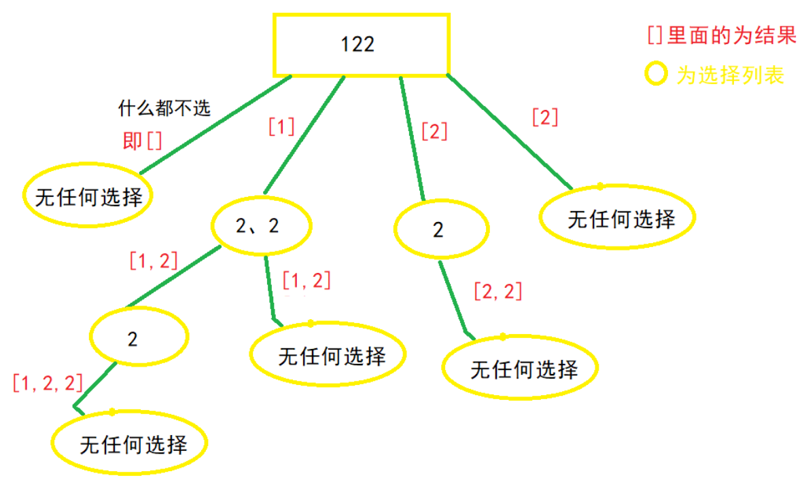
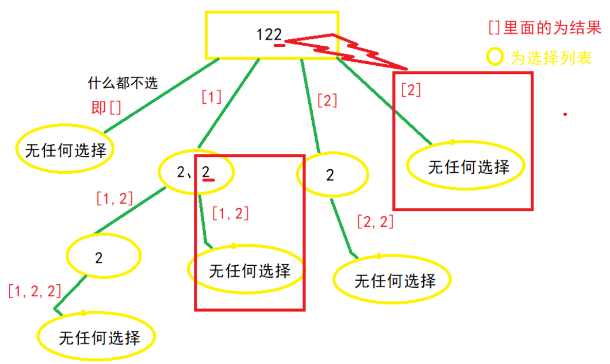
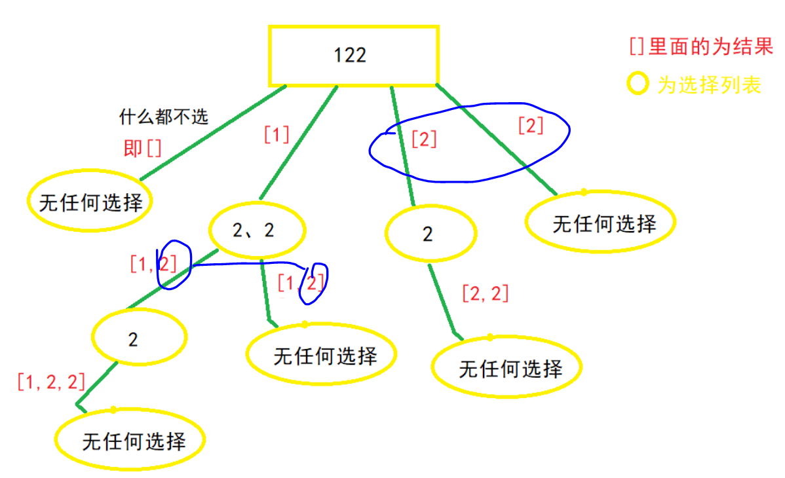

## 1.回溯法

根据之前的大佬的描述，我们按照大佬的思路来：

https://leetcode-cn.com/problems/subsets/solution/c-zong-jie-liao-hui-su-wen-ti-lei-xing-dai-ni-gao-/

**①递归树**



可以发现，树中出现了大量重复的集合，②和③和第一个问题一样，不再赘述，我们直接看第四步

**④判断是否需要剪枝**

**需要先对数组排序，使用**==排序函数 Arrays.sort(nums);==
（因为需要排除掉[1,2],[2,1] 这种子集的情况，可以根据递归树自己画一下。）
显然我们需要去除重复的集合，即需要剪枝，把递归树上的某些分支剪掉。那么应去除哪些分支呢？又该如何编码呢？

**观察上图不难发现，应该去除当前选择列表中，与上一个数重复的那个数，引出的分支，如 “2，2” 这个选择列表，第二个 “2” 是最后重复的，应该去除这个 “2” 引出的分支**




(去除图中红色大框中的分支)
编码呢，刚刚说到是 “去除当前选择列表中，与上一个数重复的那个数，引出的分支”，说明当前列表最少有两个数，当i>start时，做选择的之前，比较一下当前数，与上一个数 (i-1) 是不是相同，相同则 continue,
结合图来看，就是同一层递归树，不要有相同的数字了。



如图所示，**同一层**都**不要有一样**的数了，这样就能避免子集重复。剪枝操作就能完成。

代码：

⑤**做出选择**

```java
private void getAns(int[] nums, int start, ArrayList<Integer> temp, List<List<Integer>> ans) { 
    for (int i = start; i < nums.length; i++) {
    	if((i>start)&&(nums[i]==nums[i-1]))//(i>start)同一层的除第一个的其它元素。
        {//这步为了剪枝去重
            continue;
        }
    
        temp.add(new ArrayList<Integer>((nums[i]));//做出选择
        getAns(nums, i + 1, temp, ans);//递归进入下一层，注意i+1，标识下一个选择列表的开始位置，最重要的一步
    }
}
```

**⑥撤销选择**

```java
private void getAns(int[] nums, int start, ArrayList<Integer> temp, List<List<Integer>> ans) { 
    for (int i = start; i < nums.length; i++) {
    	if((i>start)&&(nums[i]==nums[i-1]))//(i>start)同一层的除第一个的其它元素。
        {//这步为了剪枝去重
            continue;
        }
    
        temp.add(new ArrayList<Integer>(nums[i]));//做出选择
        getAns(nums, i + 1, temp, ans);//递归进入下一层，注意i+1，标识下一个选择列表的开始位置，最重要的一步
        temp.remove(temp.size()-1);//做出选择
    }
}
```


