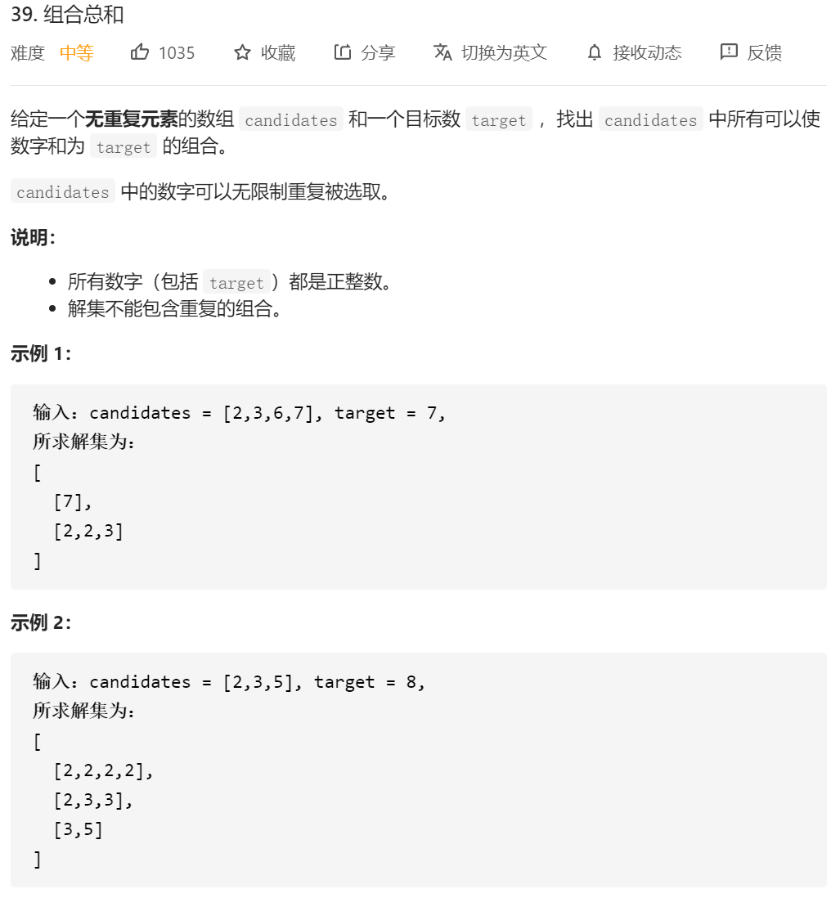
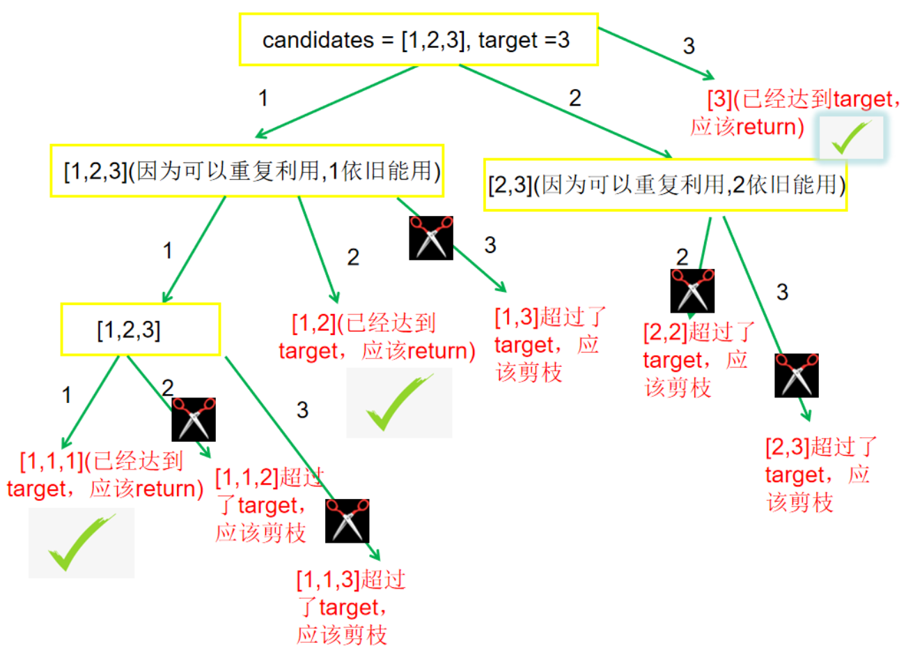

首先按照大佬给的思路，我们先生成递归树：



其实可以发现这几个点：

1.我们递归的时候，下一个的递归是从**start开始**的；
2.只有满足sum==target的时候，我们才会去将集合放入res中
3.当sum>target的时候，直接返回。
4.由于没有重复的数字，我们这边不需要排序和剪枝
对应的操作：
**1.我们递归的时候，下一个的递归是从start开始的；**

```java
 Generate3(i,nums,item,res,target,sum);//这边的开始寻找是从自身开始寻找，可以发现我们这边的递归是按1开头，2开头 这样的顺序递归下去的
```

**2.只有满足sum==target的时候，我们才会去将集合放入res中**

```java
if(sum==target)
 {
     res.add(new ArrayList<Integer>(item));
     return;
 }
```

**3.当sum>target的时候，直接返回。**

```java
 	 if(sum>target)
        {
            return;
        }
```

总结代码：

```java
class Solution {
    public List<List<Integer>> combinationSum(int[] candidates, int target) {
        List<Integer> item = new ArrayList<Integer>();
        List<List<Integer>> res = new ArrayList<List<Integer>>();//没有重复元素就是list
//        Arrays.sort(nums);
        if(candidates.length==0)
        {
            return res;
        }
        Generate3(0,candidates,item,res,target,0);
        return res;

    }

     public  void Generate3(int start,int[] nums,List<Integer> item, List<List<Integer>> res,int target,int sum)
    {
        //这边的判断都是针对上一个的sum 如果把这个写到循环体内的话，直接return会导致我缺少后撤这个数字的情况
        if(sum==target)
        {
            res.add(new ArrayList<Integer>(item));
            return;
        }
        if(sum>target)
        {
            return;
        }
        for(int i=start;i<nums.length;i++)
        {
            if(nums[i]>target)
            {
                continue;
            }
            sum=sum+nums[i];
            item.add(nums[i]);

            Generate3(i,nums,item,res,target,sum);//这边的开始寻找是从自身开始寻找，可以发现我们这边的递归是按1开头，2开头 这样的顺序递归下去的
            item.remove(item.size()-1);
            sum=sum-nums[i];
        }

    }
}
```


