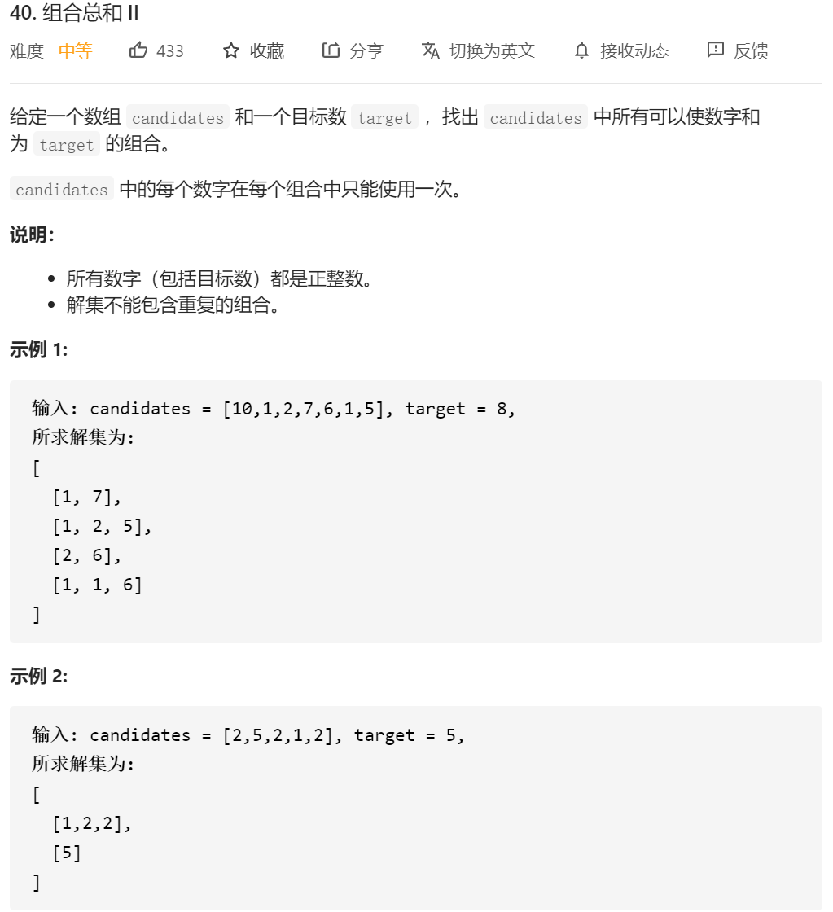

和39的差异在于这边是有重复的数字的，那其实相当于是39+90的一个结合。

1.我们需要判断每个子集是否满足了sum==target，满足了 加入集合 然后（在下一次递归的时候）return，表示不需要加下一个数了。
2.如果sum>target了，也是在进入下一步的时候return
3.由于题目要求的是一个数不能进行重复的情况，所以递归还是从i+1开始递归
4.排序，剪枝操作：剪枝操作：步骤1，2，然后是**同一行的去重**；然后凡事需要剪枝的，且数字不需要重复的那种，基本都是需要**排序**的

综上，结合题39和40，代码如下：

```java
class Solution {
    public List<List<Integer>> combinationSum2(int[] candidates, int target) {
        if (candidates == null || candidates.length <= 0 || target <= 0) {
            return null;
        }

        List<Integer> item = new ArrayList<Integer>();
        List<List<Integer>> res = new ArrayList<List<Integer>>();//没有重复元素就是list
        Arrays.sort(candidates);
        Generate4(0,candidates,item,res,target,0);
        return res;
    }

    public  void Generate4(int start,int[] nums,List<Integer> item, List<List<Integer>> res,int target,int sum)
    {
        //这边的判断都是针对上一个的sum 如果把这个写到循环体内的话，直接return会导致我缺少后撤这个数字的情况
        if(sum==target)
        {
            res.add(new ArrayList<Integer>(item));
            return;
        }
        if(sum>target)
        {
            return;
        }
        for(int i=start;i<nums.length;i++)
        {
            if(nums[i]>target||((i>start)&&(nums[i]==nums[i-1])))//这边就是经典的90题的剪枝操作 把同行的相同的给去掉
            {
                continue;
            }
            sum=sum+nums[i];
            item.add(nums[i]);

            Generate4(i+1,nums,item,res,target,sum);//从下一个开始找 因为这边是不能重复使用自己的 是需要排序的
            item.remove(item.size()-1);
            sum=sum-nums[i];
        }

    }
}
```

