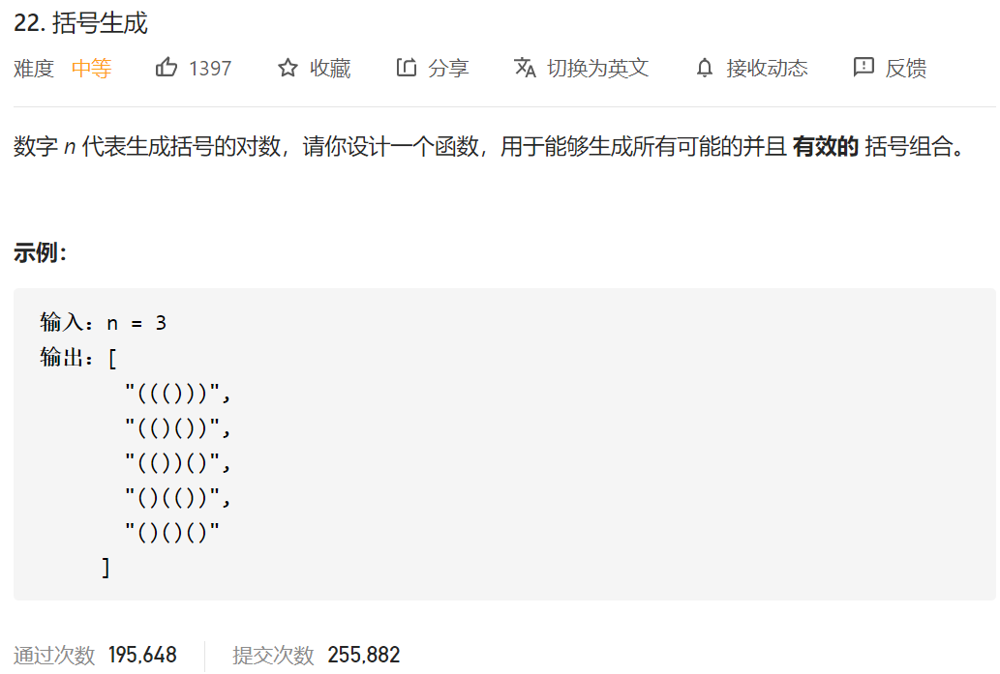

很别样的一题回溯题目。

写这题的时候，先要考虑一下，如果给了n=3，如何将所有的情况都给回溯出来？

```java
public  void Generate(List<String> res,String temp,temp.length(),int num){
        if(temp.length()==(num*2))
        {
            // System.out.println(temp);
            res.add(temp);
            return;// 满足条件 返回
        }
            Generate(res,temp+'(',temp.length(),num);//添加（ 继续递归
            Generate(res,temp+')',temp.length(),num);//添加 ） 继续递归
    }
```

限制条件：

1.左括号和右括号的数量不能大于n
2.右括号的数量必须小于左括号

所以 先考虑左括号，然后再考虑右括号，甚至不需要反悔操作。

综上总的代码为：

```java
class Solution {
    public List<String> generateParenthesis(int n) {
        List<String> res = new ArrayList<String>();
        String temp="";

        int leftNum=n;
        int rightNum=n;

        Generate(res,temp,leftNum,rightNum,n);

        return res;
    }

    public  void Generate(List<String> res,String temp,int leftNum,int rightNum,int num){
        if(temp.length()==(num*2))
        {
            // System.out.println(temp);
            
            res.add(temp);
            return;
        }
        if(leftNum>0)//只要还有左括号
        {
//            System.out.println(temp);
            Generate(res,temp+'(',leftNum-1,rightNum,num);
        }
        if(rightNum>leftNum)//只有右括号数目剩下的大于左括号数目的时候，才考虑加入右括号
        {
//            System.out.println(temp);
            Generate(res,temp+')',leftNum,rightNum-1,num);
        }
    }
}
```

