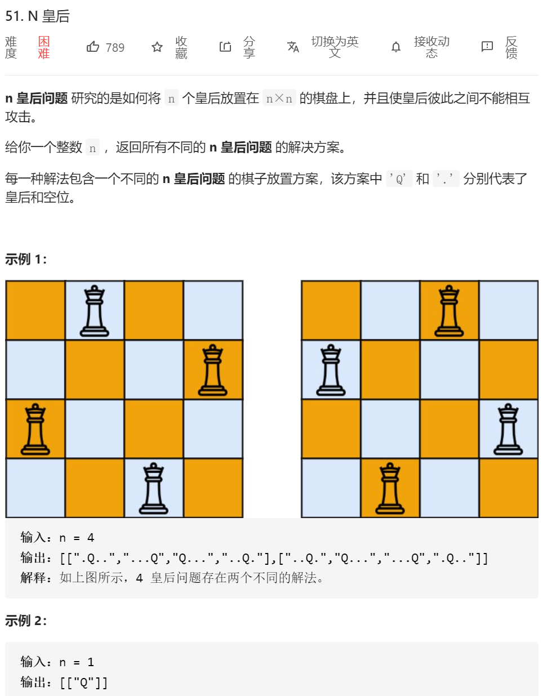
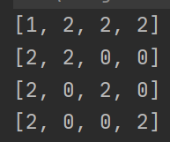

思路：经典回溯

1.对第一行放置一个皇后，然后把这个皇后的上下左右斜边全部给划掉。



2.然后往第二行去放置…… 然后第三 …… 第四行……  如果中途直接没地方放皇后了，就直接往上返回。

3.返回条件：1.没地方放皇后了，自动返回（回溯），尝试下一种放置。2，如果depth=数组的维度n（数组下标0 — n-1）那说明之前能够到达第n层，直接放置结果，然后返回。

自己写的代码：

```java
class Solution {
   public List<List<String>> solveNQueens(int n) {
        List<List<String>> res=new ArrayList<>();

        int nnArray[][]=new int[n][n];
        //矩阵定义：0 可以放置皇后  1：放置皇后  2：不能放置皇后
        for(int i=0;i<n;i++)
        {
            for(int j=0;j<n;j++)
            {
                nnArray[i][j]=0;
            }
        }
        dfs(res,nnArray, 0,n);

        // System.out.println(res);


        return res;
    }


    public void putInRes(List<List<String>> res,int arr[][])//将一个二维数组转化为
    {
        List<String> temp=new ArrayList<String>();
        for(int i=0;i< arr.length;i++)
        {
            StringBuilder sb=new StringBuilder();
            for(int j=0;j<arr.length;j++)
            {
                if(arr[i][j]==1)
                {
                    sb.append("Q");
                }else
                {
                    sb.append(".");
                }
            }
            temp.add(sb.toString());
        }
        res.add(temp);
    }
    
    public void dfs(List<List<String>> res,int arr[][],int depth,int arrLength)
    {
        if(depth==arrLength)
        {
            putInRes(res,arr);
            //res.add(arr[][]);
//            printArr(arr);
//            System.out.println();
            return;
        }

        int arrCopy[][]=new int[arr.length][arr.length];


        for(int i=0;i<arr.length;i++)
        {
            if(arr[depth][i]==0)
            {
                //说明这个地方可以放置棋子
                for(int ii=0;ii<arrLength;ii++)
                {
                    for(int jj=0;jj<arrLength;jj++)
                    {
                        arrCopy[ii][jj]=arr[ii][jj];
                    }
                }
                //先搞一个副本
                putQueue(arrCopy,depth,i);//然后我对这个副本进行放皇后 然后再把这个皇后给放进去
                dfs(res,arrCopy,depth+1,arrLength);

            }
        }
    }


    public void putQueue(int nnArray[][],int x,int y)//放置皇后 函数
    {
        if(nnArray[x][y]==2||nnArray[x][y]==1)
        {
            return;
        }

        for(int i=0;i<nnArray.length;i++)
        {
            for(int j=0;j<nnArray.length;j++)
            {
                if(i==x||j==y||(Math.abs(i-x)==Math.abs(j-y)))
                {
                    nnArray[i][j]=2;
                }

            }
        }

        nnArray[x][y]=1;
    }

    private static void printArr(int[][] nums) {
        for (int i = 0; i < nums.length; i++) {
            System.out.println(Arrays.toString(nums[i]));
        }
    }
    
}
```


然后看看那大佬们的代码：（我感觉还是的代码方便输出看结果）

```java
class Solution {
       public List<List<String>> solveNQueens(int n) {
        char[][] chess = new char[n][n];
        //初始化数组
        for (int i = 0; i < n; i++)
            for (int j = 0; j < n; j++)
                chess[i][j] = '.';
        List<List<String>> res = new ArrayList<>();
        solve(res, chess, 0);
        return res;
    }

    private void solve(List<List<String>> res, char[][] chess, int row) {
        //终止条件，最后一行都走完了，说明找到了一组，把它加入到集合res中
        if (row == chess.length) {
            res.add(construct(chess));
            return;
        }
        //遍历每一行
        for (int col = 0; col < chess.length; col++) {
            //判断这个位置是否可以放皇后
            if (valid(chess, row, col)) {
                //数组复制一份
                char[][] temp = copy(chess);
                //在当前位置放个皇后
                temp[row][col] = 'Q';
                //递归到下一行继续
                solve(res, temp, row + 1);
            }
        }
    }

    //把二维数组chess中的数据测下copy一份
    private char[][] copy(char[][] chess) {
        char[][] temp = new char[chess.length][chess[0].length];
        for (int i = 0; i < chess.length; i++) {
            for (int j = 0; j < chess[0].length; j++) {
                temp[i][j] = chess[i][j];
            }
        }
        return temp;
    }

    //row表示第几行，col表示第几列
    private boolean valid(char[][] chess, int row, int col) {
        //判断当前列有没有皇后,因为他是一行一行往下走的，
        //我们只需要检查走过的行数即可，通俗一点就是判断当前
        //坐标位置的上面有没有皇后
        for (int i = 0; i < row; i++) {
            if (chess[i][col] == 'Q') {
                return false;
            }
        }
        //判断当前坐标的右上角有没有皇后
        for (int i = row - 1, j = col + 1; i >= 0 && j < chess.length; i--, j++) {
            if (chess[i][j] == 'Q') {
                return false;
            }
        }
        //判断当前坐标的左上角有没有皇后
        for (int i = row - 1, j = col - 1; i >= 0 && j >= 0; i--, j--) {
            if (chess[i][j] == 'Q') {
                return false;
            }
        }
        return true;
    }

    //把数组转为list
    private List<String> construct(char[][] chess) {
        List<String> path = new ArrayList<>();
        for (int i = 0; i < chess.length; i++) {
            path.add(new String(chess[i]));
        }
        return path;
    }


}
```


