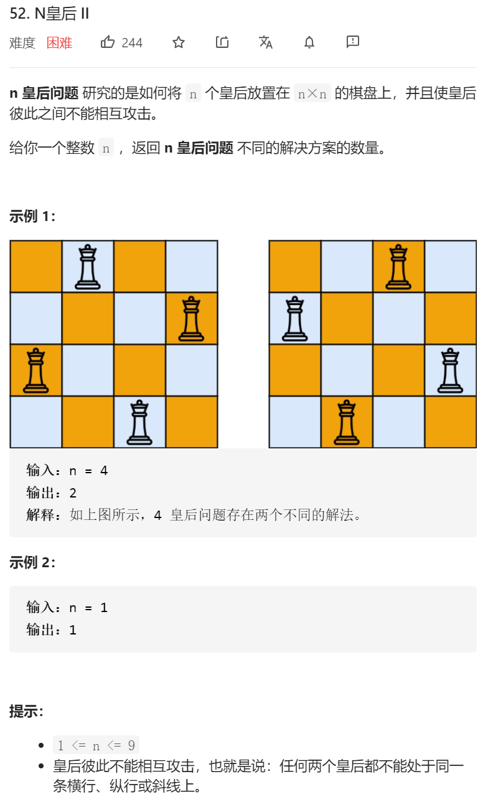

思路：和之前的一样。就吧数组变成需要的int数字就行了。（下一次刷的时候可以看看优化啥的）

```java
class Solution {
     public int res=0;
    public int totalNQueens(int n) {

//        List<Integer> res=new ArrayList<>();

        int nnArray[][]=new int[n][n];
        //矩阵定义：0 可以放置皇后  1：放置皇后  2：不能放置皇后
        for(int i=0;i<n;i++)
        {
            for(int j=0;j<n;j++)
            {
                nnArray[i][j]=0;
            }
        }

        dfs(res,nnArray, 0,n);

        // System.out.println(res);


        return res;
    }


    public void putInRes(List<List<String>> res,int arr[][])
    {
        List<String> temp=new ArrayList<String>();
        for(int i=0;i< arr.length;i++)
        {
            StringBuilder sb=new StringBuilder();
            for(int j=0;j<arr.length;j++)
            {
                if(arr[i][j]==1)
                {
                    sb.append("Q");
                }else
                {
                    sb.append(".");
                }
            }
            temp.add(sb.toString());
        }
        res.add(temp);
    }

    public void dfs(int res,int arr[][],int depth,int arrLength)
    {
        if(depth==arrLength)
        {
//            System.out.println("ok");
//            putInRes(res,arr);

            this.res=this.res+1;
            //res.add(arr[][]);
//            printArr(arr);
//            System.out.println();
            return;
        }

        int arrCopy[][]=new int[arr.length][arr.length];


        for(int i=0;i<arr.length;i++)
        {
            if(arr[depth][i]==0)
            {
                //说明这个地方可以放置棋子
                for(int ii=0;ii<arrLength;ii++)
                {
                    for(int jj=0;jj<arrLength;jj++)
                    {
                        arrCopy[ii][jj]=arr[ii][jj];
                    }
                }
                //先搞一个副本
                putQueue(arrCopy,depth,i);
                dfs(this.res,arrCopy,depth+1,arrLength);

            }

        }

    }


    public void putQueue(int nnArray[][],int x,int y)
    {
        if(nnArray[x][y]==2||nnArray[x][y]==1)
        {
            return;
        }

        for(int i=0;i<nnArray.length;i++)
        {
            for(int j=0;j<nnArray.length;j++)
            {
                if(i==x||j==y||(Math.abs(i-x)==Math.abs(j-y)))
                {
                    nnArray[i][j]=2;
                }

            }
        }

        nnArray[x][y]=1;
    }

}
```

