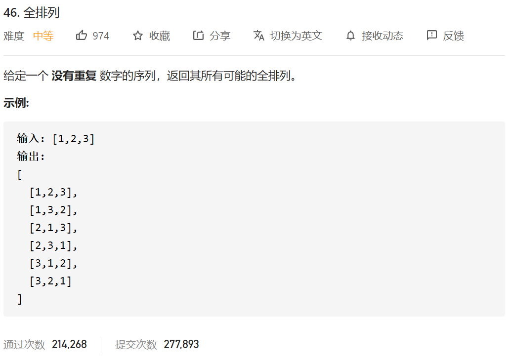
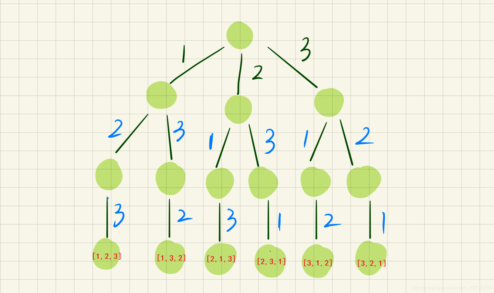

本题的递归树为：



(最下面的叶子节点，红色【】中的就是要求的结果)
然后我们来回想一下，整个问题的思考过程，这棵树是如何画出来的。首先，我们固定1，然后只有2、3可选：如果选2，那就只剩3可选，得出结果[1,2,3]；如果选3，那就只剩2可选，得出结果[1,3,2]。再来，如果固定2，那么只有1,3可选：如果选1，那就只剩3，得出结果[2,1,3].....
有没有发现一个规律：如果我们固定了(选择了)某个数，那么他的下一层的选择列表就是——除去这个数以外的其他数！！\比如，第一次选择了2，那么他的下一层的选择列表只有1和3；如果选择了3，那么他的下一层的选择列表只有1和2,那么这个时候就要引入一个used数组来记录使用过的数字，算法签名如下

```java
 public void Generate(int nums[],int flag[],List<Integer> item,List<List<Integer>> res )
```

#### ②找结束条件

```java
if(item.size()==nums.length)
        {
             // System.out.println(item);
            res.add(new ArrayList<Integer>(item));
            return;
        }
```

### ③找准选择列表

```java
for(int i=0;i<nums.size();i++)
{
    if(flag[i]==0)//从给定的数中除去用过的，就是当前的选择列表  flag表示未被使用
    {
    }
}
```

### ④判断是否需要剪枝

不需要剪枝，或者你可以认为，flag[i]==0已经是剪枝

### ⑤做出选择

```java
for(int i=0;i<nums.size();i++)
{
    if(!used[i])//从给定的数中除去用过的，就是当前的选择列表
    {
         item.add(nums[i]);
                flag[i] = 1;
                Generate(nums,flag,item,res);
    }
}
```

#### ⑥撤销选择

整体代码如下

```java
class Solution {
    public List<List<Integer>> permute(int[] nums) {

        List<Integer> item = new ArrayList<Integer>();
        List<List<Integer>> res = new ArrayList<List<Integer>>();//没有重复元素就是list
        int flag[]=new int[nums.length];
        Generate(nums,flag,item,res);

        return res;
    }

     public void Generate(int nums[],int flag[],List<Integer> item,List<List<Integer>> res )
    {
        if(item.size()==nums.length)
        {
            // System.out.println(item);
            res.add(new ArrayList<Integer>(item));
            return;
        }

        for(int i=0;i<nums.length;i++)
        {
            if(flag[i]==0) {
                item.add(nums[i]);
                flag[i] = 1;
                Generate(nums,flag,item,res);
                flag[i] = 0;
                item.remove(item.size()-1);
            }
        }

    }


}
```

# 总结：可以发现“排列”类型问题和“子集、组合”问题不同在于：“排列”问题使用used数组来标识选择列表，而“子集、组合”问题则使用start参数