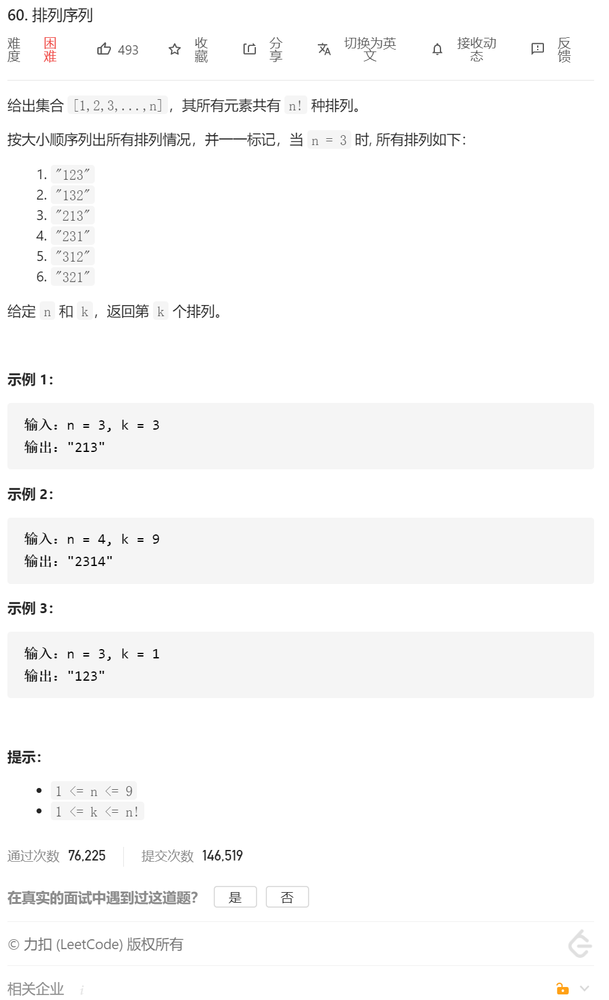
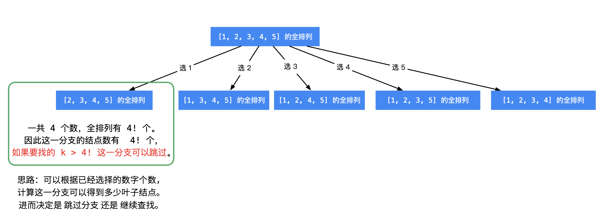

自己的思路：

全排列，排列过程中记录count，如果到达了需要计算的count，就不需要回溯了，直接返回。

自己的代码：

```java
class Solution {
     public int count=0;
    public void dfs(int nums[],int flag[],List<Integer> temp,List<List<Integer>> res,int count,int k)
    {

//        System.out.println(this.count);
        if(this.count==k)
        {
            return;
        }
        if(temp.size()==nums.length)
        {
            res.add(new ArrayList<>(temp));
            this.count++;
            return;
        }

        for(int i=0;i< nums.length;i++)
        {
            if(flag[i]==0)
            {
                temp.add(nums[i]);
                flag[i]=1;
                dfs(nums,flag,temp,res,this.count,k);
                flag[i]=0;
                temp.remove(temp.size()-1);
            }
        }


    }

    public String getPermutation(int n, int k) {
        int nums[]=new int[n];
        for(int i=0;i<n;i++)
        {
            nums[i]=i+1;
        }

//        for(int i=0;i<n;i++)
//        {
//            System.out.println(nums[i]);
//        }

        List<List<Integer>> res=new ArrayList<>();
        List<Integer> tempRes=new ArrayList<>();
        int flag[]=new int[nums.length];

        dfs(nums,flag,tempRes,res,this.count,k);
        //    System.out.println(res.get(k).toString());

        StringBuilder sb=new StringBuilder();
        for(int i=0;i<res.get(k-1).size();i++)
        {
            sb.append(res.get(k-1).get(i));
        }
        // System.out.println(sb.toString());
        String res2=sb.toString();
        return res2;

    }
}
```


dalao的题解：

一句话题解：以下给出了两种方法，思路其实是一样的：通过 **计算剩余数字个数的阶乘数**，一位一位选出第 `k` 个排列的数位。

**思路分析**：容易想到，使用同「力扣」第 46 题： [全排列](https://leetcode-cn.com/problems/permutations/) 的回溯搜索算法，依次得到全排列，输出第 k*k* 个全排列即可。事实上，我们不必求出所有的全排列。

基于以下几点考虑：

所求排列 一定在叶子结点处得到，进入每一个分支，可以根据已经选定的数的个数，进而计算还未选定的数的个数，然后计算阶乘，就知道这一个分支的 叶子结点 的个数：
	如果 kk 大于这一个分支将要产生的叶子结点数，直接跳过这个分支，这个操作叫「剪枝」；
	如果 kk 小于等于这一个分支将要产生的叶子结点数，那说明所求的全排列一定在这一个分支将要产生的叶子结点里，需要递归求解。



下面以示例 2：输入: n = 4*n*=4，k = 9*k*=9，介绍如何使用「回溯 + 剪枝」的思想得到输出 `"2314"`。

编码注意事项：

计算阶乘的时候，可以使用循环计算。注意：0!=1，它表示了没有数可选的时候，即表示到达叶子结点了，排列数只剩下 11 个；
题目中说「给定 nn 的范围是 [1, 9][1,9]」，可以把从 00 到 99 的阶乘计算好，放在一个数组里，可以根据索引直接获得阶乘值；
编码的时候，+1 还是 −1 ，大于还是大于等于，这些不能靠猜。常见的做法是：代入一个具体的数值，认真调试。

```java
import java.util.Arrays;
/*
	优化思路主要是排除前面不可能的情况，剪枝
	然后从应该开始的地方开始
	比如
	1 2 3 4  #1
	1 2 4 3  #2
	1 3 2 4  #3
	1 3 4 2  #4
	1 4 2 3  #5
	1 4 3 2  #6
	//------
	2 1 3 4  #7
	2 1 4 3  #8
	2 3 1 4  #9
	2 3 4 1  #10
	2 4 1 3  #11
	2 4 3 1  #12
	//----
	3 1 2 4
	
	1 2 3 4   N = 4 K 9
*/

作者：venturekwok
链接：https://leetcode-cn.com/problems/permutation-sequence/solution/javachao-hao-li-jie-ti-gong-zhu-shi-xiang-xi-de-yo/
来源：力扣（LeetCode）
著作权归作者所有。商业转载请联系作者获得授权，非商业转载请注明出处。
public class Solution {

    /**
     * 记录数字是否使用过
     */
    private boolean[] used;

    /**
     * 阶乘数组
     */
    private int[] factorial;

    private int n;
    private int k;

    public String getPermutation(int n, int k) {
        this.n = n;
        this.k = k;
        calculateFactorial(n);

        // 查找全排列需要的布尔数组
        used = new boolean[n + 1];
        Arrays.fill(used, false);

        StringBuilder path = new StringBuilder();
        dfs(0, path);
        return path.toString();
    }


    /**
     * @param index 在这一步之前已经选择了几个数字，其值恰好等于这一步需要确定的下标位置
     * @param path
     */
    private void dfs(int index, StringBuilder path) {
        if (index == n) {
            return;
        }

        // 计算还未确定的数字的全排列的个数，第 1 次进入的时候是 n - 1
        int cnt = factorial[n - 1 - index];
        for (int i = 1; i <= n; i++) {
            if (used[i]) {
                continue;
            }
            if (cnt < k) {
                k -= cnt;
                continue;
            }
            path.append(i);
            used[i] = true;
            dfs(index + 1, path);
            // 注意 1：不可以回溯（重置变量），算法设计是「一下子来到叶子结点」，没有回头的过程
            // 注意 2：这里要加 return，后面的数没有必要遍历去尝试了
            return;
        }
    }

    /**
     * 计算阶乘数组
     *
     * @param n
     */
    private void calculateFactorial(int n) {
        factorial = new int[n + 1];
        factorial[0] = 1;
        for (int i = 1; i <= n; i++) {
            factorial[i] = factorial[i - 1] * i;
        }
    }
}


```

