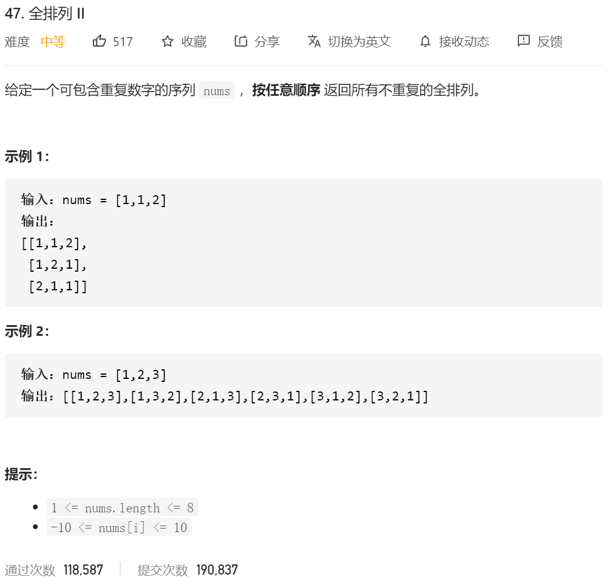
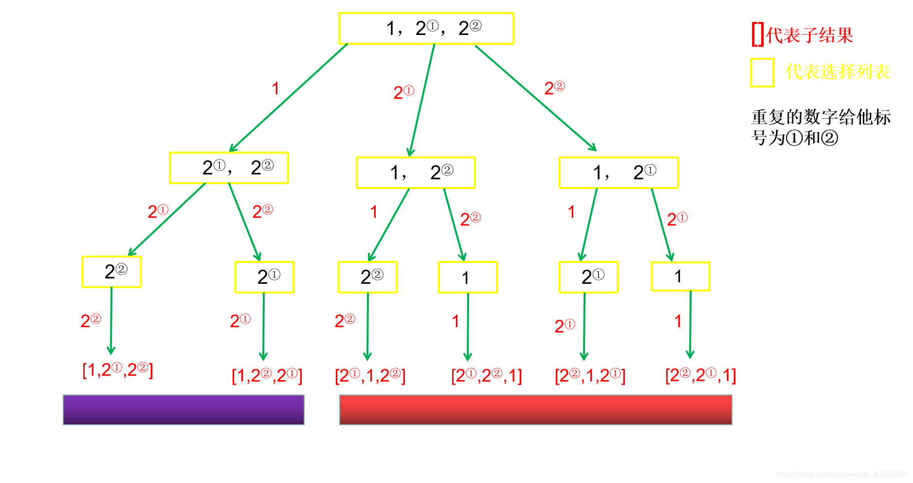
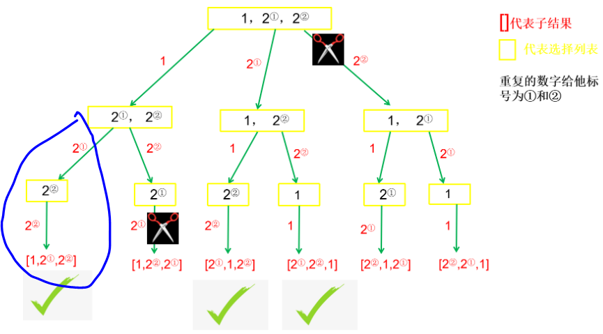
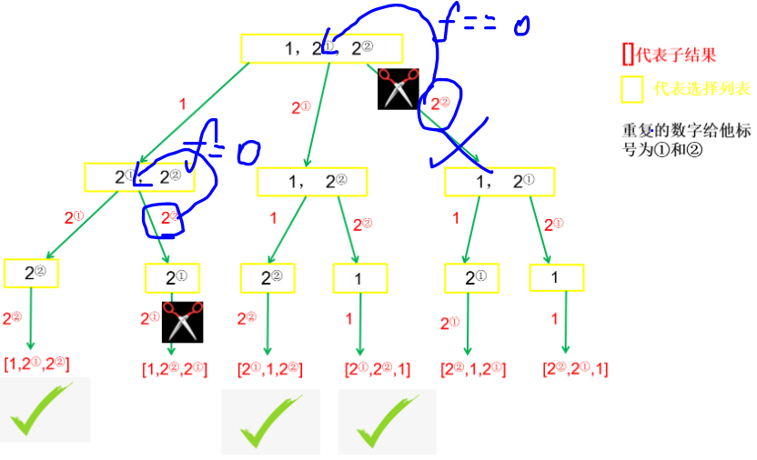

很明显又是一个“重复”问题，在上一篇文章C++ 总结了回溯问题类型 带你搞懂回溯算法(大量例题)的例题B中，当遇到有重复元素求子集时，先对nums数组的元素**排序**，再用**if(i>start&&nums[i]==nums[i-1])**来判断是否剪枝，那么在排列问题中又该怎么做呢？

### 解题步骤

#### ①递归树

依旧要画递归树，判断在哪里剪枝。这个判断不是凭空想出来，而是看树上的重复部分，而归纳出来的



可以看到，有两组是各自重复的，那么应该剪去哪条分支？首先要弄懂，重复结果是怎么来的，比如最后边的分支，选了第二个2后，,竟然还能选第一个2，从而导致最右边整条分支都是重复的.


②③不再赘述，直接看④

④判断是否需要剪枝，如何编码
有了前面“子集、组合”问题的判重经验，同样首先要对题目中给出的nums数组排序，让重复的元素并列排在一起，在if(i>start&&nums[i]==nums[i-1])，基础上修改为if(i>0&&nums[i]=nums[i-1]&&!used[i-1])，语义为：当i可以选第一个元素之后的元素时(因为如果i=0，即只有一个元素，哪来的重复？有重复即说明起码有**两个元素或以上**,i>0)，然后判断当**前元素是否和上一个元素相同**？如果相同，再**判断上一个元素是否能用**？如果三个条件都满足，那么该分支一定是重复的，应该剪去。

其实这边最后加的used[i-1],真正回归到【1，2，2】这个例子中的时候，能发现，是为了避免第一次递归的时候，再1，2，2第一次出现的时候就直接返回了。



由于全排列和组合不一样，

**组合**是通过start来进行递归的，组合再进入（第二个）2的时候，start就是2了，那条件i>start,就保证了在遍历第二个2的时候，就不会去判断到nums[i-1]了。所以直接就能进入下一个。

**排列**是通过flag[i]来进行判断的，所以每一次都是从0开始进行递归，所以前提的条件必须是之前的数没有被flag标记过。（如小图所示）



给出最终代码:

```java
class Solution {
    public List<List<Integer>> permuteUnique(int[] nums) {
         List<Integer> item = new ArrayList<Integer>();
        List<List<Integer>> res = new ArrayList<List<Integer>>();//没有重复元素就是list
        Arrays.sort(nums);
        int flag[]=new int[nums.length];
        Generate(nums,flag,item,res);

        return res;
    }


     public void Generate(int nums[],int flag[],List<Integer> item,List<List<Integer>> res )
    {
        if(item.size()==nums.length)
        {
//            System.out.println(item);
            res.add(new ArrayList<Integer>(item));
            return;
        }

        for(int i=0;i<nums.length;i++)
        {

            if(flag[i]==0) {
                // System.out.println(item);
                if(i>0&&(nums[i]==nums[i-1])&&(flag[i-1]==0))////前后数字相等 且前一个数处于未访问状态的时候(其实处于访问状态也是可以的 就是剪枝的效果不太一样)
                {
                    continue;
                }
                item.add(nums[i]);
                flag[i] = 1;
                Generate(nums,flag,item,res);
                flag[i] = 0;
                item.remove(item.size()-1);
            }
        }

    }


}
```


