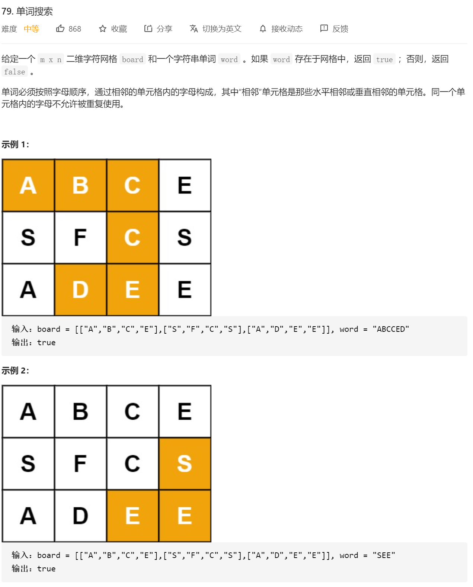

大佬的精炼代码：

```java
public class Solution {

    private static final int[][] DIRECTIONS = {{-1, 0}, {0, -1}, {0, 1}, {1, 0}};
    private int rows;
    private int cols;
    private int len;
    private boolean[][] visited;
    private char[] charArray;
    private char[][] board;

    public boolean exist(char[][] board, String word) {
        rows = board.length;
        if (rows == 0) {
            return false;
        }
        cols = board[0].length;
        visited = new boolean[rows][cols];

        this.len = word.length();
        this.charArray = word.toCharArray();
        this.board = board;
        for (int i = 0; i < rows; i++) {
            for (int j = 0; j < cols; j++) {
                if (dfs(i, j, 0)) {
                    return true;
                }
            }
        }
        return false;
    }

    private boolean dfs(int x, int y, int begin) {
        if (begin == len - 1) {//当出现最后一位的时候，直接判断最后一位和目前遍历的那个点是不是一样的就行
            //这个能够避免 [["a"]]   这个样例 因为按照我的写法 这种样例是没法左右上下移动的
					    //"a"
            return board[x][y] == charArray[begin];
        }
        if (board[x][y] == charArray[begin]) {
            visited[x][y] = true;
            for (int[] direction : DIRECTIONS) {
                int newX = x + direction[0];
                int newY = y + direction[1];
                if (inArea(newX, newY) && !visited[newX][newY]) {
                    if (dfs(newX, newY, begin + 1)) {
                        return true;
                    }
                }
            }
            visited[x][y] = false;
        }
        return false;
    }

    private boolean inArea(int x, int y) {
        return x >= 0 && x < rows && y >= 0 && y < cols;
    }
}

作者：liweiwei1419
链接：https://leetcode-cn.com/problems/word-search/solution/zai-er-wei-ping-mian-shang-shi-yong-hui-su-fa-pyth/
来源：力扣（LeetCode）
著作权归作者所有。商业转载请联系作者获得授权，非商业转载请注明出处。
```


然后再是我这边的代码：

```java
class Solution {
   public boolean exist(char[][] board, String word) {

        ArrayList<Character> temp=new ArrayList<>();
        ArrayList<ArrayList<Character>> res=new ArrayList<>();
        int visit[][]=new int[board.length][board[0].length];

        if(board.length==1&&board[0].length==1)
        {//这边为了防止上面那个样例 还有那种 board里面只有一个元素 但是word长度大于等于1的那种情况
            if(board[0][0]!=word.charAt(0)||word.length()>1)
            {
                return false;
            }
            else
            {
                return true;
            }
        }


        for(int i=0;i<board.length;i++)
        {
            for(int j=0;j<board[0].length;j++)
            {
                dfs(temp,res,word,i,j,board,visit);
            }
        }

    //    System.out.println("res"+res);

        if(res.size()>0)
        {
            return true;
        }


        return false;
    }

    //递归退出条件  temp.size>0 &&  临时temp_arrayList.get(arrayList.size()-1)!=word.get(arrayList.size()-1)
    //再判断 临时temp_arrayList.size==word.length&&temp_arrayList.get(arrayList.size()-1)==word.get(arrayList.size()-1)
    //就是找到了

    public void dfs(ArrayList<Character> temp,ArrayList<ArrayList<Character>> res,String word,int x,int y,char[][] board,int visit[][])
    {
    //    System.out.println(temp);
        if(res.size()==1)
        {
//            System.out.println("有结果了返回");
            return;
        }
        if(temp.size()!=0&&(temp.get(temp.size()-1)!=word.charAt(temp.size()-1)))//对应的位置不一样
        {
//            System.out.println("对应位置不一样，其中 temp.get(temp.size()-1)="+temp.get(temp.size()-1)+"word.charAt(temp.size()-1)="+word.charAt(temp.size()-1));
            return;
        }
        if(temp.size()==word.length())//找到了对应的
        {
//            System.out.println("第一次找到对应的");
            res.add(new ArrayList<>(temp));
            return;
        }
        if(visit[x][y]!=0)
        {
            return;
        }

        //上下左右dfs
        char oneTemp=board[x][y];
//        ArrayList<Character> temp2=new ArrayList<>(temp);
        temp.add(oneTemp);
        // System.out.println(temp);
        
        visit[x][y]=1;

        //上下左右
        //向上
        if(x>0)
        {
            dfs(temp,res,word,x-1,y,board,visit);
        }
        //向下
        if(x<board.length-1)
        {
            dfs(temp,res,word,x+1,y,board,visit);
        }
//        向左
        if(y>0)
        {
            dfs(temp,res,word,x,y-1,board,visit);
        }
        //向右
        if(y<board[0].length-1)
        {
            dfs(temp,res,word,x,y+1,board,visit);
        }

        temp.remove(temp.size()-1);
        visit[x][y]=0;

    }
}
```


这边要注意的一个点：就是以后遍历这些方块内容的循环不要写在dfs里面，要放到dfs的外面才行。比如我这段调了一个上午的代码： 中间那部分循环的地方，我从E出来，到了C，会直接通过循环到E的下面的那个S（因为y的循环结束了，开始了X的循环）反正以后不要这么写了

```java
//    public void dfs(ArrayList<Character> temp,ArrayList<ArrayList<Character>> res,String word,int x,int y,char[][] board,int visit[][])
//    {
//        System.out.println();
////        System.out.println("i"+x+"j"+y);
////        System.out.println(temp);
////        System.out.println(temp.size());
//        if(res.size()==1)
//        {
//            System.out.println("有结果了返回");
//            return;
//        }
//
//        if(temp.size()!=0&&(temp.get(temp.size()-1)!=word.charAt(temp.size()-1)))//对应的位置不一样
//        {
//
//            System.out.println("对应位置不一样，其中 temp.get(temp.size()-1)="+temp.get(temp.size()-1)+"word.charAt(temp.size()-1)="+word.charAt(temp.size()-1));
//            return;
//        }
//        if(temp.size()==word.length())//找到了对应的
//        {
//            System.out.println("第一次找到对应的");
//            res.add(new ArrayList<>(temp));
//            return;
//        }
//        if(visit[x][y]!=0)
//        {
//            return;
//        }
//
//
//        for(int i=x;i<board.length;i++)//不能在递归里面调用循环 因为这样的话会导致 我在访问第一行最后一个的时候 ABCE 中的E的时候 访问结束 返回到C 直接去访问 i=1的时候的了 因为j的循环结束了 去
//        {
//            for(int j=y;j<board[0].length;j++)
//            {
//
//                    char oneTemp=board[i][j];
//
//                    ArrayList<Character> temp2=new ArrayList<>(temp);
//                    temp2.add(oneTemp);
//                    System.out.println("oneTemp"+oneTemp);
//                    System.out.println("i"+i+"j"+j);
//                    System.out.println("目前正在访问的点："+"i"+i+"j"+j);
//                    System.out.println("目前的temp"+temp2);
//                    visit[i][j]=1;
//
//                    //向左
//                    if(j>0)
//                    {
//                        System.out.println("向左访问");
//                        dfs(temp2,res,word,i,j-1,board,visit);
//                        System.out.println("向左访问结束");
//                    }
//
//                    //向右
//                    if(j<board[0].length-1)
//                    {
//                        System.out.println("向右边访问");
//                        dfs(temp2,res,word,i,j+1,board,visit);
//                        System.out.println("向右边访问结束");
//                    }
//
//                    //向下
//
//                    if(i<board.length-1)
//                    {
//                        System.out.println("向下边访问");
//                        dfs(temp2,res,word,i+1,j,board,visit);
//                        System.out.println("向下边访问结束");
//                    }
//
//                temp2.remove(temp2.size()-1);
//                    visit[i][j]=0;
//                }
//
////                visit[i][j]=1;
//
//
//
//            }
//        }

```

