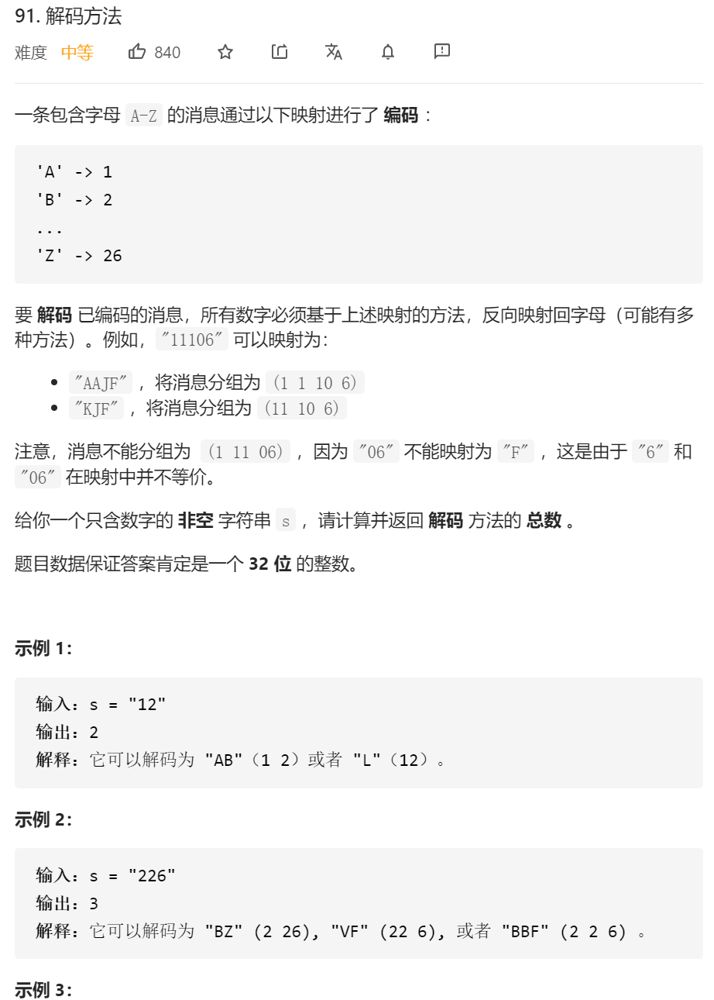
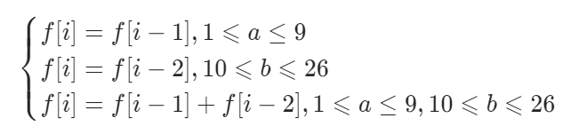

其实我是觉得宫水三叶小姐姐的题解比较好懂

## 动态规划

这其实是一道字符串类的动态规划题，不难发现对于字符串 s 的某个位置 i 而言，我们只关心「位置 i 自己能否形成独立 item 」和「位置 i 能够与上一位置（i-1）能否形成 item」，而不关心 i-1 之前的位置。

有了以上分析，我们可以从前往后处理字符串 s，使用一个数组记录以字符串 s 的每一位作为结尾的解码方案数。即定义 f[i]f[i] 为考虑前 ii 个字符的解码方案数。

对于字符串 `s` 的任意位置 `i` 而言，其存在三种情况：

只能由位置 i 的单独作为一个 item，设为 a，转移的前提是 a 的数值范围为 [1,9][1,9]，转移逻辑为 f[i] = f[i - 1]。

只能由位置 i 的与前一位置（i-1）共同作为一个 item，设为 b，转移的前提是 b 的数值范围为 [10,26][10,26]，转移逻辑为 f[i] = f[i - 2]。

位置 i 既能作为独立 item 也能与上一位置形成 item，转移逻辑为 f[i] = f[i - 1] + f[i - 2]f[i]=f[i−1]+f[i−2]。

因此，我们有如下转移方程：




其他细节：由于题目存在前导零，而前导零属于无效 item。可以进行特判，但个人习惯往字符串头部追加空格作为哨兵，追加空格既可以避免讨论前导零，也能使下标从 1 开始，简化 f[i-1] 等负数下标的判断。

```java
class Solution {
    public int numDecodings(String s) {
        int n = s.length();
        s = " " + s;
        char[] cs = s.toCharArray();
        int[] f = new int[n + 1];
        f[0] = 1;
        for (int i = 1; i <= n; i++) { 
            // a : 代表「当前位置」单独形成 item
            // b : 代表「当前位置」与「前一位置」共同形成 item
            int a = cs[i] - '0', b = (cs[i - 1] - '0') * 10 + (cs[i] - '0');
            // 如果 a 属于有效值，那么 f[i] 可以由 f[i - 1] 转移过来
            if (1 <= a && a <= 9) f[i] = f[i - 1];
            // 如果 b 属于有效值，那么 f[i] 可以由 f[i - 2] 或者 f[i - 1] & f[i - 2] 转移过来
            if (10 <= b && b <= 26) f[i] += f[i - 2];
        }
        return f[n];
    }
}

作者：AC_OIer
链接：https://leetcode-cn.com/problems/decode-ways/solution/gong-shui-san-xie-gen-ju-shu-ju-fan-wei-ug3dd/
来源：力扣（LeetCode）
著作权归作者所有。商业转载请联系作者获得授权，非商业转载请注明出处。
```


然后自己的代码：

```java
class Solution {
    public int numDecodings(String s) {
        int dp[]=new int[s.length()+1];
        dp[0]=1;

        for(int i=1;i<=s.length();i++)
        {
            if(s.charAt(i-1)!='0')
            {
                dp[i]=dp[i]+dp[i-1];//只要自己不是0 那直接就能继承前一位的数字
            }
            //然后就得判断是不是需要继承自己和自己前一位的
            if(i>1&&(s.charAt(i-2))!='0'&&(Integer.parseInt(s.substring(i - 2,i-1+1)))<=26)
            {
                dp[i]=dp[i]+dp[i-2];//只要自己不是0 那直接就能继承前一位的数字
            }

        }
        return dp[s.length()];

    }
}
```


然后DFS思路：

最初的思路，就是用纯DFS去硬怼 然后超时了

```java
class Solution {
     public int res=0;
    public int numDecodings(String s) {

        if(s.startsWith("0")){
            return 0;
        }

        dfs(0,s);
        
        return res;
    }


    public void dfs(int begin,String s)
    {
        // System.out.println(begin);
        
        if(begin>s.length())
        {
            return;
        }
        
        if(begin==s.length())
        {   
            res++;
            // System.out.println("res"+res);
            return;
        }


        for(int i=0;i<2;i++)
        {
            if(begin+i>=s.length())
            { 
                
                return;
            }
            String temp=s.substring(begin,begin+i+1);

            if(temp.length()>=1&&temp.startsWith("0"))//首0 直接返回
            {
                return;
            }

            int tempInt=Integer.parseInt(temp);
            if(tempInt<1||tempInt>26)
            {
                return;
            }

            dfs(begin+i+1,s);
            //回撤步骤都省了……
        }

    }


}
```

反思：

用一个数组保存当前下标的解法的数目。
如果112355512,处理1 12 3...以及 11 2 3.. 或者 1 1 2 3...如果我们知道下标3后面的有几种解法,那么是不是就不用重复三次3后面的递归,从而大大减少递归次数,既而减少算法的时间。

作者：Zero1018
链接：https://leetcode-cn.com/problems/decode-ways/solution/java-hui-su-ji-yi-hua-sou-suo-by-silly-a-1fie/
来源：力扣（LeetCode）
著作权归作者所有。商业转载请联系作者获得授权，非商业转载请注明出处。

这边还有个大佬的思路：

https://leetcode-cn.com/problems/decode-ways/solution/91-jie-ma-fang-fa-by-nortondark-gx8t/

核心思路就是减少中间不必要的运算

修改后的代码：

```java
class Solution {
    int []cache=new int[101];
    public int numDecodings(String s) {

        if(s.startsWith("0")){
            return 0;
        }
        Arrays.fill(cache,-1);

        dfsNum(0,s);


        return cache[0];
    }

    public int dfsNum(int begin,String s)
    {
        if(cache[begin]!=-1)
        {
            return cache[begin];
        }
        if(begin>=s.length())//如果begin到了最后还符合 那就是找到了一种
        {

            return 1;
        }
        int num=0;

        for(int i=0;i<2;i++)
        {
            if(begin+i>=s.length())
            {
                break;//直接越界了 这里不能直接返回的 因为我后面需要存储
            }

            String temp=s.substring(begin,begin+i+1);

            if(temp.startsWith("0"))//首0 直接返回
            {
                continue;
            }

            int tempInt=Integer.parseInt(temp);
            if(tempInt<1||tempInt>26)
            {
               continue;
            }

            num+=dfsNum(begin+i+1,s);//因为之前是用的 begin - begin+i 的这种 所以下一个就是begin+i+1
        }
        //num 需要计算两种情况
        cache[begin]=num;//存储记忆 末位开始的可能性  比如 123456  我们dfs是从底端开始返回的
        // 所以 我们如果知道了456可能性 那 1 2 3；  12 3；1 23；他们只需要加个456的可能性（cache[begin]）就行了，不需要再重复三次计算456可能性的步骤了
        return num;
    }

}
```


