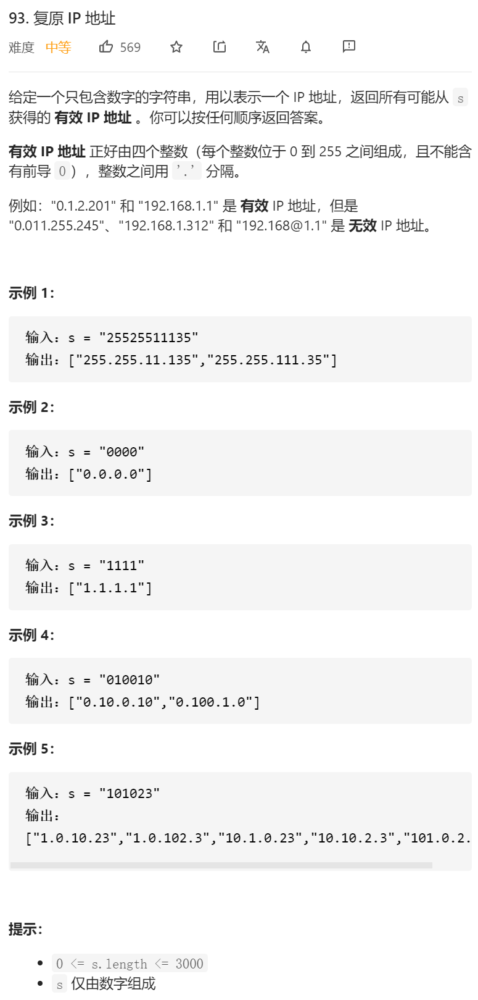

## 题意：

给定一个只包含数字的字符串，用以表示一个 IP 地址，返回所有可能从 s 获得的 有效 IP 地址 。你可以按任何顺序返回答案。

有效 IP 地址 正好由四个整数（每个整数位于 0 到 255 之间组成，且不能含有前导 0），整数之间用 '.' 分隔。

例如："0.1.2.201" 和 "192.168.1.1" 是 有效 IP 地址，但是 "0.011.255.245"、"192.168.1.312" 和 "192.168@1.1" 是 无效 IP 地址。

## 思路：

  其实看了很多题解，我觉得这题可以从**子集类**题目这个思路去解决，就是根据**start**位置来进行回溯。分解成真实的意思，就是给你一个**字符串**，把这个大字符串拆分成各个**子集字符串**，然后让满足条件的小字符串最终组合起来，输出所有满足条件的组合。

​	然后，想到回溯，这边就得想起来回溯的第一步，就是判断回溯的返回条件。

### 本题的返回条件

1.Segments最多为4段，超过四段的不行；

2.如果已经分出了四段，但是我们的指针并没有遍历到最后，比如1，1，1，1 | 1 这样就是不行的；

3.上面两个其实都是剪枝用的，最后一个也是最重要的就是，如果是四段，且我们的指针移动到最后一位的后面了，也就意味着我们把所有元素都给遍历了。这个时候，加入结果。（经过测试，没有上面两个条件，也是可以通过的）


### 本题规则：

1.小字符串需要在0-255之间，并且不能存在01，023这种情况。判断条件：长度达于1，且首字母为0的直接返回。
2。最终的大字符串必须包括全部的字符串。也就是我们的退出条件
3.只能拆分4份。判断条件  4=<长度<=12


### dfs的思路：

1.填上回退条件 （三个）

2.然后 针对每个开始的start，我们可以对其以及其后三位（包括自己的三位）进行一个回溯；

3.然后 每个1 2 3 的截断，要进行一个判断 ：

```java
 if((newStr.length() > 1 && newStr.startsWith("0"))) {
                continue;
            }
```

 然后再来个判断

```java
int value = Integer.valueOf(newStr);
            if(value < 0 || value > 255) {
                continue;
            }
```


最终的成品：

```java
class Solution {
   public List<String> restoreIpAddresses(String s) {
        List<String> res=new ArrayList<>();
        int len=s.length();
        if(len<4||len>12)
        {
            return res;
        }
        Deque<String> segments=new LinkedList<>();
        dfs(res,segments,s,0);

        return res;
    }

    public void dfs(List<String> res,Deque<String> segments,String s,int segPtr)
    {
        // System.out.println(segments);
        if(segments.size()>4){//超过四段 直接返回
            return;
        }

        if(segments.size()>=4&&segPtr<s.length())//过了四段 然后我们没有遍历到最后 也是直接返回
        {
            return;
        }

        if(segments.size()==4&&segPtr==s.length())//到了最后 且 分段为4了
        {
            res.add(String.join(".", segments));
            return;
        }

        for(int i=0;i<3;i++)//因为每个分段最多也只有三个数字 所以只需要循环三次就可以了
        {
            if(segPtr+i>=s.length())//如果越界了 直接return
            {
                return;
            }
            String newStr = s.substring(segPtr, segPtr+i+1);//[ )
            if((newStr.length() > 1 && newStr.startsWith("0"))) {
                continue;
            }
            int value = Integer.valueOf(newStr);
            if(value < 0 || value > 255) {
                continue;
            }
            ///先选择这个字符串，演算完所有相关情况，最后回退选择。

            segments.addLast(0);
            dfs(res,segments,s,segPtr+i+1);//这边有个小坑点就是我们下一个start必须是要在截断的之后 也就是segPtr+i+1  我上次就是这边错了
            segments.removeLast();
        }
    }
}
```


然后附上linweiwei的题解（我觉得思路清晰，但是有点麻烦）

 https://leetcode-cn.com/problems/restore-ip-addresses/solution/hui-su-suan-fa-hua-tu-fen-xi-jian-zhi-tiao-jian-by/


