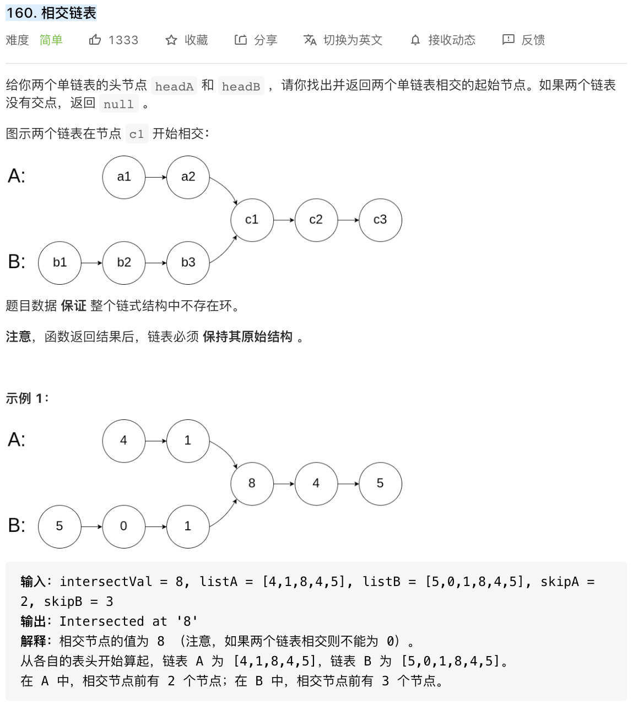

## 朴素解法

一个朴素的做法是两层循环：当遇到第一个相同的节点时说明找到了；全都走完了还没遇到相同，说明不存在交点。

```java
public class Solution {
    public ListNode getIntersectionNode(ListNode a, ListNode b) {
        for (ListNode h1 = a; h1 != null ; h1 = h1.next) {
            for (ListNode h2 = b; h2 != null ; h2 = h2.next) {
                if (h1.equals(h2)) return h1;
            }
        }
        return null;
    }
}

作者：AC_OIer
链接：https://leetcode-cn.com/problems/intersection-of-two-linked-lists/solution/gong-shui-san-xie-zhao-liang-tiao-lian-b-h3bd/
来源：力扣（LeetCode）
著作权归作者所有。商业转载请联系作者获得授权，非商业转载请注明出处。
```

## 差值解法

先对两条链表扫描一遍，取得两者长度，然后让长的链表先走「两者的长度差值」，然后再同时走，遇到第一个节点即是答案。

```
public class Solution {
    public ListNode getIntersectionNode(ListNode a, ListNode b) {
        int c1 = 0, c2 = 0;
        ListNode t1 = a, t2 = b;
        while (t1 != null && ++c1 > 0) t1 = t1.next;
        while (t2 != null && ++c2 > 0) t2 = t2.next;
        int t = Math.abs(c1 - c2);
        while (t-- > 0) {
            if (c1 > c2) a = a.next;
            else b = b.next;
        }
        while (a != null && b != null) {
            if (a.equals(b)) {
                return a;
            } else {
                a = a.next;
                b = b.next;
            }
        }
        return null;
    }
}

作者：AC_OIer
链接：https://leetcode-cn.com/problems/intersection-of-two-linked-lists/solution/gong-shui-san-xie-zhao-liang-tiao-lian-b-h3bd/
来源：力扣（LeetCode）
著作权归作者所有。商业转载请联系作者获得授权，非商业转载请注明出处。
```

