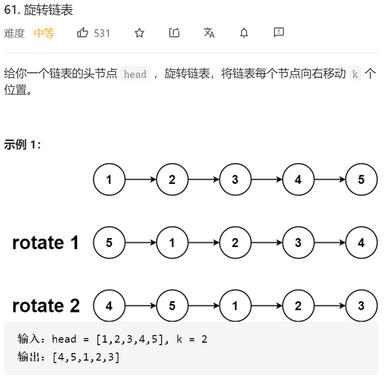

思路挺简单的，先计算出长度，然后取个mod，然后就是三个指针：left，preLeft，right

坑点：

1.链表为null的时候 返回null

2.链表长度为1的时候 直接返回

3.链表移动长度为0 或者mod为0的时候 直接返回。

代码：

```java
/**
 * Definition for singly-linked list.
 * public class ListNode {
 *     int val;
 *     ListNode next;
 *     ListNode() {}
 *     ListNode(int val) { this.val = val; }
 *     ListNode(int val, ListNode next) { this.val = val; this.next = next; }
 * }
 */
class Solution {
    public ListNode rotateRight(ListNode head, int k) {
        ListNode headPre=new ListNode(0);
        headPre.next=head;
        if(head==null)
        {
            return null;
        }
        if(head.next==null||k==0)
        {
            return head;
        }

        int len=1;
        while (head.next!=null)
        {
            len++;
            head=head.next;
        }
//        System.out.println(len);
        int moveK=k%len;
        // System.out.println(moveK);
        if(moveK==0)
        {
            return headPre.next;
        }

        ListNode left=headPre.next;
        ListNode right=headPre.next;

        ListNode leftPre=new ListNode(0);
        leftPre.next=left;

//        ListNode rightPre=new ListNode(0);
//        rightPre.next=right;

        for(int i=1;i<moveK;i++)
        {
            right=right.next;
        }

        while (right.next!=null)
        {
            right=right.next;
            left=left.next;
            leftPre=leftPre.next;
        }
       
         right.next=headPre.next;
        leftPre.next=null;
        return left;

    }
}
```

大佬的题解：

```
class Solution {
    public ListNode rotateRight(ListNode head, int k) {
        if (k == 0 || head == null || head.next == null) {
            return head;
        }
        int n = 1;
        ListNode iter = head;
        while (iter.next != null) {
            iter = iter.next;
            n++;
        }
        int add = n - k % n;
        if (add == n) {
            return head;
        }
        iter.next = head;
        while (add-- > 0) {
            iter = iter.next;
        }
        ListNode ret = iter.next;
        iter.next = null;
        return ret;
    }
}

作者：LeetCode-Solution
链接：https://leetcode-cn.com/problems/rotate-list/solution/xuan-zhuan-lian-biao-by-leetcode-solutio-woq1/
来源：力扣（LeetCode）
著作权归作者所有。商业转载请联系作者获得授权，非商业转载请注明出处。
```

