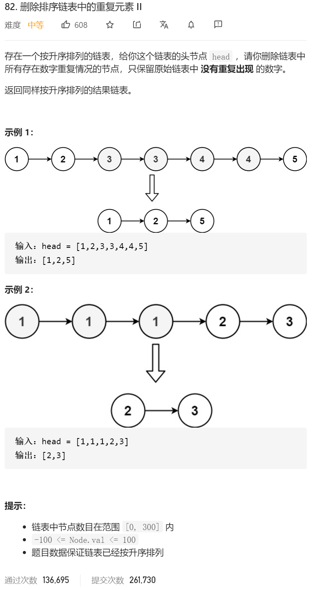

自己的思路，升序降序无所谓，快慢指针。三根指针 pre slow fast

```java
/**
 * Definition for singly-linked list.
 * public class ListNode {
 *     int val;
 *     ListNode next;
 *     ListNode() {}
 *     ListNode(int val) { this.val = val; }
 *     ListNode(int val, ListNode next) { this.val = val; this.next = next; }
 * }
 */
class Solution {
    public ListNode deleteDuplicates(ListNode head) {

        ListNode resHeadPre=new ListNode(-11);
        ListNode pre=new ListNode(-11);
        ListNode slow=new ListNode(-11);
        ListNode fast=new ListNode(-11);

        //给头结点加个pre 这个pre固定
        resHeadPre.next=head;

        //然后弄一个会移动的pre
        pre=resHeadPre;////pre这边的初始地址为resHeadPre的副本 如果单纯只是pre.next=head; 会出错 因为会导致resHeadPre.next还是指向head不变
        if(head==null||head.next==null)//如果只有0或者1个元素 直接返回head
        {
            return head;
        }

        //然后考虑两个元素及其以上的情况
        slow=head;
        fast=head.next;

        while (fast!=null)//总条件 fast指针不为空
        {
            if(slow.val==fast.val)//如果慢指针==快指针
            {
                while (fast!=null&&fast.val==slow.val)//只要快指针一直等于慢指针 或者快指针为null了
                {
                    fast= fast.next;
                }
                //出来之后 fast要不就是不一样 要不就是null
                //这个时候 我们的pre 指向fast 将重复的全部给跳过
                pre.next=fast;
                slow=fast;//然后 slow指向我们的fast
                if(fast!=null)//这边只要我们的fast不为空 我们就将fast给往后推
                {
                    fast=fast.next;
                }
//                continue;
            }else
            {
                //然后如果不相等了 直接三个指针往后移动
                fast=fast.next;
                slow=slow.next;
                pre=pre.next;
            }
        }

        return resHeadPre.next;

    }
}
```

然后 看看大佬的思路：

宫水三叶 yyds

1.建一个「虚拟头节点」dummy 以减少边界判断，往后的答案链表会接在 dummy 后面

2.使用 tail 代表当前有效链表的结尾

3.通过原输入的 head 指针进行链表扫描

我们会确保「进入外层循环时 head 不会与上一节点相同」，因此插入时机：

1.head 已经没有下一个节点，head 可以被插入

2.head 有一下个节点，但是值与 head 不相同，head 可以被插入


其实思路和我的类似 我当时考虑她第二个循环的时候 没有考虑直接让 head=head.next

```java
class Solution {
    public ListNode deleteDuplicates(ListNode head) {
        ListNode dummy = new ListNode();
        ListNode tail = dummy;
        while (head != null) {
            // 进入循环时，确保了 head 不会与上一节点相同
            if (head.next == null || head.val != head.next.val) {
                tail.next = head;
                tail = head;
            }
            // 如果 head 与下一节点相同，跳过相同节点
            while (head.next != null && head.val == head.next.val) head = head.next;
            head = head.next;
        }
        tail.next = null;
        return dummy.next;
    }
}

```


