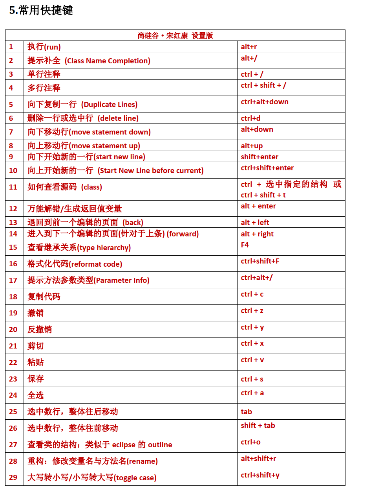
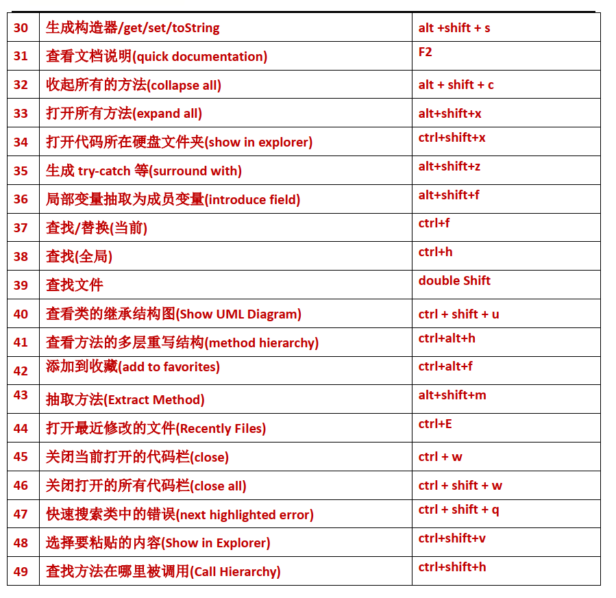

| **尚硅谷·宋红康 设置版** |                                                              |                                                        |
| ------------------------ | ------------------------------------------------------------ | ------------------------------------------------------ |
| **1**                    | **执行****(run)**                                            | **alt+r**                                              |
| **2**                    | **提示补全**  **(Class Name Completion)**                    | **alt+/**                                              |
| **3**                    | **单行注释**                                                 | **ctrl + /**                                           |
| **4**                    | **多行注释**                                                 | **ctrl  + shift + /**                                  |
| **5**                    | **向下复制一行** **(Duplicate  Lines)**                      | **ctrl+alt+down**                                      |
| **6**                    | **删除一行或选中行** **(delete  line)**                      | **ctrl+d**                                             |
| **7**                    | **向下移动行****(move statement down)**                      | **alt+down**                                           |
| **8**                    | **向上移动行****(move  statement up)**                       | **alt+up**                                             |
| **9**                    | **向下开始新的一行****(start  new line)**                    | **shift+enter**                                        |
| **10**                   | **向上开始新的一行**  **(Start New Line before  current)**   | **ctrl+shift+enter**                                   |
| **11**                   | **如何查看源码**  **(class)**                                | **ctrl +** **选中指定的结构 或**  **ctrl + shift + t** |
| **12**                   | **万能解错****/****生成返回值变量**                          | **alt  + enter**                                       |
| **13**                   | **退回到前一个编辑的页面** **(back)**                        | **alt + left**                                         |
| **14**                   | **进入到下一个编辑的页面****(****针对于上条****) (forward)** | **alt + right**                                        |
| **15**                   | **查看继承关系****(type hierarchy)**                         | **F4**                                                 |
| **16**                   | **格式化代码****(reformat code)**                            | **ctrl+shift+F**                                       |
| **17**                   | **提示方法参数类型****(Parameter Info)**                     | **ctrl+alt+/**                                         |
| **18**                   | **复制代码**                                                 | **ctrl  + c**                                          |
| **19**                   | **撤销**                                                     | **ctrl  + z**                                          |
| **20**                   | **反撤销**                                                   | **ctrl  + y**                                          |
| **21**                   | **剪切**                                                     | **ctrl  + x**                                          |
| **22**                   | **粘贴**                                                     | **ctrl  + v**                                          |
| **23**                   | **保存**                                                     | **ctrl  + s**                                          |
| **24**                   | **全选**                                                     | **ctrl  + a**                                          |
| **25**                   | **选中数行，整体往后移动**                                   | **tab**                                                |
| **26**                   | **选中数行，整体往前移动**                                   | **shift  + tab**                                       |
| **27**                   | **查看类的结构：类似于**  **eclipse** **的** **outline**     | **ctrl+o**                                             |
| **28**                   | **重构：修改变量名与方法名****(rename)**                     | **alt+shift+r**                                        |
| **29**                   | **大写转小写****/****小写转大写****(toggle case)**           | **ctrl+shift+y**                                       |

| **30** | **生成构造器****/get/set/toString**                | **alt  +shift + s**   |
| ------ | -------------------------------------------------- | --------------------- |
| **31** | **查看文档说明****(quick documentation)**          | **F2**                |
| **32** | **收起所有的方法****(collapse  all)**              | **alt  + shift + c**  |
| **33** | **打开所有方法****(expand all)**                   | **alt+shift+x**       |
| **34** | **打开代码所在硬盘文件夹****(show in explorer)**   | **ctrl+shift+x**      |
| **35** | **生成** **try-catch** **等****(surround with)**   | **alt+shift+z**       |
| **36** | **局部变量抽取为成员变量****(introduce field)**    | **alt+shift+f**       |
| **37** | **查找****/****替换****(****当前****)**            | **ctrl+f**            |
| **38** | **查找****(****全局****)**                         | **ctrl+h**            |
| **39** | **查找文件**                                       | **double  Shift**     |
| **40** | **查看类的继承结构图****(Show UML Diagram)**       | **ctrl  + shift + u** |
| **41** | **查看方法的多层重写结构****(method hierarchy)**   | **ctrl+alt+h**        |
| **42** | **添加到收藏****(add to favorites)**               | **ctrl+alt+f**        |
| **43** | **抽取方法****(Extract Method)**                   | **alt+shift+m**       |
| **44** | **打开最近修改的文件****(Recently Files)**         | **ctrl+E**            |
| **45** | **关闭当前打开的代码栏****(close)**                | **ctrl  + w**         |
| **46** | **关闭打开的所有代码栏****(close all)**            | **ctrl  + shift + w** |
| **47** | **快速搜索类中的错误****(next highlighted error)** | **ctrl  + shift + q** |
| **48** | **选择要粘贴的内容****(Show in Explorer)**         | **ctrl+shift+v**      |
| **49** | **查找方法在哪里被调用****(Call Hierarchy)**       | **ctrl+shift+h**      |

