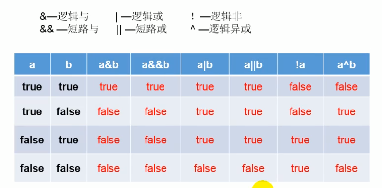
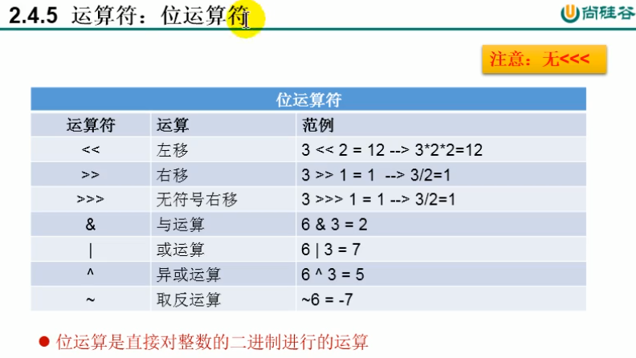

# 变量与运算符

一、关键字和保留字
保留字：goto ，const


# 标识符


Java 命名规范


java采用Unicode字符集 所以中文也可以做变量名


# 变量


引用类型要注意：类（String），数组，接口


## 3.1整形


存储最小是byte=8位 2^8 =256个数  -128-127

bit是计算机中的最小的存储单元 

long变量必须要以L或者l结尾

long l1=100l;


## 3.2浮点型


java默认为double，float 和long 都要再后面加个字母

这两个类的精度都不是很高，所以正经使用的时候都是用Java的类的


## 3.3char 类型

一个字符=2个字节 byte 16个bit

char a= 'c'

定义char变量通常使用‘’，内部只能有一个字符，不能是'ab'


## 3.4Boolean类型

true false


## 3.5 基本类型的运算

### 自动类型提升

```java
byte b1=1;
int a2=2;
a2=b1;
```

最后是个int

浮点型 就是转化到后面加个 。0

byte short char-> int-> long-> float-> double 自动类型提升

当byte char short 相互计算的时候 结果为int

char类型怎么办呢？

byte short char-> int-> long-> float-> double


### 强制类型转换

自动类型提升的逆运算

1.需要使用强制转换符号（）

```java
double cl=12.3;
int ck=3;
ck=(int)cl;//截断操作 损失精度
```

2.可能会导致精度损失

```java
int i2=128;
byte v=(byte)i2;
System.out.println(v);
-128
```

### 变量运算规则的两个特殊情况：

1.

```java
long al=123;
```

long 不加l 就变成了int类型 超出范围就会失败

```java
float af=23.33;//直接报错  因为float不能转double 强制类型转换
```


2.编码情况2

```java
byte b=12;
byte b2=b+1;//报错 整形常量是默认int 浮点常量默认为double
```


## 3.6 String

String是引用数据类型

1.String 属于引用数据类型，

2.声明String 类型变量时，使用""

3.char 里面不能什么都不写，有且只能有一个，String可以不放

4.String 可以和八组基本类型数据运算 包括和boolean 且运算只能是连接+计算。

```java
char a='a';//97
char A='A';//65
```


# 进制转化


二进制： 0b开头或者0B开头
十进制：
八进制：0开头
十六进制：0x开头

原码 反码 补码


正数三码合一 ；负数会有这三个的关系。计算机的底层都以补码的方式存储数据

复数的二进制用补码表示


Java类  Integer.toBinaryString(akk);

```java
int akk=233;
Integer awl=new Integer(90);
String addd=Integer.toBinaryString(akk);
System.out.println(addd);;
```


# 运算符

## 算术运算符


%取模运算结果的符号与被取模的符号相同

++ 就是有前++和后++ 之分

++的作用：不会改变本身的数据类型  +=也不会改变数据类型

short a=1；a=a+1 这个是错误的 编译过不了a是short 1是int



逻辑运算符和位运算符 要看的是前后的数据类型，是int就是位运算 boolean是逻辑运算符


&& 如果前面是false的，后面就不用执行了，&会执行

但两者的运算结果是相同的。

||也是的

开发中推荐使用短路的&& 和||



位运算符

i<<1 =i*2


