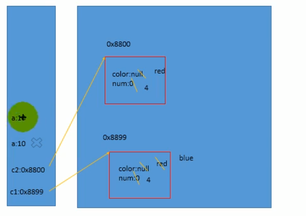

3.说明关于权限修饰符

3.1 默认方法权限修饰符：

private，public，缺省，protected->封装性 这个是按照频率排血的

3.2 返回值和没有返回值

5.方法使用过程中，可以调用当前类的属性或者方法

5.1 方法A中调用了A 我们说明是递归方法

5.2方法中不能定义方法

内存图：

a=10 这个局部变量 在方法结束的时候 生命周期也就结束了

在show2方法结束的时候，main方法也结束了，这时候 c1和c2 也出去了

这时候 java的垃圾回收机制就发现堆中有两个东西没有任何引用的指向，也就是没有办法被调用。

这两个垃圾就被回收了