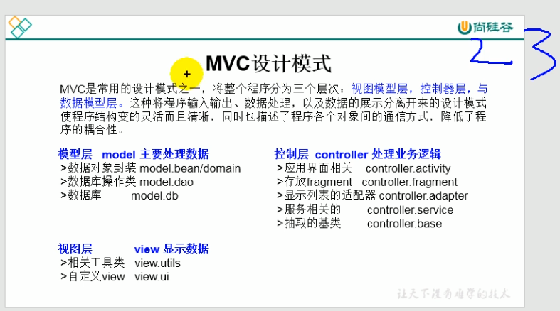
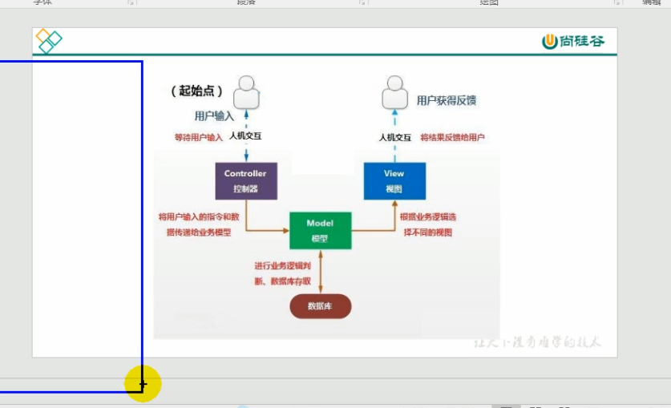

```
/*
 * 一、package关键字的使用
 * 1.为了更好的实现项目中类的管理，提供包的概念
 * 2.使用package声明类或接口所属的包，声明在源文件的首行
 * 3.包，属于标识符，遵循标识符的命名规则、规范(xxxyyyzzz)、“见名知意”
 * 4.每"."一次，就代表一层文件目录。import com.atguigu.java2.java3.Dog;
 * 
 * 补充：同一个包下，不能命名同名的接口、类。//一层文件目录下本来就不能定义不同的类
 *     不同的包下，可以命名同名的接口、类。
 * 
 * 二、import关键字的使用
 * import:导入
 * 1. 在源文件中显式的使用import结构导入指定包下的类、接口
 * 2. 声明在包的声明和类的声明之间
 * 3. 如果需要导入多个结构，则并列写出即可
 * 4. 可以使用"xxx.*"的方式，表示可以导入xxx包下的所有结构
 * 5. 如果使用的类或接口是java.lang包下定义的，则可以省略import结构
 * 6. 如果使用的类或接口是本包下定义的，则可以省略import结构
 * 7. 如果在源文件中，使用了不同包下的同名的类，则必须至少有一个类需要以全类名的方式显示。
 * 8. 使用"xxx.*"方式表明可以调用xxx包下的所有结构。但是如果使用的是xxx子包下的结构，则仍需要显式导入  子包不能直接用*代替
 
 * 
 * 9. import static:导入指定类或接口中的静态结构:属性或方法。 
 */
```


MVC设计模式



