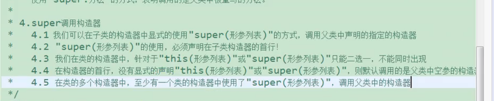

情况：

父类定义的方法，子类重写了。但是我们想用父类的方法

这个和this有那么一点点像 

this和形参做区分  super 子类和父类的重写函数作区分

父类定义了一个id

子类定义了id

这个时候内存里面有两个id

我们如果想使用父类中被重写的方法

要用super 如果没有重写 super 可以省略

super 调用构造器的问题

父类的属性为private的时候，我们没法直接去在子类进行构造初始化

这个时候我们就在子类直接调用父类的构造函数就行了

就是使用super

子类的构造函数，默认会使用super的构造函数 super() super空

如果全是this的话 就成了一个环了

