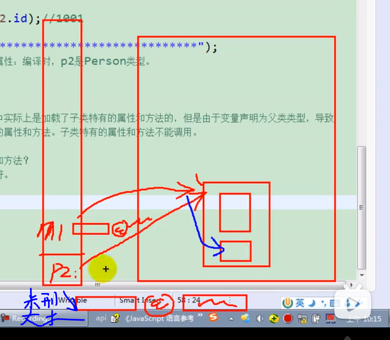

```
多态性：

1.理解多态性：一个事物的多种形态。
2.何为多态性：总结：父类的引用指向子类的对象（或者是子类的对象赋值给父类的引用）
3.多态的适用：虚拟方法的调用
有了对象的多态性之后，我们在编译的时候，只能调用父类中声明的方法，在运行期，我们实际执行的是子类重写的方法。也就是编译，看左边；执行，看右边
4.多态性的一个使用前提：1.要有类的继承关系。2，要有方法的重写
```


申明的是一个变量，左边可以是其各种子类。提供对象值的时候，是多种的

总结：父类的引用指向子类的对象


不能调用子类没有调用过的方法


编译的时候，默认认为这是个Person。执行的时候，才发现这个被重写了。


多态性的使用：


如果没有了多态性

那这边对于每一个类，都得写一个新的方法。

 有了多态之后，那方法的可复用性就大了很多，不需要重载很多了方法了。


多态不适用于属性


虚拟方法的调用：


多态是一个运行时的行为。其在编译期间是没法确定的。

只有运行的时候，才知道正真的调用的函数是谁的


什么是多态性：

对象的多态性：父类的引用指向子类的对象

什么是虚拟方法的调用：

编译时看左边，运行时看右边。

也就是编译的时候我们认为你调用的是父类声明的方法，当我们运行的时候，默认为子类运行的方法。


获取和调用是两码事情


instance of


我们new一个对象，这些属性一定会加载在堆空间中


有了对象的多态性之后，内存中实际上是已经加载了子类特有的属性和方法的，但由于声明的变量是父类的类型，导致编译的时候，只能调用父类中声明的属性和方法。子类特有的属性和方法并不能调用


**如何才能调用子类特有的属性和方法？**

```java
Man m1=(Man)P2
```

强制类型转化，向下转型


内存图



强转的时候 有可能不成功

Man不能住哪华 Woman