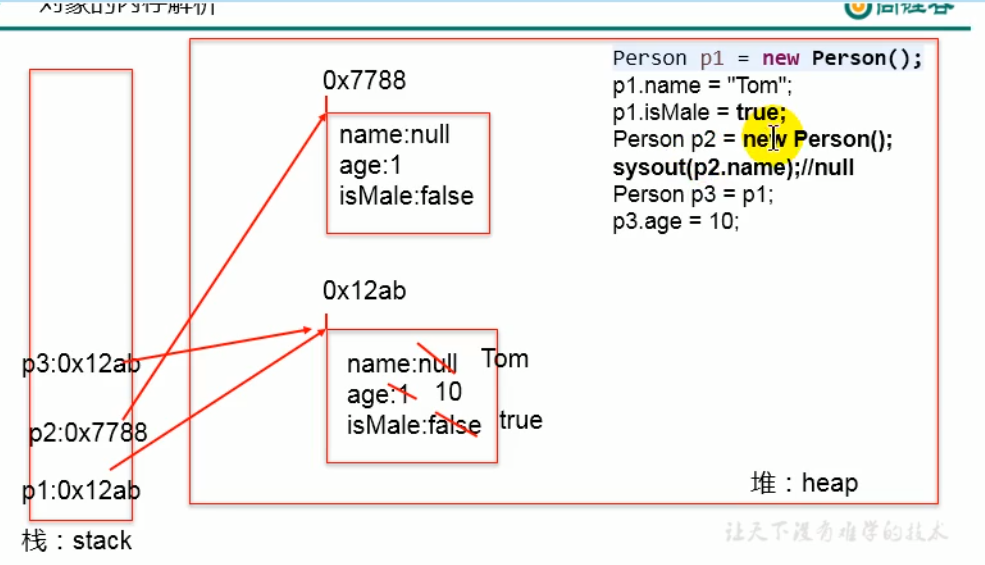

普通引用类型的内存分配：

在栈中存放临时变量  这个变量存放这个对象的地址 也就是student存的是个地址 类型为类 

再堆中存放类的实体，开辟了一块空间，默认是null 

源代码->字节码文件(编译生成)->解释运行

内存解析，是在运行的时候，编译完是个文件（字节码文件）。

编译完源程序后，生成一个或者多个字节码文件。

我们使用JVM中类的加载器和解释器对生成的字节码文件进行解释运行。意味着，需要将字节码文件对应的类加载到内存中，涉及到内存解析。

虚拟机栈：也就是平时提到的栈结构。我们将局部变量存放在栈结构。

堆：将new出来的结构（比如数组，对象）加载在堆空间中。对象的属性（非static），加载在堆空间中

方法区：类的加载信息、常量池、静态域