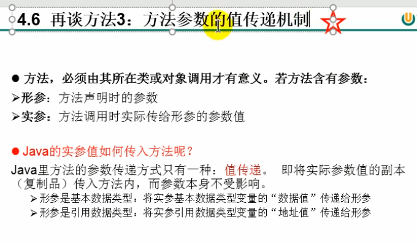

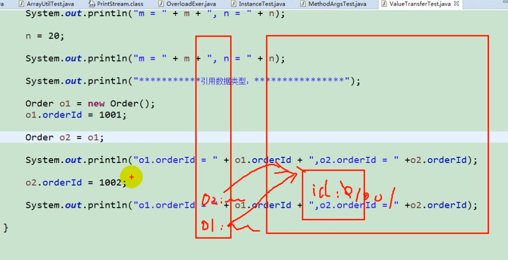

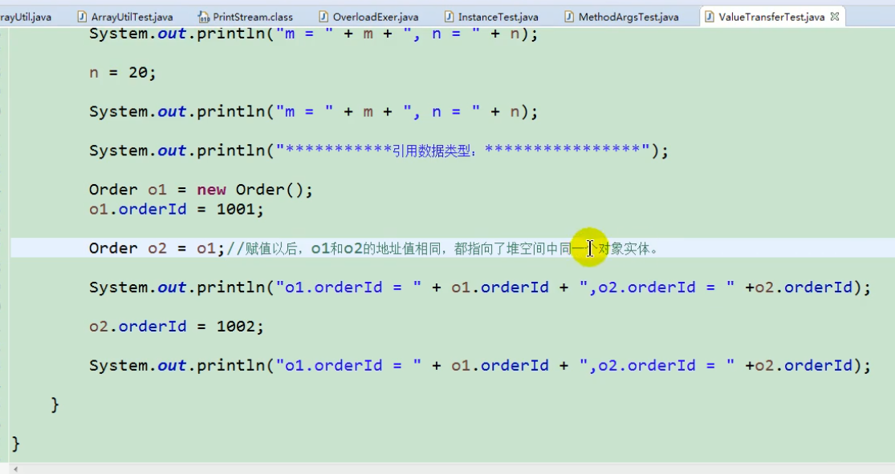

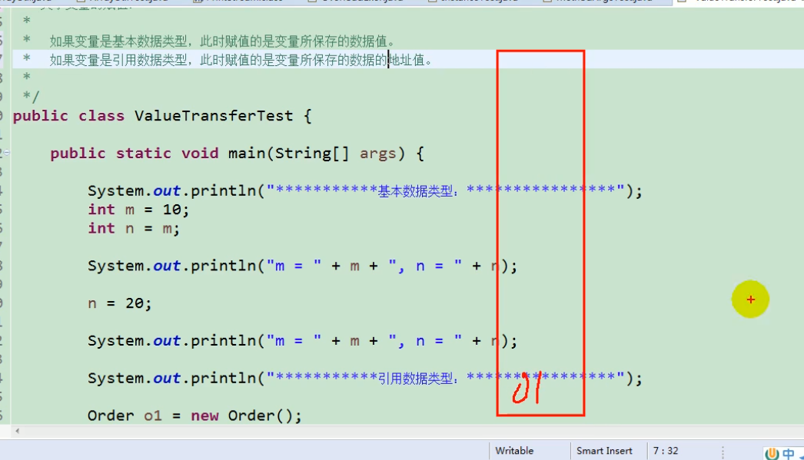

这边说的是变量 数据类型  String是常量 不符合这个标准

引用类型存放的是地址，所以赋值的时候给的也是地址

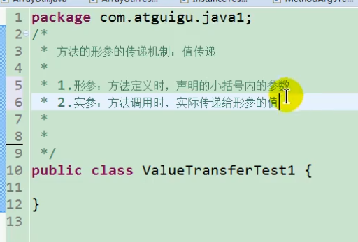

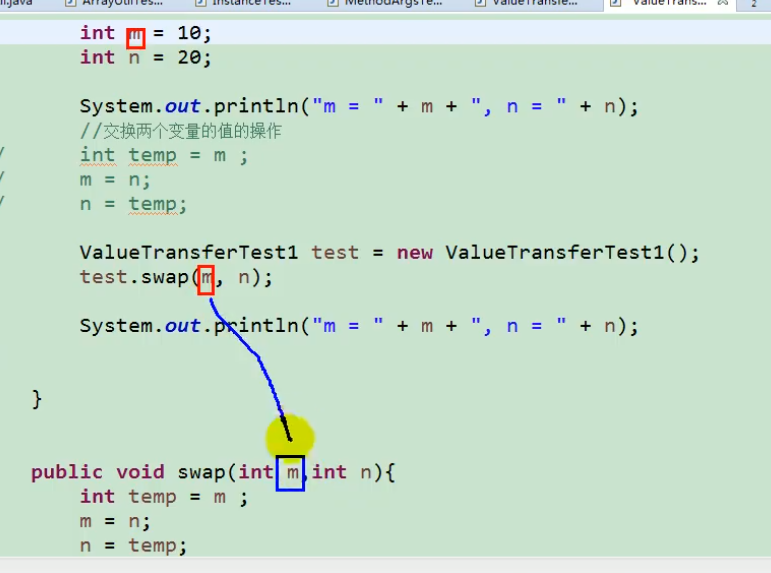

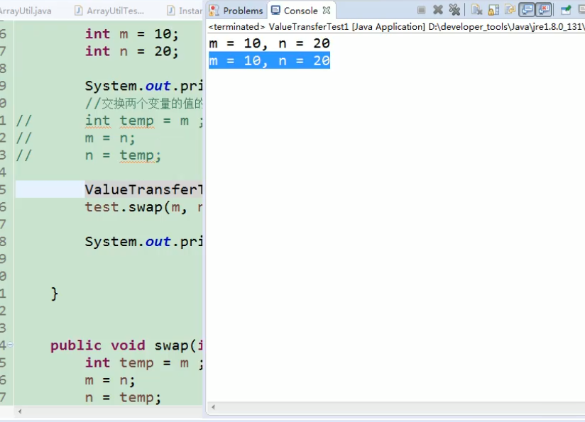

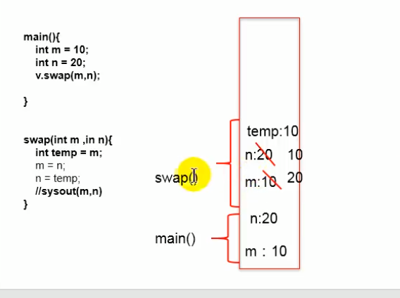

Swap执行完之后直接销毁了

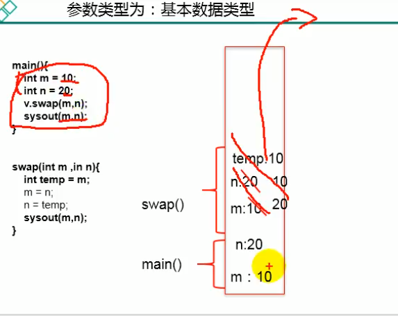

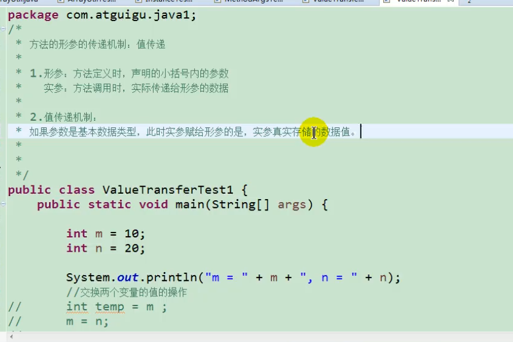

如果形参是基本数据类型，实参给形参的就是 真实存储的数据值

——————————————————————————————————————————————————

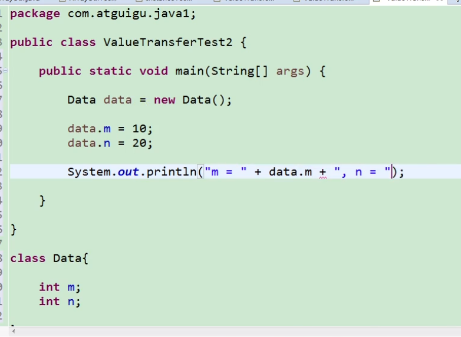

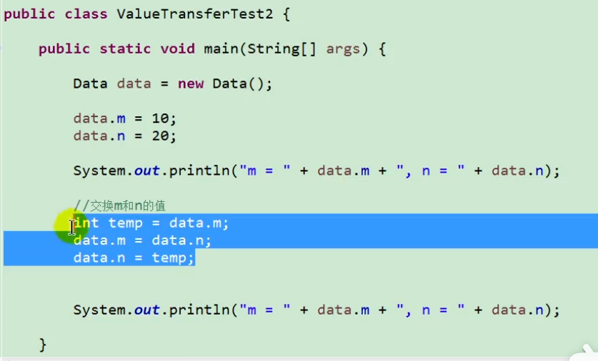

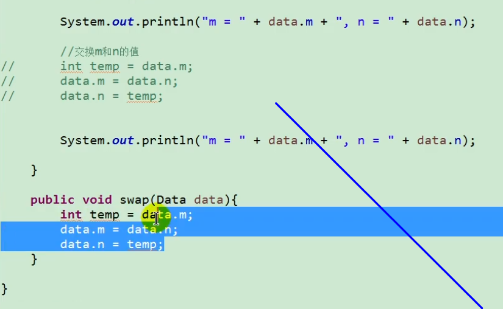

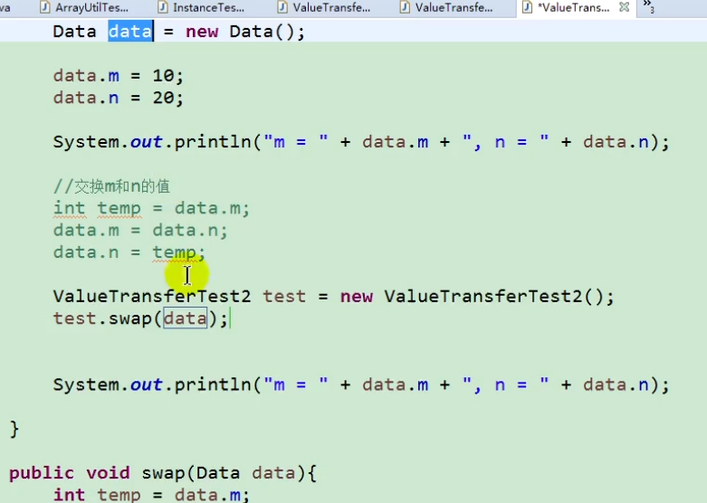

这样就能换成了

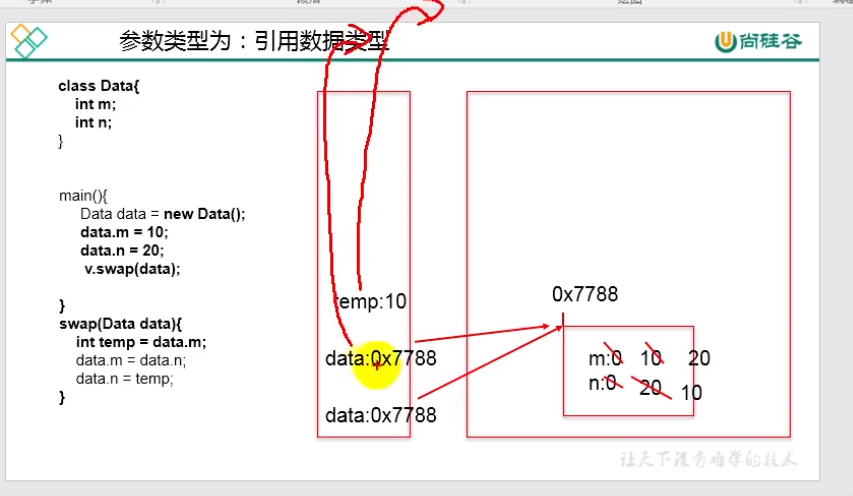

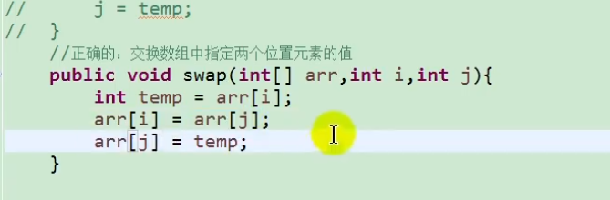

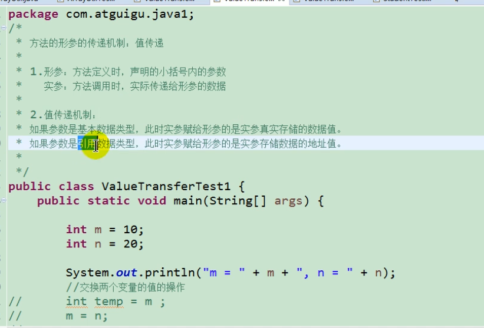

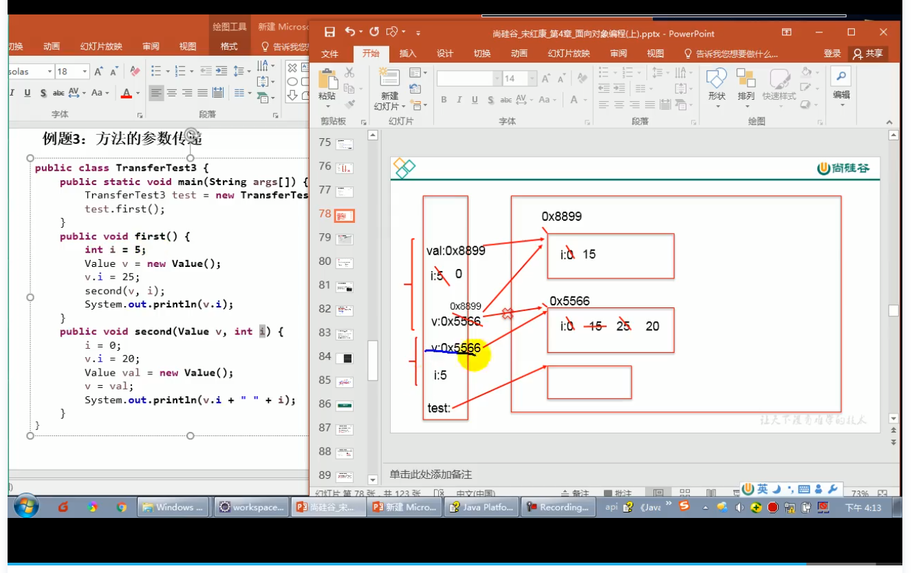

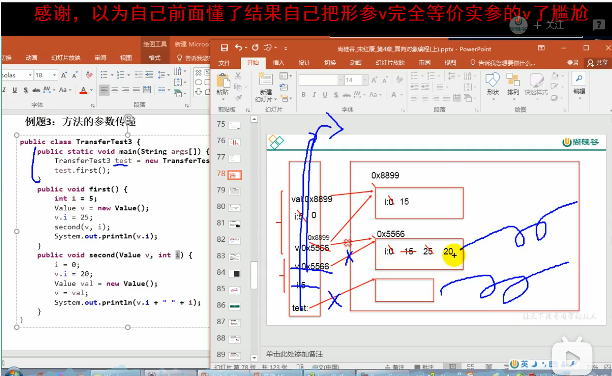

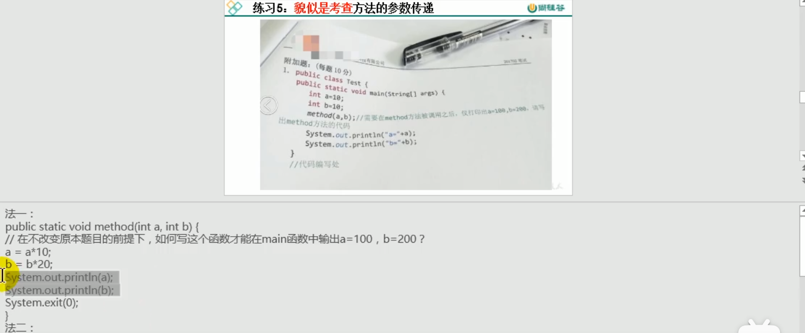

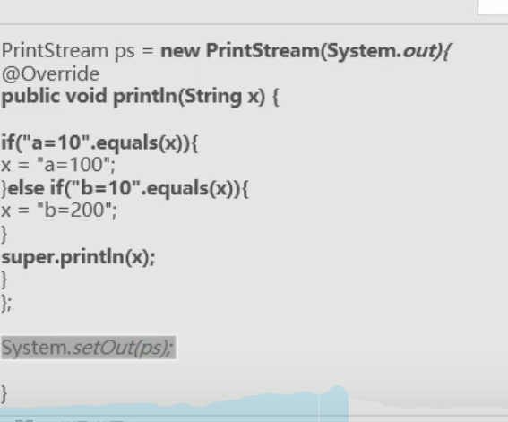

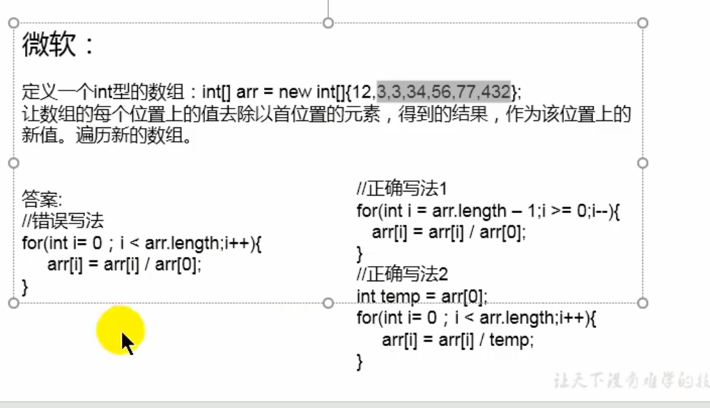

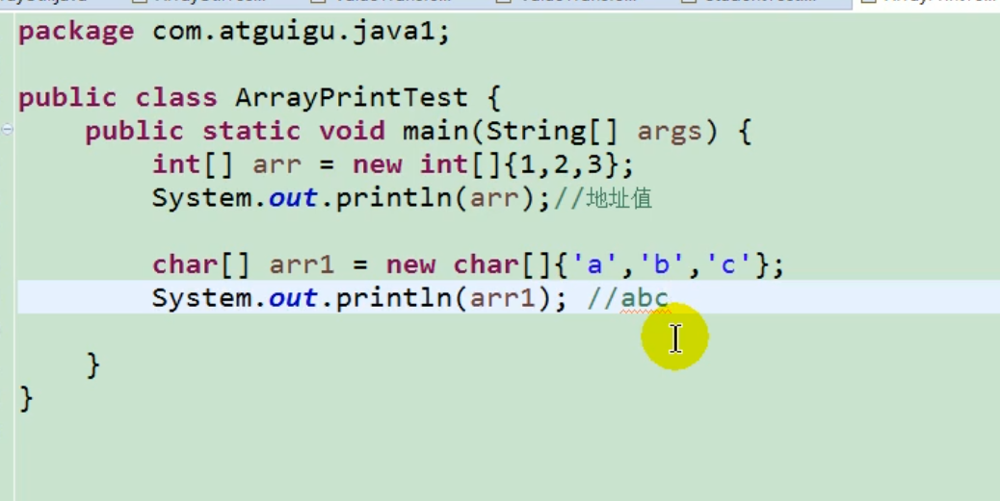

因为sout调用的不是一方法，sout有重载 