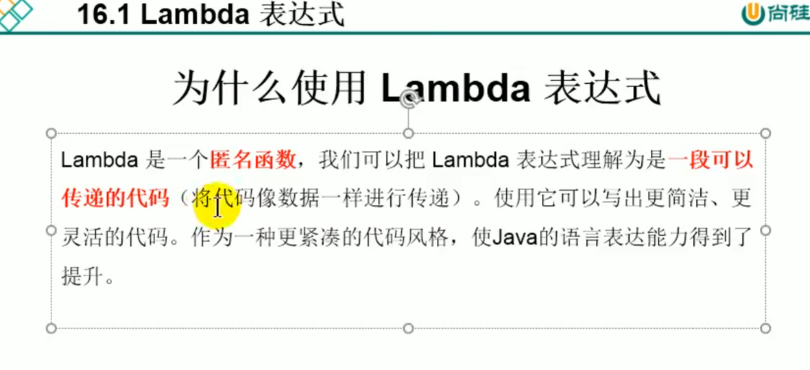
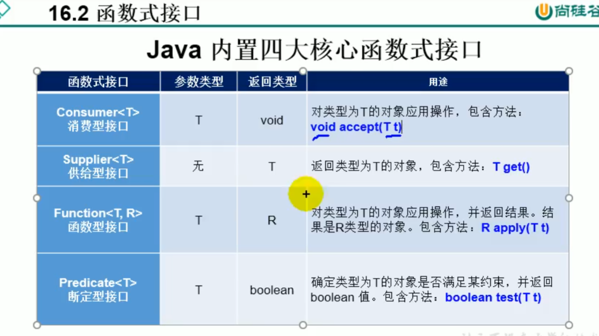

别的语言有了，咱也得有。

```java
package com.atguigu.java1;


import org.junit.Test;

import java.util.Comparator;

/**
 * Lambda表达式的使用举例
 *
 * @author shkstart
 * @create 2019 上午 11:30
 */
public class LambdaTest {

    @Test
    public void test1(){

        Runnable r1 = new Runnable() {
            @Override
            public void run() {
                System.out.println("我爱北京天安门");
            }
        };

        r1.run();

        System.out.println("***********************");

        Runnable r2 = () -> System.out.println("我爱北京故宫");

        r2.run();
    }


    @Test
    public void test2(){

        Comparator<Integer> com1 = new Comparator<Integer>() {
            @Override
            public int compare(Integer o1, Integer o2) {
                return Integer.compare(o1,o2);
            }
        };

        int compare1 = com1.compare(12,21);
        System.out.println(compare1);

        System.out.println("***********************");
        //Lambda表达式的写法
        Comparator<Integer> com2 = (o1,o2) -> Integer.compare(o1,o2);

        int compare2 = com2.compare(32,21);
        System.out.println(compare2);


        System.out.println("***********************");
        //方法引用
        Comparator<Integer> com3 = Integer :: compare;

        int compare3 = com3.compare(32,21);
        System.out.println(compare3);
    }

}
```

```java
package com.atguigu.java1;

import org.junit.Test;

import java.util.ArrayList;
import java.util.Comparator;
import java.util.function.Consumer;

/**
 * Lambda表达式的使用
 *
 * 1.举例： (o1,o2) -> Integer.compare(o1,o2);
 * 2.格式：
 *      -> :lambda操作符 或 箭头操作符
 *      ->左边：lambda形参列表 （其实就是接口中的抽象方法的形参列表）
 *      ->右边：lambda体 （其实就是重写的抽象方法的方法体）
 *
 * 3. Lambda表达式的使用：（分为6种情况介绍）
 *
 *    总结：
 *    ->左边：lambda形参列表的参数类型可以省略(类型推断)；如果lambda形参列表只有一个参数，其一对()也可以省略
 *    ->右边：lambda体应该使用一对{}包裹；如果lambda体只有一条执行语句（可能是return语句），省略这一对{}和return关键字
 *
 * 4.Lambda表达式的本质：作为函数式接口的实例
 *
 * 5. 如果一个接口中，只声明了一个抽象方法（接口中的方法全是抽象方法），则此接口就称为函数式接口。我们可以在一个接口上使用 @FunctionalInterface 注解，
 *   这样做可以检查它是否是一个函数式接口。
 *
 * 6. 所以以前用匿名实现类表示的现在都可以用Lambda表达式来写。
 *
 * @author shkstart
 * @create 2019 上午 11:40
 */
public class LambdaTest1 {
    //语法格式一：无参，无返回值
    @Test
    public void test1(){
        Runnable r1 = new Runnable() {
            @Override
            public void run() {
                System.out.println("我爱北京天安门");
            }
        };

        r1.run();

        System.out.println("***********************");

        Runnable r2 = () -> {
            System.out.println("我爱北京故宫");
        };

        r2.run();
    }
    //语法格式二：Lambda 需要一个参数，但是没有返回值。
    @Test
    public void test2(){

        Consumer<String> con = new Consumer<String>() {
            @Override
            public void accept(String s) {
                System.out.println(s);
            }
        };
        con.accept("谎言和誓言的区别是什么？");

        System.out.println("*******************");

        Consumer<String> con1 = (String s) -> {
            System.out.println(s);
        };
        con1.accept("一个是听得人当真了，一个是说的人当真了");

    }

    //语法格式三：数据类型可以省略，因为可由编译器推断得出，称为“类型推断”
    @Test
    public void test3(){

        Consumer<String> con1 = (String s) -> {
            System.out.println(s);
        };
        con1.accept("一个是听得人当真了，一个是说的人当真了");

        System.out.println("*******************");
		//由于我们的这个泛型已经确定为string了 所以其实能够直接做类型推断了
        Consumer<String> con2 = (s) -> {
            System.out.println(s);
        };
        con2.accept("一个是听得人当真了，一个是说的人当真了");

    }

    @Test
    public void test4(){

        ArrayList<String> list = new ArrayList<>();//类型推断

        int[] arr = {1,2,3};//类型推断

    }

    //语法格式四：Lambda 若只需要一个参数时，参数的小括号可以省略
    @Test
    public void test5(){
        Consumer<String> con1 = (s) -> {
            System.out.println(s);
        };
        con1.accept("一个是听得人当真了，一个是说的人当真了");

        System.out.println("*******************");

        Consumer<String> con2 = s -> {
            System.out.println(s);
        };
        con2.accept("一个是听得人当真了，一个是说的人当真了");


    }

    //语法格式五：Lambda 需要两个或以上的参数，多条执行语句，并且可以有返回值
    @Test
    public void test6(){

        Comparator<Integer> com1 = new Comparator<Integer>() {
            @Override
            public int compare(Integer o1, Integer o2) {
                System.out.println(o1);
                System.out.println(o2);
                return o1.compareTo(o2);
            }
        };

        System.out.println(com1.compare(12,21));

        System.out.println("*****************************");
        Comparator<Integer> com2 = (o1,o2) -> {
            System.out.println(o1);
            System.out.println(o2);
            return o1.compareTo(o2);
        };

        System.out.println(com2.compare(12,6));


    }

    //语法格式六：当 Lambda 体只有一条语句时，return 与大括号若有，都可以省略
    @Test
    public void test7(){

        Comparator<Integer> com1 = (o1,o2) -> {
            return o1.compareTo(o2);
        };

        System.out.println(com1.compare(12,6));

        System.out.println("*****************************");

        Comparator<Integer> com2 = (o1,o2) -> o1.compareTo(o2);

        System.out.println(com2.compare(12,21));

    }

    @Test
    public void test8(){
        Consumer<String> con1 = s -> {
            System.out.println(s);
        };
        con1.accept("一个是听得人当真了，一个是说的人当真了");

        System.out.println("*****************************");

        Consumer<String> con2 = s -> System.out.println(s);

        con2.accept("一个是听得人当真了，一个是说的人当真了");

    }

}

```

```java
package com.atguigu.java1;

/**
 * 自定义函数式接口
 * @author shkstart
 * @create 2019 下午 2:20
 */
@FunctionalInterface
public interface MyInterface {

    void method1();

//    void method2();
}
```



```java
package com.atguigu.java1;

import org.junit.Test;

import java.util.ArrayList;
import java.util.Arrays;
import java.util.List;
import java.util.function.Consumer;
import java.util.function.Predicate;

/**
 * java内置的4大核心函数式接口
 *
 * 消费型接口 Consumer<T>     void accept(T t)
 * 供给型接口 Supplier<T>     T get()
 * 函数型接口 Function<T,R>   R apply(T t)
 * 断定型接口 Predicate<T>    boolean test(T t)
 *
 *
 * @author shkstart
 * @create 2019 下午 2:29
 */
public class LambdaTest2 {

    @Test
    public void test1(){

        happyTime(500, new Consumer<Double>() {
            @Override
            public void accept(Double aDouble) {
                System.out.println("学习太累了，去天上人间买了瓶矿泉水，价格为：" + aDouble);
            }
        });

        System.out.println("********************");

        happyTime(400,money -> System.out.println("学习太累了，去天上人间喝了口水，价格为：" + money));
    }

    public void happyTime(double money, Consumer<Double> con){
        con.accept(money);
    }


    @Test
    public void test2(){
        List<String> list = Arrays.asList("北京","南京","天津","东京","西京","普京");

        List<String> filterStrs = filterString(list, new Predicate<String>() {
            @Override
            public boolean test(String s) {
                return s.contains("京");
            }
        });

        System.out.println(filterStrs);


        List<String> filterStrs1 = filterString(list,s -> s.contains("京"));
        System.out.println(filterStrs1);
    }

    //根据给定的规则，过滤集合中的字符串。此规则由Predicate的方法决定
    public List<String> filterString(List<String> list, Predicate<String> pre){

        ArrayList<String> filterList = new ArrayList<>();

        for(String s : list){
            if(pre.test(s)){
                filterList.add(s);
            }
        }

        return filterList;

    }

}
```