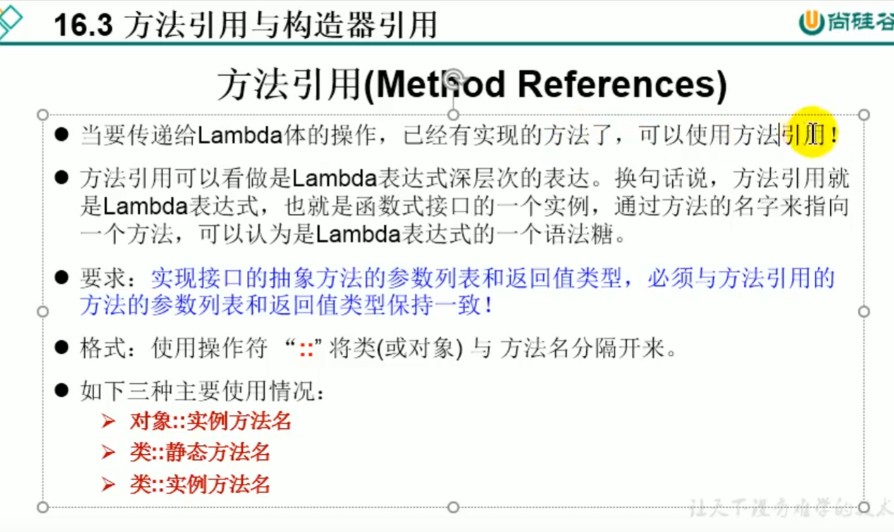

```java
package com.atguigu.java2;

/**
 * @author shkstart 邮箱：shkstart@126.com
 */
public class Employee {

   private int id;
   private String name;
   private int age;
   private double salary;

   public int getId() {
      return id;
   }

   public void setId(int id) {
      this.id = id;
   }

   public String getName() {
      return name;
   }

   public void setName(String name) {
      this.name = name;
   }

   public int getAge() {
      return age;
   }

   public void setAge(int age) {
      this.age = age;
   }

   public double getSalary() {
      return salary;
   }

   public void setSalary(double salary) {
      this.salary = salary;
   }

   public Employee() {
      System.out.println("Employee().....");
   }

   public Employee(int id) {
      this.id = id;
      System.out.println("Employee(int id).....");
   }

   public Employee(int id, String name) {
      this.id = id;
      this.name = name;
   }

   public Employee(int id, String name, int age, double salary) {

      this.id = id;
      this.name = name;
      this.age = age;
      this.salary = salary;
   }

   @Override
   public String toString() {
      return "Employee{" + "id=" + id + ", name='" + name + '\'' + ", age=" + age + ", salary=" + salary + '}';
   }

   @Override
   public boolean equals(Object o) {
      if (this == o)
         return true;
      if (o == null || getClass() != o.getClass())
         return false;

      Employee employee = (Employee) o;

      if (id != employee.id)
         return false;
      if (age != employee.age)
         return false;
      if (Double.compare(employee.salary, salary) != 0)
         return false;
      return name != null ? name.equals(employee.name) : employee.name == null;
   }

   @Override
   public int hashCode() {
      int result;
      long temp;
      result = id;
      result = 31 * result + (name != null ? name.hashCode() : 0);
      result = 31 * result + age;
      temp = Double.doubleToLongBits(salary);
      result = 31 * result + (int) (temp ^ (temp >>> 32));
      return result;
   }
}
```

```java
package com.atguigu.java2;

import java.util.ArrayList;
import java.util.List;
/**
 * 提供用于测试的数据
 * 
 * @author shkstart 邮箱：shkstart@126.com
 *
 */
public class EmployeeData {
   
   public static List<Employee> getEmployees(){
      List<Employee> list = new ArrayList<>();
      
      list.add(new Employee(1001, "马化腾", 34, 6000.38));
      list.add(new Employee(1002, "马云", 12, 9876.12));
      list.add(new Employee(1003, "刘强东", 33, 3000.82));
      list.add(new Employee(1004, "雷军", 26, 7657.37));
      list.add(new Employee(1005, "李彦宏", 65, 5555.32));
      list.add(new Employee(1006, "比尔盖茨", 42, 9500.43));
      list.add(new Employee(1007, "任正非", 26, 4333.32));
      list.add(new Employee(1008, "扎克伯格", 35, 2500.32));
      
      return list;
   }
   
}
```

```java
package com.xh.ConstructionRef;


import org.testng.annotations.Test;

import java.io.PrintStream;
import java.util.Comparator;
import java.util.function.BiPredicate;
import java.util.function.Consumer;
import java.util.function.Function;
import java.util.function.Supplier;

/**
 * 方法引用的使用
 *
 * 1.使用情境：当要传递给Lambda体的操作，已经有实现的方法了，可以使用方法引用！
 *
 * 2.方法引用，本质上就是Lambda表达式，而Lambda表达式作为函数式接口的实例。所以
 *   方法引用，也是函数式接口的实例。
 *
 * 3. 使用格式：  类(或对象) :: 方法名
 *
 * 4. 具体分为如下的三种情况：
 *    情况1     对象 :: 非静态方法
 *    情况2     类 :: 静态方法
 *
 *    情况3     类 :: 非静态方法  String：：compareTo 
 *
 * 5. 方法引用使用的要求：要求接口中的抽象方法的形参列表和返回值类型与方法引用的方法的
 *    形参列表和返回值类型相同！（针对于情况1和情况2）
 *
 * Created by shkstart.
 */
public class MethodRefTest {

   // 情况一：对象 :: 实例方法
   //Consumer中的void accept(T t)     抽象方法的形参列表(T t)  抽象方法的返回值:无
   //PrintStream中的void println(T t) 方法引用的形参列表(T t)  
   @Test
   public void test1() {
      Consumer<String> con1 = str -> System.out.println(str);
      con1.accept("北京");

      System.out.println("*******************");
      PrintStream ps = System.out;
      Consumer<String> con2 = ps::println;
      con2.accept("beijing");
   }
   
   //Supplier中的T get()
   //Employee中的String getName()
   @Test
   public void test2() {
      Employee emp = new Employee(1001,"Tom",23,5600);

      Supplier<String> sup1 = () -> emp.getName();
      System.out.println(sup1.get());

      System.out.println("*******************");
      Supplier<String> sup2 = emp::getName;
      System.out.println(sup2.get());

   }

   // 情况二：类 :: 静态方法
   //Comparator中的int compare(T t1,T t2)
   //Integer中的int compare(T t1,T t2)
   @Test
   public void test3() {
      Comparator<Integer> com1 = (t1,t2) -> Integer.compare(t1,t2);
      System.out.println(com1.compare(12,21));

      System.out.println("*******************");

      Comparator<Integer> com2 = Integer::compare;
      System.out.println(com2.compare(12,3));

   }
   
   //Function中的R apply(T t)
   //Math中的Long round(Double d)
   @Test
   public void test4() {
      Function<Double,Long> func = new Function<Double, Long>() {
         @Override
         public Long apply(Double d) {
            return Math.round(d);
         }
      };

      System.out.println("*******************");

      Function<Double,Long> func1 = d -> Math.round(d);
      System.out.println(func1.apply(12.3));

      System.out.println("*******************");

      Function<Double,Long> func2 = Math::round;
      System.out.println(func2.apply(12.6));
   }

   // 情况三：类 :: 实例方法  (有难度)
   // Comparator中的int comapre(T t1,T t2)
   // String中的int t1.compareTo(t2)
   @Test
   public void test5() {
      Comparator<String> com1 = (s1,s2) -> s1.compareTo(s2);
      System.out.println(com1.compare("abc","abd"));

      System.out.println("*******************");

      Comparator<String> com2 = String :: compareTo;
      System.out.println(com2.compare("abd","abm"));
   }

   //BiPredicate中的boolean test(T t1, T t2);
   //String中的boolean t1.equals(t2)
   @Test
   public void test6() {
      BiPredicate<String,String> pre1 = (s1,s2) -> s1.equals(s2);
      System.out.println(pre1.test("abc","abc"));

      System.out.println("*******************");
      BiPredicate<String,String> pre2 = String :: equals;
      System.out.println(pre2.test("abc","abd"));
   }
   
   // Function中的R apply(T t)
   // Employee中的String getName();
   @Test
   public void test7() {
      Employee employee = new Employee(1001, "Jerry", 23, 6000);


      Function<Employee,String> func1 = e -> e.getName();
      System.out.println(func1.apply(employee));

      System.out.println("*******************");


      Function<Employee,String> func2 = Employee::getName;
      System.out.println(func2.apply(employee));


   }

}
```

+++++++++++++++++++++++++构造器引用+++++++++++++++++++++++++++++++++++++++++++

```java
package com.atguigu.java2;

import org.junit.Test;

import java.util.Arrays;
import java.util.function.BiFunction;
import java.util.function.Function;
import java.util.function.Supplier;

/**
 * 一、构造器引用
 *      和方法引用类似，函数式接口的抽象方法的形参列表和构造器的形参列表一致。
 *      抽象方法的返回值类型即为构造器所属的类的类型
 *
 * 二、数组引用
 *     大家可以把数组看做是一个特殊的类，则写法与构造器引用一致。
 *
 * Created by shkstart
 */
public class ConstructorRefTest {
   //构造器引用
    //Supplier中的T get()
    //Employee的空参构造器：Employee()
    @Test
    public void test1(){

        Supplier<Employee> sup = new Supplier<Employee>() {
            @Override
            public Employee get() {
                return new Employee();
            }
        };
        System.out.println("*******************");

        Supplier<Employee>  sup1 = () -> new Employee();
        System.out.println(sup1.get());

        System.out.println("*******************");

        Supplier<Employee>  sup2 = Employee :: new;
        System.out.println(sup2.get());
    }

   //Function中的R apply(T t)
    @Test
    public void test2(){
        Function<Integer,Employee> func1 = id -> new Employee(id);
        Employee employee = func1.apply(1001);
        System.out.println(employee);

        System.out.println("*******************");

        Function<Integer,Employee> func2 = Employee :: new;
        Employee employee1 = func2.apply(1002);
        System.out.println(employee1);

    }

   //BiFunction中的R apply(T t,U u)
    @Test
    public void test3(){
        BiFunction<Integer,String,Employee> func1 = (id,name) -> new Employee(id,name);
        System.out.println(func1.apply(1001,"Tom"));

        System.out.println("*******************");

        BiFunction<Integer,String,Employee> func2 = Employee :: new;
        System.out.println(func2.apply(1002,"Tom"));

    }

   //数组引用
    //Function中的R apply(T t)
    @Test
    public void test4(){
        Function<Integer,String[]> func1 = length -> new String[length];
        String[] arr1 = func1.apply(5);
        System.out.println(Arrays.toString(arr1));

        System.out.println("*******************");

        Function<Integer,String[]> func2 = String[] :: new;
        String[] arr2 = func2.apply(10);
        System.out.println(Arrays.toString(arr2));

    }
}
```