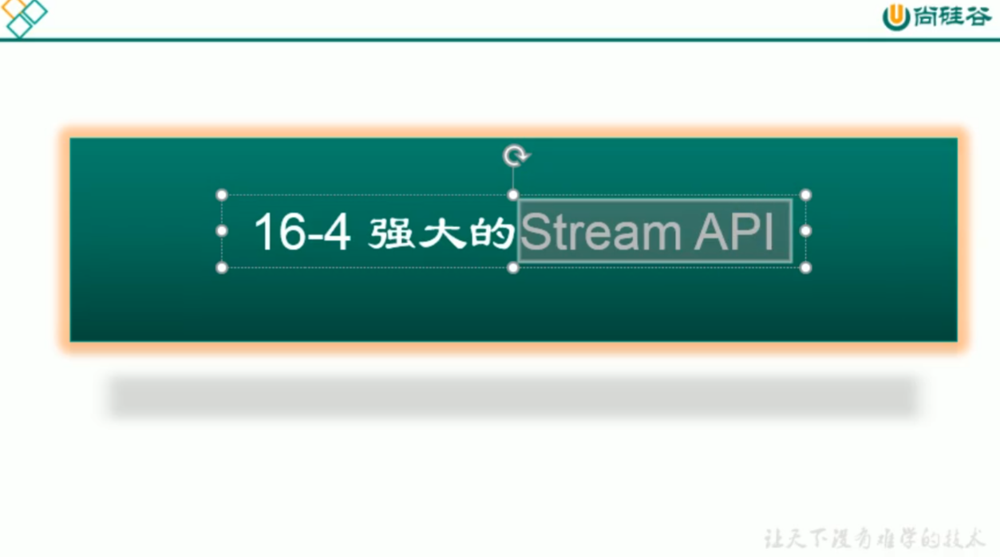

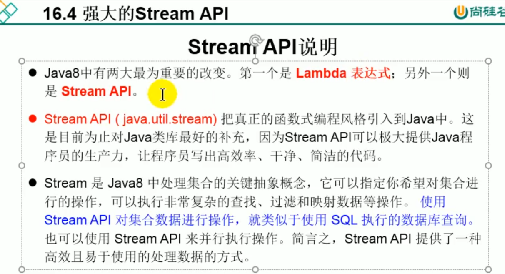


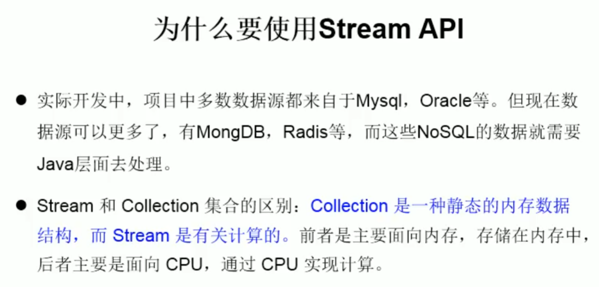

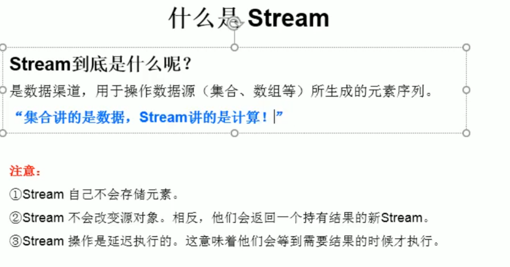

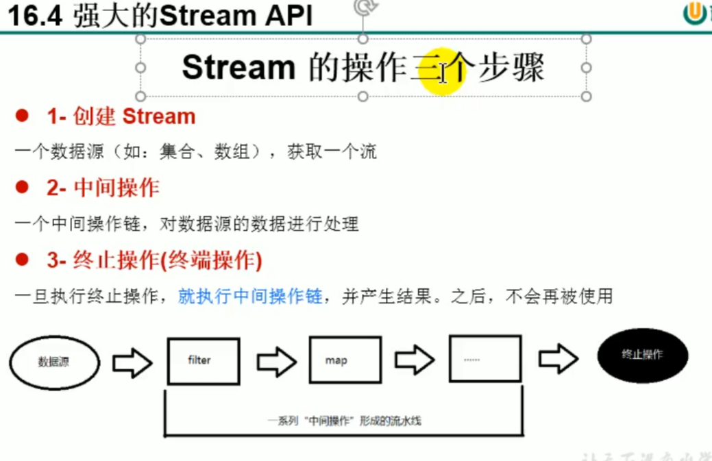


```java
package com.atguigu.java3;

import com.atguigu.java2.Employee;
import com.atguigu.java2.EmployeeData;
import org.junit.Test;

import java.util.Arrays;
import java.util.List;
import java.util.stream.IntStream;
import java.util.stream.Stream;

/**
 * 1. Stream关注的是对数据的运算，与CPU打交道
 *    集合关注的是数据的存储，与内存打交道
 *
 * 2.
 * ①Stream 自己不会存储元素。
 * ②Stream 不会改变源对象。相反，他们会返回一个持有结果的新Stream。
 * ③Stream 操作是延迟执行的。这意味着他们会等到需要结果的时候才执行
 *
 * 3.Stream 执行流程
 * ① Stream的实例化
 * ② 一系列的中间操作（过滤、映射、...)
 * ③ 终止操作
 *
 * 4.说明：
 * 4.1 一个中间操作链，对数据源的数据进行处理
 * 4.2 一旦执行终止操作，就执行中间操作链，并产生结果。之后，不会再被使用
 *
 *
 *  测试Stream的实例化
 *
 * @author shkstart
 * @create 2019 下午 4:25
 */
public class StreamAPITest {

    //创建 Stream方式一：通过集合
    @Test
    public void test1(){
        List<Employee> employees = EmployeeData.getEmployees();

//        default Stream<E> stream() : 返回一个顺序流
        Stream<Employee> stream = employees.stream();

//        default Stream<E> parallelStream() : 返回一个并行流
        Stream<Employee> parallelStream = employees.parallelStream();

    }

    //创建 Stream方式二：通过数组
    @Test
    public void test2(){
        int[] arr = new int[]{1,2,3,4,5,6};
        //调用Arrays类的static <T> Stream<T> stream(T[] array): 返回一个流
        IntStream stream = Arrays.stream(arr);

        Employee e1 = new Employee(1001,"Tom");
        Employee e2 = new Employee(1002,"Jerry");
        Employee[] arr1 = new Employee[]{e1,e2};
        Stream<Employee> stream1 = Arrays.stream(arr1);

    }
    //创建 Stream方式三：通过Stream的of()
    @Test
    public void test3(){

        Stream<Integer> stream = Stream.of(1, 2, 3, 4, 5, 6);

    }

    //创建 Stream方式四：创建无限流
    @Test
    public void test4(){

//      迭代
//      public static<T> Stream<T> iterate(final T seed, final UnaryOperator<T> f)
        //遍历前10个偶数
        Stream.iterate(0, t -> t + 2).limit(10).forEach(System.out::println);


//      生成
//      public static<T> Stream<T> generate(Supplier<T> s)
        Stream.generate(Math::random).limit(10).forEach(System.out::println);

    }

}
```

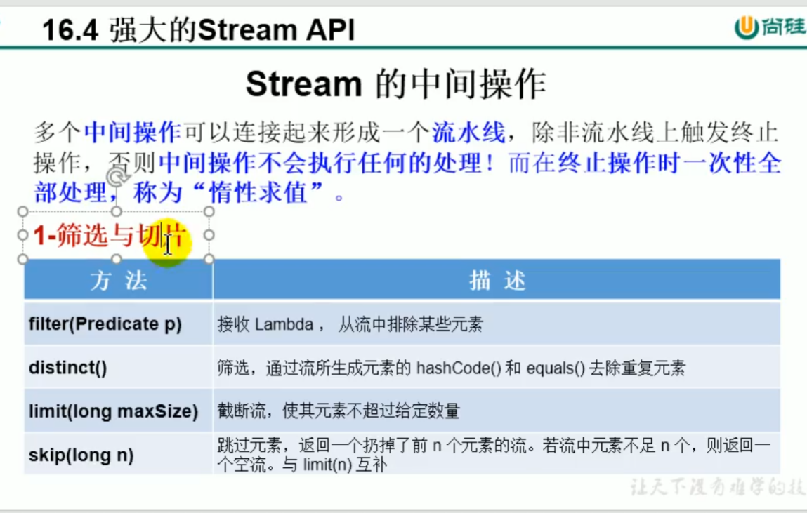

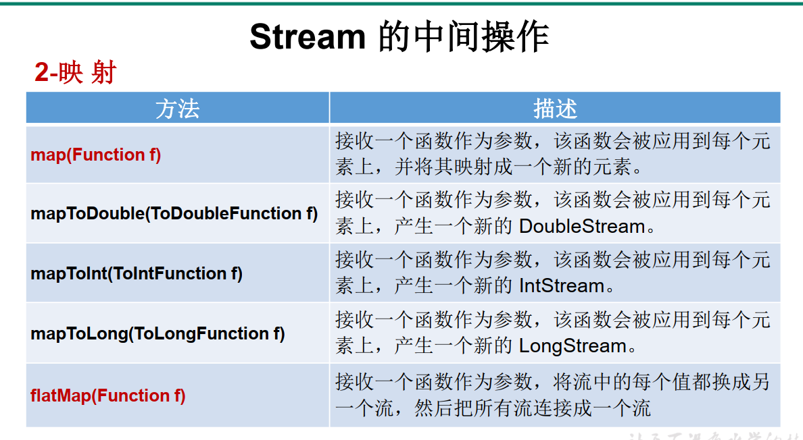

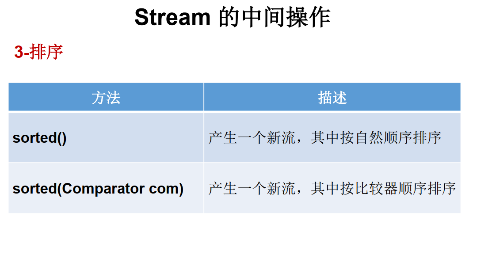

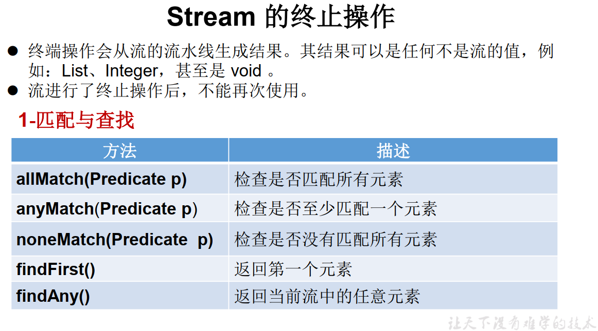

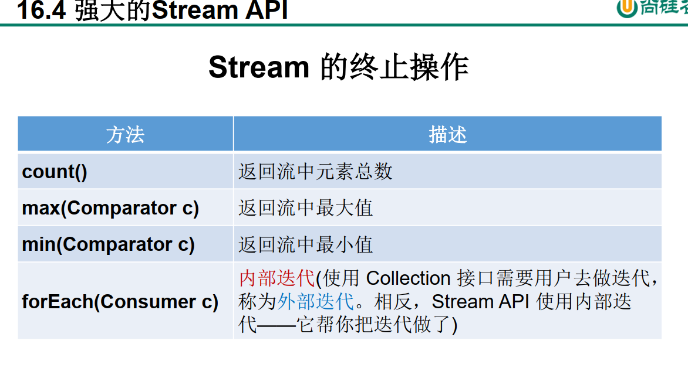

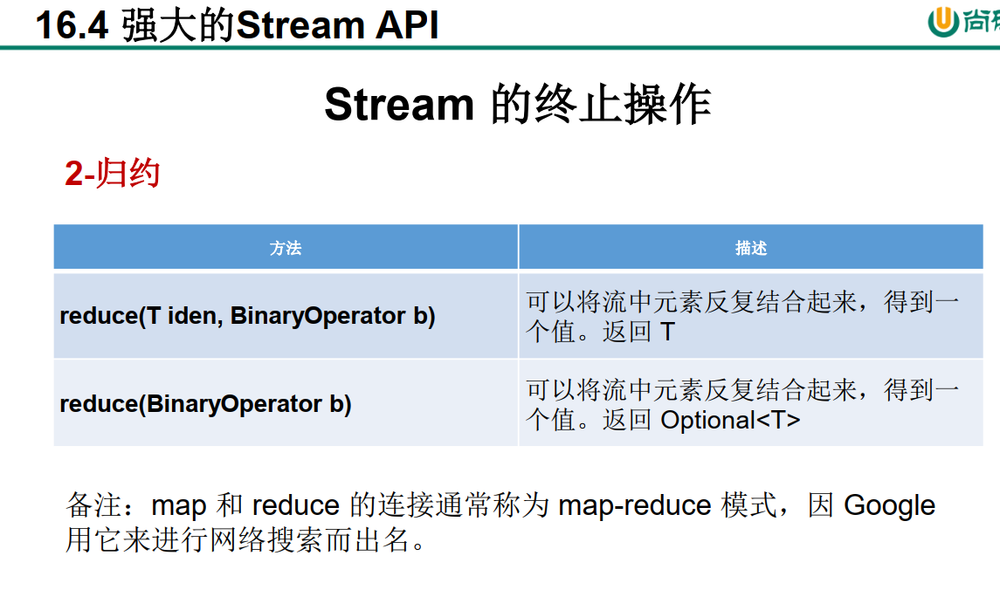

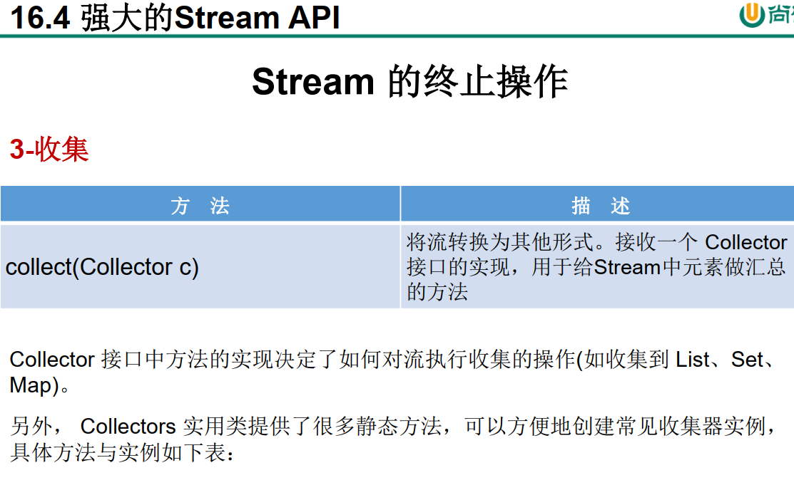

```java
package com.atguigu.java3;

import com.atguigu.java2.Employee;
import com.atguigu.java2.EmployeeData;
import org.junit.Test;

import java.util.ArrayList;
import java.util.Arrays;
import java.util.List;
import java.util.stream.Stream;

/**
 * 测试Stream的中间操作
 *
 * @author shkstart
 * @create 2019 下午 4:42
 */
public class StreamAPITest1 {

    //1-筛选与切片
    @Test
    public void test1(){
        List<Employee> list = EmployeeData.getEmployees();
//        filter(Predicate p)——接收 Lambda ， 从流中排除某些元素。
        Stream<Employee> stream = list.stream();
        //练习：查询员工表中薪资大于7000的员工信息
        stream.filter(e -> e.getSalary() > 7000).forEach(System.out::println);
        
          Stream<Employee> stream = employees.stream();
        stream.filter(new Predicate<Employee>() {
            @Override
            public boolean test(Employee employee) {
                return employee.getSalary()>7000;
            }
        }).forEach(new Consumer<Employee>() {
            @Override
            public void accept(Employee employee) {
                System.out.println(employee);
            }
        });


        Stream<Employee> stream2 = employees.stream();
        stream2.filter((employee)->employee.getSalary()>7000).forEach((employee)-> System.out.println(employee));


        Stream<Employee> stream3 = employees.stream();
        stream3.filter((employee)>employee.getSalary()>7000).forEach(System.out::println);

        System.out.println();
//        limit(n)——截断流，使其元素不超过给定数量。
        list.stream().limit(3).forEach(System.out::println);
        System.out.println();

//        skip(n) —— 跳过元素，返回一个扔掉了前 n 个元素的流。若流中元素不足 n 个，则返回一个空流。与 limit(n) 互补
        list.stream().skip(3).forEach(System.out::println);

        System.out.println();
//        distinct()——筛选，通过流所生成元素的 hashCode() 和 equals() 去除重复元素

        list.add(new Employee(1010,"刘强东",40,8000));
        list.add(new Employee(1010,"刘强东",41,8000));
        list.add(new Employee(1010,"刘强东",40,8000));
        list.add(new Employee(1010,"刘强东",40,8000));
        list.add(new Employee(1010,"刘强东",40,8000));

//        System.out.println(list);

        list.stream().distinct().forEach(System.out::println);
    }

    //映射
    @Test
    public void test2(){
//        map(Function f)——接收一个函数作为参数，将元素转换成其他形式或提取信息，该函数会被应用到每个元素上，并将其映射成一个新的元素。
        List<String> list = Arrays.asList("aa", "bb", "cc", "dd");
        list.stream().map(str -> str.toUpperCase()).forEach(System.out::println);

//        练习1：获取员工姓名长度大于3的员工的姓名。
        List<Employee> employees = EmployeeData.getEmployees();
        Stream<String> namesStream = employees.stream().map(Employee::getName);
        namesStream.filter(name -> name.length() > 3).forEach(System.out::println);
        System.out.println();
        //练习2：
         //这样的话里面的每一个元素都是一个流，所以需要在foreach的时候，对每个元素都得重新forEach一下类似
        //[a,b,[c],[d,e,f]]
        Stream<Stream<Character>> streamStream = list.stream().map(StreamAPITest1::fromStringToStream);
        streamStream.forEach(s ->{
            s.forEach(System.out::println);
        });
        System.out.println();
        
//        flatMap(Function f)——接收一个函数作为参数，将流中的每个值都换成另一个流，然后把所有流连接成一个流。
        //就会吧所有的流全部拆开 然后再合并成一个流 //[a,b,c,d,e,f]
        Stream<Character> characterStream = list.stream().flatMap(StreamAPITest1::fromStringToStream);
        characterStream.forEach(System.out::println);

    }

    //将字符串中的多个字符构成的集合转换为对应的Stream的实例
    public static Stream<Character> fromStringToStream(String str){//aa
        ArrayList<Character> list = new ArrayList<>();
        for(Character c : str.toCharArray()){
            list.add(c);
        }
       return list.stream();

    }


    @Test
    public void test3(){
        ArrayList list1 = new ArrayList();
        list1.add(1);
        list1.add(2);
        list1.add(3);

        ArrayList list2 = new ArrayList();
        list2.add(4);
        list2.add(5);
        list2.add(6);

//        list1.add(list2);
        list1.addAll(list2);
        System.out.println(list1);

    }

    //3-排序
    @Test
    public void test4(){
//        sorted()——自然排序
        List<Integer> list = Arrays.asList(12, 43, 65, 34, 87, 0, -98, 7);
        list.stream().sorted().forEach(System.out::println);
        //抛异常，原因:Employee没有实现Comparable接口
//        List<Employee> employees = EmployeeData.getEmployees();
//        employees.stream().sorted().forEach(System.out::println);


//        sorted(Comparator com)——定制排序

        List<Employee> employees = EmployeeData.getEmployees();
        employees.stream().sorted( (e1,e2) -> {

           int ageValue = Integer.compare(e1.getAge(),e2.getAge());
           if(ageValue != 0){
               return ageValue;
           }else{
               return -Double.compare(e1.getSalary(),e2.getSalary());
           }

        }).forEach(System.out::println);
    }

}

```

```java
package com.atguigu.java3;

import com.atguigu.java2.Employee;
import com.atguigu.java2.EmployeeData;
import org.junit.Test;

import java.util.Arrays;
import java.util.List;
import java.util.Optional;
import java.util.Set;
import java.util.stream.Collectors;
import java.util.stream.Stream;

/**
 * 测试Stream的终止操作
 *
 * @author shkstart
 * @create 2019 下午 6:37
 */
public class StreamAPITest2 {

    //1-匹配与查找
    @Test
    public void test1(){
        List<Employee> employees = EmployeeData.getEmployees();

//        allMatch(Predicate p)——检查是否匹配所有元素。
//          练习：是否所有的员工的年龄都大于18
        boolean allMatch = employees.stream().allMatch(e -> e.getAge() > 18);
        System.out.println(allMatch);

//        anyMatch(Predicate p)——检查是否至少匹配一个元素。
//         练习：是否存在员工的工资大于 10000
        boolean anyMatch = employees.stream().anyMatch(e -> e.getSalary() > 10000);
        System.out.println(anyMatch);

//        noneMatch(Predicate p)——检查是否没有匹配的元素。
//          练习：是否存在员工姓“雷”
        boolean noneMatch = employees.stream().noneMatch(e -> e.getName().startsWith("雷"));
        System.out.println(noneMatch);
//        findFirst——返回第一个元素
        Optional<Employee> employee = employees.stream().findFirst();
        System.out.println(employee);
//        findAny——返回当前流中的任意元素
        Optional<Employee> employee1 = employees.parallelStream().findAny();
        System.out.println(employee1);

    }

    @Test
    public void test2(){
        List<Employee> employees = EmployeeData.getEmployees();
        // count——返回流中元素的总个数
        long count = employees.stream().filter(e -> e.getSalary() > 5000).count();
        System.out.println(count);
//        max(Comparator c)——返回流中最大值
//        练习：返回最高的工资：
        Stream<Double> salaryStream = employees.stream().map(e -> e.getSalary());
        Optional<Double> maxSalary = salaryStream.max(Double::compare);
        System.out.println(maxSalary);
//        min(Comparator c)——返回流中最小值
//        练习：返回最低工资的员工
        Optional<Employee> employee = employees.stream().min((e1, e2) -> Double.compare(e1.getSalary(), e2.getSalary()));
        System.out.println(employee);
        System.out.println();
//        forEach(Consumer c)——内部迭代
        employees.stream().forEach(System.out::println);

        //使用集合的遍历操作
        employees.forEach(System.out::println);
    }

    //2-归约
    @Test
    public void test3(){
//        reduce(T identity, BinaryOperator)——可以将流中元素反复结合起来，得到一个值。返回 T
//        练习1：计算1-10的自然数的和
        List<Integer> list = Arrays.asList(1,2,3,4,5,6,7,8,9,10);
        Integer sum = list.stream().reduce(0, Integer::sum);
        System.out.println(sum);


//        reduce(BinaryOperator) ——可以将流中元素反复结合起来，得到一个值。返回 Optional<T>
//        练习2：计算公司所有员工工资的总和
        List<Employee> employees = EmployeeData.getEmployees();
        Stream<Double> salaryStream = employees.stream().map(Employee::getSalary);
//        Optional<Double> sumMoney = salaryStream.reduce(Double::sum);
        Optional<Double> sumMoney = salaryStream.reduce((d1,d2) -> d1 + d2);
        System.out.println(sumMoney.get());

    }

    //3-收集
    @Test
    public void test4(){
//        collect(Collector c)——将流转换为其他形式。接收一个 Collector接口的实现，用于给Stream中元素做汇总的方法
//        练习1：查找工资大于6000的员工，结果返回为一个List或Set

        List<Employee> employees = EmployeeData.getEmployees();
        List<Employee> employeeList = employees.stream().filter(e -> e.getSalary() > 6000).collect(Collectors.toList());

        employeeList.forEach(System.out::println);
        System.out.println();
        Set<Employee> employeeSet = employees.stream().filter(e -> e.getSalary() > 6000).collect(Collectors.toSet());

        employeeSet.forEach(System.out::println);


    }
}

```

