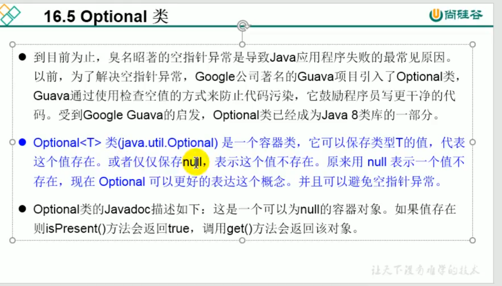
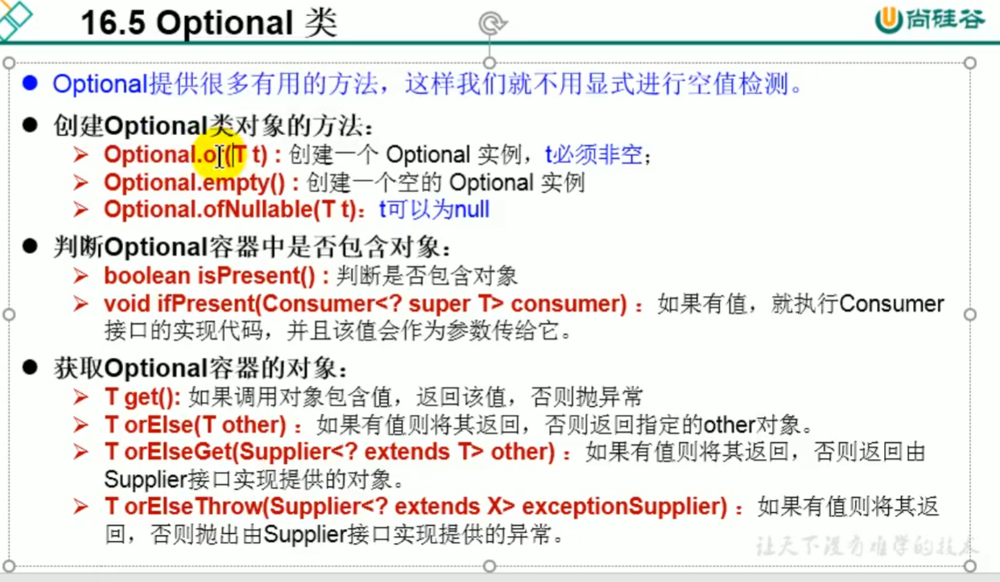

```java
package com.xh.Optional;

/**
 * @author shkstart
 * @create 2019 下午 7:22
 */
public class Boy {
    private Girl girl;

    @Override
    public String toString() {
        return "Boy{" +
                "girl=" + girl +
                '}';
    }

    public Girl getGirl() {
        return girl;
    }

    public void setGirl(Girl girl) {
        this.girl = girl;
    }

    public Boy() {

    }

    public Boy(Girl girl) {

        this.girl = girl;
    }
}

```

```java
package com.xh.Optional;

/**
 * @author shkstart
 * @create 2019 下午 7:23
 */
public class Girl {

    private String name;

    @Override
    public String toString() {
        return "Girl{" +
                "name='" + name + '\'' +
                '}';
    }

    public String getName() {
        return name;
    }

    public void setName(String name) {
        this.name = name;
    }

    public Girl() {

    }

    public Girl(String name) {

        this.name = name;
    }
}

```

```java
package com.xh.Optional;

import org.junit.jupiter.api.Test;

import javax.swing.text.html.Option;
import java.util.Optional;

/**
 * Optional类：为了在程序中避免出现空指针异常而创建的。
 *
 * 常用的方法：ofNullable(T t)
 *            orElse(T t)
 *
 * @author shkstart
 * @create 2019 下午 7:24
 */
public class OptionalTest {

    /*
Optional.of(T t) : 创建一个 Optional 实例，t必须非空；
Optional.empty() : 创建一个空的 Optional 实例
Optional.ofNullable(T t)：t可以为null

 */
    @Test
    public void test1(){
        Girl girl = new Girl();
//        girl = null;
        //of(T t):保证t是非空的
        Optional<Girl> optionalGirl = Optional.of(girl);

    }

    @Test
    public void test2(){
        Girl girl = new Girl();
       girl = null;
        //ofNullable(T t)：t可以为null
        Optional<Girl> optionalGirl = Optional.ofNullable(girl);
        System.out.println(optionalGirl);
        //orElse(T t1):如果单前的Optional内部封装的t是非空的，则返回内部的t.
        //如果内部的t是空的，则返回orElse()方法中的参数t1.
        Girl girl1 = optionalGirl.orElse(new Girl("赵丽颖"));
        System.out.println(girl1);

    }

    public String getGirlName(Boy boy){
        return boy.getGirl().getName();
    }

    @Test
    public void test3(){
        Boy boy = new Boy();
        boy = null;
        String girlName = getGirlName(boy);
        System.out.println(girlName);

    }
    //优化以后的getGirlName():
    public String getGirlName1(Boy boy){
        if(boy != null){
            Girl girl = boy.getGirl();
            if(girl != null){
                return girl.getName();
            }
        }

        return null;

    }

    @Test
    public void test4(){
        Boy boy = new Boy();
        boy = null;
        String girlName = getGirlName1(boy);
        System.out.println(girlName);

    }

    //优化以后的getGirlName():
    public String getGirlName2(Boy boy){
        Optional<Boy> boyOptional = Optional.ofNullable(boy);
        Boy boy1 = boyOptional.orElse(new Boy(new Girl("迪丽热巴")));
        Girl girl = boy1.getGirl();
        Optional<Girl> girlOptional = Optional.ofNullable(girl);
        Girl girl1 = girlOptional.orElse(new Girl("古力娜扎"));

        return girl1.getName();
    }

    @Test
    public void test05(){
        Boy boy=null;
        boy=new Boy();

        boy=new Boy(new Girl("苍老师"));
        String girlName2 = getGirlName2(boy);
        System.out.println(girlName2);
    }


}

```

