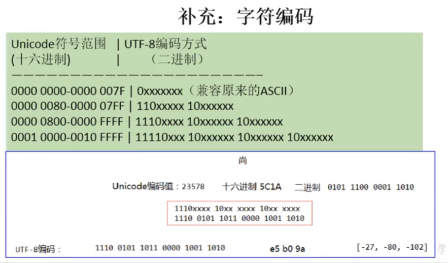
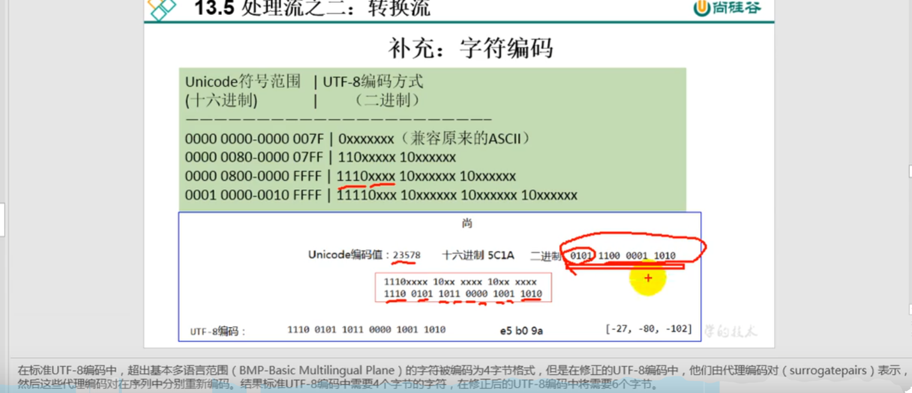

```java
package com.guigu.java1;


import org.junit.Test;

import java.io.*;

/**
 * 处理流之二：转换流的使用 问题来源：我们在使用字节流的时候，读取中文的时候会出现乱码
 * 1.转换流：属于字符流
 *   InputStreamReader：将一个字节的输入流转换为字符的输入流
 *   OutputStreamWriter：将一个字符的输出流转换为字节的输出流
 *
 * 2.作用：提供字节流与字符流之间的转换
 *
 * 3. 解码：字节、字节数组  --->字符数组、字符串
 *    编码：字符数组、字符串 ---> 字节、字节数组
 *
 *
 * 4.字符集
 *ASCII：美国标准信息交换码。
 用一个字节的7位可以表示。
 ISO8859-1：拉丁码表。欧洲码表
 用一个字节的8位表示。
 GB2312：中国的中文编码表。最多两个字节编码所有字符
 GBK：中国的中文编码表升级，融合了更多的中文文字符号。最多两个字节编码
 Unicode：国际标准码，融合了目前人类使用的所有字符。为每个字符分配唯一的字符码。所有的文字都用两个字节来表示。
 UTF-8：变长的编码方式，可用1-4个字节来表示一个字符。

 *
 *
 * @author shkstart
 * @create 2019 下午 4:25
 */


public class InputStreamReader {

    /*
   此时处理异常的话，仍然应该使用try-catch-finally
   InputStreamReader的使用，实现字节的输入流到字符的输入流的转换
    */
    @Test
    public void test1() throws IOException {

        FileInputStream fis = new FileInputStream("dbcp.txt");
//        InputStreamReader isr = new InputStreamReader(fis);//使用系统默认的字符集
        //参数2指明了字符集，具体使用哪个字符集，取决于文件dbcp.txt保存时使用的字符集
        java.io.InputStreamReader isr = new java.io.InputStreamReader(fis,"UTF-8");//使用系统默认的字符集

        char[] cbuf = new char[20];
        int len;
        while((len = isr.read(cbuf)) != -1){
            String str = new String(cbuf,0,len);
            System.out.print(str);
        }

        isr.close();

    }

    /*
    此时处理异常的话，仍然应该使用try-catch-finally

    综合使用InputStreamReader和OutputStreamWriter
     */
    @Test
    public void test2() throws Exception {
        //1.造文件、造流
        File file1 = new File("dbcp.txt");
        File file2 = new File("dbcp_gbk.txt");

        FileInputStream fis = new FileInputStream(file1);
        FileOutputStream fos = new FileOutputStream(file2);

        java.io.InputStreamReader isr = new java.io.InputStreamReader(fis,"utf-8");
        OutputStreamWriter osw = new OutputStreamWriter(fos,"gbk");

        //2.读写过程
        char[] cbuf = new char[20];
        int len;
        while((len = isr.read(cbuf)) != -1){
            osw.write(cbuf,0,len);
        }

        //3.关闭资源
        isr.close();
        osw.close();


    }


}
```




