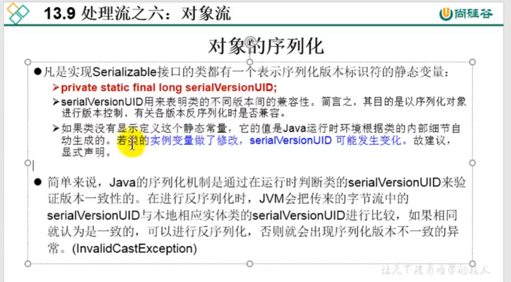

加了这个版本号之后，如果原有的类进行了修改，但是修改不影响序列化后的功能的话，还是能正常反序列化。

但是，如果在序列化的时候，没有加这个id，那么这个类的这个id会根据类的具体内容进行生成。如果对类A进行序列化后（A没有定义id），如果对A进行了修改，那A的id（系统自动生成的）就会发生变化，这就不能进行反序列化了。

```java
package com.xh.ObjectStream;

import java.io.Serializable;

/**
 * Person需要满足如下的要求，方可序列化
 * 1.需要实现接口：Serializable
 * 2.当前类提供一个全局常量：serialVersionUID
 * 3.除了当前Person类需要实现Serializable接口之外，还必须保证其内部所有属性
 *   也必须是可序列化的。（默认情况下，基本数据类型可序列化）
 * 补充：ObjectOutputStream和ObjectInputStream不能序列化static（是归类所有的）和transient修饰的成员变量
 
 *serialVersionUID适用于java序列化机制。简单来说，JAVA序列化的机制是通过 判断类的serialVersionUID来验证的版本一致的。在进行反序列化时，JVM会把传来的字节流中的serialVersionUID于本地相应实体类的serialVersionUID进行比较。如果相同说明是一致的，可以进行反序列化，否则会出现反序列化版本一致的异常，即是InvalidCastException。
具体序列化的过程是这样的：序列化操作时会把系统当前类的serialVersionUID写入到序列化文件中，当反序列化时系统会自动检测文件中的serialVersionUID，判断它是否与当前类中的serialVersionUID一致。如果一致说明序列化文件的版本与当前类的版本是一样的，可以反序列化成功，否则就失败；
原文出处：https://www.cnblogs.com/duanxz/p/3511695.html
不加是会出问题的
 *

 *
 *
 * @author shkstart
 * @create 2019 上午 10:38
 */
public class Person implements  {

    public static final long serialVersionUID = 475463534532L;//这就定义一个标识

    private String name;
    private int age;
    private int id;
    private Account acct;

    public Person(String name, int age, int id) {
        this.name = name;
        this.age = age;
        this.id = id;
    }

    public Person(String name, int age, int id, Account acct) {
        this.name = name;
        this.age = age;
        this.id = id;
        this.acct = acct;
    }

    @Override
    public String toString() {
        return "Person{" +
                "name='" + name + '\'' +
                ", age=" + age +
                ", id=" + id +
                ", acct=" + acct +
                '}';
    }

    public int getId() {
        return id;
    }

    public void setId(int id) {
        this.id = id;
    }

    public String getName() {
        return name;
    }

    public void setName(String name) {
        this.name = name;
    }

    public int getAge() {
        return age;
    }

    public void setAge(int age) {
        this.age = age;
    }

    public Person(String name, int age) {

        this.name = name;
        this.age = age;
    }

    public Person() {

    }
}

class Account implements Serializable{
    public static final long serialVersionUID = 4754534532L;
    private double balance;

    @Override
    public String toString() {
        return "Account{" +
                "balance=" + balance +
                '}';
    }

    public double getBalance() {
        return balance;
    }

    public void setBalance(double balance) {
        this.balance = balance;
    }

    public Account(double balance) {

        this.balance = balance;
    }
}

```


```java
package com.atguigu.java;

import org.junit.Test;

import java.io.*;

/**
 * 对象流的使用
 * 1.ObjectInputStream 和 ObjectOutputStream
 * 2.作用：用于存储和读取基本数据类型数据或对象的处理流。它的强大之处就是可以把Java中的对象写入到数据源中，也能把对象从数据源中还原回来。
 *
 * 3.要想一个java对象是可序列化的，需要满足相应的要求。见Person.java
 *
 * 4.序列化机制：
 * 对象序列化机制允许把内存中的Java对象转换成平台无关的二进制流，从而允许把这种
 * 二进制流持久地保存在磁盘上，或通过网络将这种二进制流传输到另一个网络节点。
 * 当其它程序获取了这种二进制流，就可以恢复成原来的Java对象。

 *
 * @author shkstart
 * @create 2019 上午 10:27
 */
public class ObjectInputOutputStreamTest {

    /*
    序列化过程：将内存中的java对象保存到磁盘中或通过网络传输出去
    使用ObjectOutputStream实现
     */
    @Test
    public void testObjectOutputStream(){
        ObjectOutputStream oos = null;

        try {
            //1.
            oos = new ObjectOutputStream(new FileOutputStream("object.dat"));
            //2.
            oos.writeObject(new String("我爱北京天安门"));
            oos.flush();//刷新操作

            oos.writeObject(new Person("王铭",23));
            oos.flush();

            oos.writeObject(new Person("张学良",23,1001,new Account(5000)));
            oos.flush();

        } catch (IOException e) {
            e.printStackTrace();
        } finally {
            if(oos != null){
                //3.
                try {
                    oos.close();
                } catch (IOException e) {
                    e.printStackTrace();
                }

            }
        }

    }

    /*
    反序列化：将磁盘文件中的对象还原为内存中的一个java对象
    使用ObjectInputStream来实现
     */
    @Test
    public void testObjectInputStream(){
        ObjectInputStream ois = null;
        try {
            ois = new ObjectInputStream(new FileInputStream("object.dat"));

            Object obj = ois.readObject();
            String str = (String) obj;

            Person p = (Person) ois.readObject();
            Person p1 = (Person) ois.readObject();

            System.out.println(str);
            System.out.println(p);
            System.out.println(p1);

        } catch (IOException e) {
            e.printStackTrace();
        } catch (ClassNotFoundException e) {
            e.printStackTrace();
        } finally {
            if(ois != null){
                try {
                    ois.close();
                } catch (IOException e) {
                    e.printStackTrace();
                }

            }
        }


    }

}
```