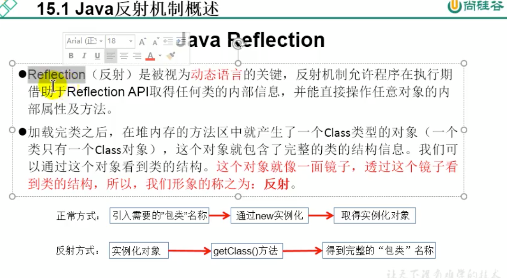
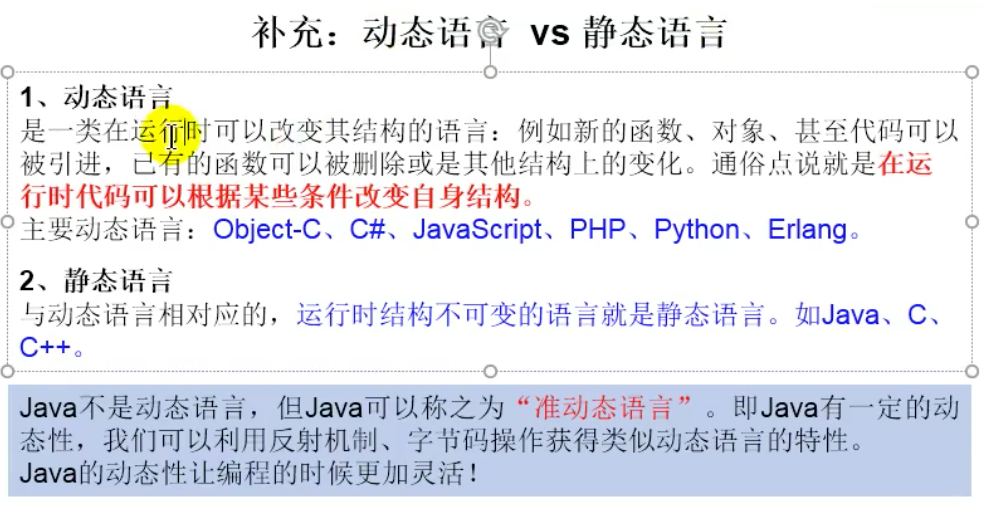
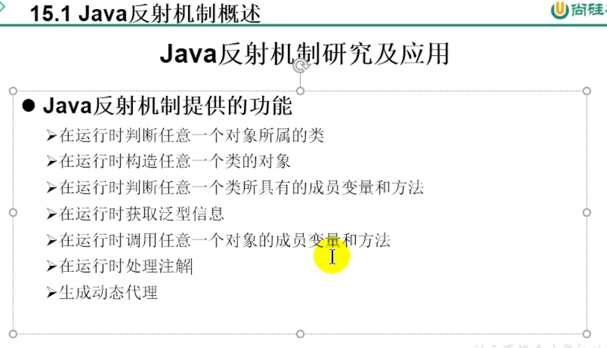
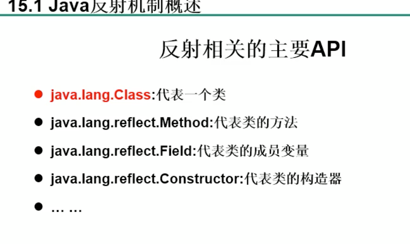

```java
package com.guigu.com;

import org.junit.Test;

import java.lang.reflect.Constructor;
import java.lang.reflect.Field;
import java.lang.reflect.InvocationTargetException;
import java.lang.reflect.Method;

public class ReflectionTest {

    //反射之前，对于Person的操作
    @Test
    public void test1() {

        //1.创建Person类的对象
        Person p1 = new Person("Tom", 12);

        //2.通过对象，调用其内部的属性、方法
        p1.age = 10;
        System.out.println(p1.toString());

        p1.show();

        //在Person类外部，不可以通过Person类的对象调用其内部私有结构。
        //比如：name、showNation()以及私有的构造器
    }


    //反射之后，对于Person的操作
    @Test
    public void test2() throws NoSuchMethodException, IllegalAccessException, InvocationTargetException, InstantiationException, NoSuchFieldException {

        Class clazz=Person.class;
        Constructor cons=clazz.getConstructor(String.class,int.class);

        Object obj=cons.newInstance("tom",12);


        Person p=(Person)obj;
        System.out.println(obj.toString());

        //2.通过反射 调用对象指定的属性、方法
        //调用属性
        Field age = clazz.getDeclaredField("age");
        age.set(p,10);
        System.out.println(p.toString());


        //调用方法
        Method show = clazz.getDeclaredMethod("show");
        show.invoke(p);

        System.out.println("*******************************");

        //通过反射，可以调用Person类的私有结构的。比如：私有的构造器、方法、属性
        //调用私有的构造器
        Constructor cons1 = clazz.getDeclaredConstructor(String.class);
        cons1.setAccessible(true);
        Person p1 = (Person) cons1.newInstance("Jerry");
        System.out.println(p1);

        //调用私有的属性
        Field name = clazz.getDeclaredField("name");
        name.setAccessible(true);
        name.set(p1,"HanMeimei");
        System.out.println(p1);

        //调用私有的方法
        Method showNation = clazz.getDeclaredMethod("showNation", String.class);
        showNation.setAccessible(true);
        String nation = (String) showNation.invoke(p1,"中国");//相当于String nation = p1.showNation("中国")
        System.out.println(nation);

    }


}
```

```java
package com.guigu.com;

import org.junit.Test;

import java.lang.reflect.Constructor;
import java.lang.reflect.Field;
import java.lang.reflect.InvocationTargetException;
import java.lang.reflect.Method;

public class ReflectionTest {

    //疑问1：通过直接new的方式或反射的方式都可以调用公共的结构，开发中到底用那个？
    //建议：直接new的方式。
    //什么时候会使用：反射的方式。 运行的的时候不确定生成哪个对象，就得用反射，你发过来什么，我生成什么  反射的特征：动态性  你服务器开起来了 我要login 那我就申请一个login的类，造login的对象；如果来别的操作比如注册操作了，就利用反射申请注册类，生成注册的对象
    //这个过程是动态的
    //疑问2：反射机制与面向对象中的封装性是不是矛盾的？如何看待两个技术？
    //不矛盾。
    // 封装性在设计一个类的时候会私有 公用。当你一个类写私有和共有的方法的时候，你只能调用共有的方法。包括单例模式 就是你别创建对象类
    //单例 你没有必要去调用  但是 你非要用反射去做 也性  封装性是建议你调用不调用  反射解决的是能不能调用的问题

    /*
    关于java.lang.Class类的理解
    1.类的加载过程：
    程序经过javac.exe命令以后，会生成一个或多个字节码文件(.class结尾)。
    接着我们使用java.exe命令对某个字节码文件进行解释运行。相当于将某个字节码文件
    加载到内存中。此过程就称为类的加载。加载到内存中的类，我们就称为运行时类，此
    运行时类，就作为Class的一个实例。
    
    类加载在内存中之后都可作为一个实例

    2.换句话说，Class的实例就对应着一个运行时类。
    3.加载到内存中的运行时类，会缓存一定的时间。在此时间之内，我们可以通过不同的方式
    来获取此运行时类。
     */ 
    //获取Class的实例的方式（前三种方式需要掌握）
    @Test
    public void test3() throws ClassNotFoundException {
        //方式一：调用运行时类的属性：.class
        Class clazz1 = Person.class;
        System.out.println(clazz1);
        //方式二：通过运行时类的对象,调用getClass()
        Person p1 = new Person();
        Class clazz2 = p1.getClass();
        System.out.println(clazz2);

        //方式三：调用Class的静态方法：forName(String classPath)
        Class clazz3 = Class.forName("com.atguigu.java.Person");
//        clazz3 = Class.forName("java.lang.String");
        System.out.println(clazz3);

        System.out.println(clazz1 == clazz2);
        System.out.println(clazz1 == clazz3);

        //方式四：使用类的加载器：ClassLoader  (了解)
        ClassLoader classLoader = ReflectionTest.class.getClassLoader();
        Class clazz4 = classLoader.loadClass("com.atguigu.java.Person");
        System.out.println(clazz4);

        System.out.println(clazz1 == clazz4);

    }
  
  
  //万事万物皆对象？对象.xxx,File,URL,反射,前端、数据库操作


    //Class实例可以是哪些结构的说明：
    @Test
    public void test4(){
        Class c1 = Object.class;
        Class c2 = Comparable.class;
        Class c3 = String[].class;
        Class c4 = int[][].class;
        Class c5 = ElementType.class;
        Class c6 = Override.class;
        Class c7 = int.class;
        Class c8 = void.class;
        Class c9 = Class.class;

        int[] a = new int[10];
        int[] b = new int[100];
        Class c10 = a.getClass();
        Class c11 = b.getClass();
        // 只要数组的元素类型与维度一样，就是同一个Class
        System.out.println(c10 == c11);

    }

}
```