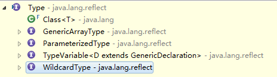

## 课件中的理解

```
/*
    关于java.lang.Class类的理解
    1.类的加载过程：
    程序经过javac.exe命令以后，会生成一个或多个字节码文件(.class结尾)。
    接着我们使用java.exe命令对某个字节码文件进行解释运行。相当于将某个字节码文件
    加载到内存中。此过程就称为类的加载。加载到内存中的类，我们就称为运行时类，此
    运行时类，就作为Class的一个实例。
    
    类加载在内存中之后都可作为一个实例

    2.换句话说，Class的实例就对应着一个运行时类。
    3.加载到内存中的运行时类，会缓存一定的时间。在此时间之内，我们可以通过不同的方式
    来获取此运行时类。
     */ 
```

## 博客的理解

http://t.zoukankan.com/niujifei-p-12312661.html

# 一、java.lang.Class 类型

　　所有的 Java 类型（包括基本数据类型、引用数据类型、void）被加载到内存后，或者编译器自动编译生成的 class 字节码，最终都会用一个 Class 对象表示。

　　所有的 Java 类型，在内存中都表示为一个 Class 对象。Class 类的实例表示正在运行的 Java 应用程序中的类和接口。事实上，所有类型都可以表示为 Class 的实例对象。

```
（1）class：外部类，内部类

（2）interface：接口

（3）[]：数组，所有具有相同元素类型和维数的数组共享同一个Class 对象

（4）enum：枚举

（5）annotation：注解@interface

（6）primitive type：8种基本数据类型

（7）void
```

Demo：

```java
@Test
    public void test1(){
        Class<?> c1 = int.class;//基本数据类型
        Class<?> c2 = void.class;//void类型

        Class<?> c3 = String.class;//系统定义的类类型
        Class<?> c4 = Object.class;//类
        Class<?> c5 = Class.class;//类
        Class<?> c6 = Comparable.class;//接口类型

        //只要元素类型与维度一样，就是同一个Class
        Class<?> c7 = int[].class;
        int[] arr1 = new int[5];
        int[] arr2 = new int[10];
        System.out.println(arr1.getClass() == c7);
        System.out.println(arr2.getClass() == c7);
        Class c9 = String[].class;
        Class c10 = int[][].class;
        System.out.println(c7 == c9);
        System.out.println(c7 == c10);

        Class c11 = Override.class;//注解类型
        Class c12 = ElementType.class;//枚举类型

        //Class c9 = Student.class;//错误的，因为编译期间不存在
    }
```

# 二、获取 Class 对象【重点】

　　Java 程序中可以通过以下四种方式获得 Class 对象：

## 　　1、类型名.class

　　　　这种方式适用于编译期间已知的类型，如果某个类型编译期间是已知的，优选考虑此方法

　　　　优点：代码更安全、效率更高、简洁

　　　　缺点：要求编译期间这个类型就要存在

　　　　**注意**：基本数据类型和 void 有只能通过该方式获取 Class对象；不能通过方式三和方式四来获得

## 　　2、对象.getClass()

　　　　这个方法在 java.lang.Object 类型中声明的，可以获取该对象的运行时类型的 Class 对象；

　　　　适用情况：必须先有对象，才能获取 Class 对象

## 　　3、Class.forName("类型全名称")

　　　　该方法需要传入一个字符串参数，该值是某个类的全限定名（即完整的包.类型名），该方法适用于除了数组以外的任意引用数据类型；

　　　　优点：这个类型可以在编译期间未知，这个类名称可以在代码中出现，也可以配置在配置文件中，或键盘输入等方式来指定

## 　　4、使用类加载器对象.loadClass("类型全名称")

　　　　该方法也需要传入一个类的全限定类名，该方法一般都是用在自定义类加载器对象去加载指定路径下的类

　　 Demo：

```java
@Test
    public void test() throws ClassNotFoundException{
        Class<?> c1 = String.class;
        Class<?> c2 = "hello".getClass();
        Class<?> c3 = Class.forName("java.lang.String");
        Class<?> c4 = ClassLoader.getSystemClassLoader().loadClass("java.lang.String");
        System.out.println(c1 == c2);     // true
        System.out.println(c1 == c3);     // true
        System.out.println(c1 == c4);     // true
    }
```

# 三、从 Class 中获取信息

Class 类中提供了大量实例方法来获取该 Class 对象所对应类的详细信息， Class 类大致包含如下几种方法，下面每种方法都可能包含多个重载的版本。

　　如：包、修饰符、类名、父类、父接口、注解、及成员（属性、构造器、方法）等。

　　反射相关的 API 主要是 java.lang.Class 和 java.lang.reflect 包的内容。

## 　　1、获取某个类的加载器

```
public ClassLoader getClassLoader()：返回该类的类加载器
```

　　　　有些实现可能使用 null 来表示引导类加载器。如果此对象表示一个基本类型或 void，则返回 null。

## 　　2、获取包名

```
public Package getPackage()：获取此类的包
```

　　　　获取Package实例对象后，调用Package实例对象的 getName()获取包名。

## 　　3、获取类名

```
public String getName()：以 String 的形式返回此 Class 对象所表示的实体（类、接口、数组类、基本类型或 void）名称。
```

　Demo：

```java
@Test
    public void test1(){
        //java.lang.String
        System.out.println(String.class.getName());
        //int
        System.out.println(int.class.getName());
        //[I
        System.out.println(int[].class.getName());
        //[[[I
        System.out.println(int[][][].class.getName());
        //[Ljava.lang.Object;
        System.out.println(Object[].class.getName());
    }
```

如果此类对象表示的是非数组类型的引用类型，则返回该类的二进制名称，即包.类名。

　　　　如果此类对象表示一个基本类型或 void，则返回该基本类型或 void 所对应的 Java 语言关键字相同的字符串名。

　　　　如果此类对象表示一个数组类，则名字的内部形式为：表示该数组嵌套深度的一个或多个'['字符加元素类型名。元素类型名的编码如下：

| **Element**        | **Type Encoding** |
| ------------------ | ----------------- |
| byte               | B                 |
| short              | S                 |
| int                | I                 |
| long               | L                 |
| float              | F                 |
| double             | D                 |
| boolean            | Z                 |
| char               | C                 |
| class or interface | Lclassname;       |

## 4、获取类型修饰符

```
public int getModifiers()：返回此类或接口以整数编码的 Java 语言修饰符。
```

　　　　修饰符由 Java 虚拟机的 public、protected、private、final、static、abstract和 interface对应的常量组成，它们应当使用 Modifier 类的方法来解码。

　　　　如果底层类是数组类，则其public、private 和 protected 修饰符与其组件类型的修饰符相同。

　　　　如果此 Class 表示一个基本类型或 void，则其 public 修饰符始终为 true，protected和private修饰符始终为 false。

　　　　如果此对象表示一个数组类、一个基本类型或 void，则其 final 修饰符始终为 true、其 接口修饰符始终为 false。

Demo:

```
@Test
    public void test2(){
        Class<?> clazz = String.class;
        int mod = clazz.getModifiers();            // 返回 int 类型的常量
        System.out.println(Modifier.toString(mod));//public final
        System.out.println(Modifier.isPublic(mod));//true
    }
```

## 5、获取父类

```
public Class<? super T> getSuperclass()：返回表示此 Class 所表示的实体（类、接口、基本类型或 void）的超类的 Class。
```

　　　　 如果此 Class 表示 Object 类、一个接口、一个基本类型或 void，则返回 null。

　　　　如果此对象表示一个数组类，则返回表示该 Object 类的 Class 对象。

　　　　Demo：

```
@Test
    public void test3(){
        System.out.println(Integer.class.getSuperclass());//Number
        System.out.println(int.class.getSuperclass());//null
        System.out.println(Runnable.class.getSuperclass());//null
        System.out.println(int[].class.getSuperclass());//Object
        System.out.println(String[].class.getSuperclass());//Object
    }
```

## 6、获取父接口

```
public Class<?>[] getInterfaces()：确定此对象所表示的类或接口实现的接口。
```

　　　　  如果此对象表示一个类，则返回值是一个数组，它包含了表示该类所实现的所有接口的对象。数组中接口对象顺序与此对象所表示的类的声明与 implement 子句中接口名顺序一致。

　　　　 如果此对象表示一个接口，则该数组包含表示该接口扩展的所有接口的对象。数组中接口对象顺序与此对象所表示的接口的声明的 extends 子句中接口名顺序一致。

　　　　 如果此对象表示一个不实现任何接口的类或接口，则此方法返回一个长度为0的数组。

　　　　 如果此对象表示一个基本类型或 void ，则此方法返回一个长度为 0 的数组。

　　　　Demo：

```
@Test
    public void test4(){
        Class<?> clazz = String.class;
        Class<?>[] interfaces = clazz.getInterfaces();
        for (Class<?> inter : interfaces) {
            System.out.println(inter);
        }
    }
```

## 7、获取内部类或外部类信息

```
public Class<?>[] getClasses()：返回所有公共内部类和内部接口。包括从超类继承的公共类和接口成员以及该类声明的公共类和接口成员；
public Class<?> getDeclaringClass()：如果此 Class 对象所表示的类或接口是一个内部类或内部接口，则返回它的外部类或外部接口，否则返回null；
public Class<?>[] getDeclaredClasses()：返回 Class 对象的一个数组，这些对象反映声明为此 Class 对象所表示的类的成员的所有类和接口。
包括该类所声明的公共、保护、默认（包）访问及私有类和接口，但不包括继承的类和接口；
```

　　　　Demo：

```
@Test
    public void test5(){
        Class<?> clazz = Map.class;
        Class<?>[] inners = clazz.getDeclaredClasses();
        for (Class<?> inner : inners) {
            System.out.println(inner);
        }

        Class<?> ec = Map.Entry.class;
        Class<?> outer = ec.getDeclaringClass();
        System.out.println(outer);
    }
```

## 8、获取属性

　　　　四个方法用于访问 Class 对应类所包含的属性（Field）：

　　　　**（1）获取所有可访问的公共字段**

```
public Field[] getFields()：返回一个包含某些 Field 对象的数组，这些对象反映此 Class 对象所表示的类或接口的所有可访问公共字段。
```

　　　　　　  返回数组中的元素没有排序，也没有任何特定的顺序。包括继承的公共字段。

　　　　**（2）获取指定公共成员字段**

```
public Field getField(String name)：返回一个 Field 对象，它反映此 Class 对象所表示的类或接口的指定公共成员字段。
```

　　　　　　　　包括继承的公共字段。name 参数是一个 String，用于指定所需字段的简称。

　　　　**（3）获取所有字段**

```
public Field[] getDeclaredFields()：返回 Field 对象的一个数组，这些对象反映此 Class 对象所表示的类或接口所声明的所有字段
```

　　　　　　　　包括公共、保护、默认（包）访问和私有字段，但不包括继承的字段。返回数组中的元素没有排序，也没有任何特定的顺序

　　　　**（4）获取指定已声明字段**

```
public Field getDeclaredField(String name)：返回一个 Field 对象，该对象反映此 Class 对象所表示的类或接口的指定已声明字段。
```

Demo：

```java
@Test
    public void test6(){
        Class<?> clazz = String.class;
        Field[] fields = clazz.getDeclaredFields();
        for (Field field : fields) {
            int mod = field.getModifiers();     // 获取字段的修饰符
            Class<?> type = field.getType();    // 获取字段的类型
            String name = field.getName();      // 获取字段的名字
            System.out.print(Modifier.toString(mod)+"	");
            System.out.println(type.getName()+"	" + name); // 修饰符  类型   名称
        }
    }
```

## 9、获取构造器

　　　　四个方法用于访问 Class 对应的类所包含的构造器（Constructor）

```
public Constructor<T> getDeclaredConstructor(Class<?>... parameterTypes)：获取指定的构造方法
public Constructor<?>[] getDeclaredConstructors()：它们是公共、保护、默认（包）访问和私有构造方法。
public Constructor<T> getConstructor(Class<?>... parameterTypes)：指定公共构造方法
public Constructor<?>[] getConstructors()：所有公共构造方法
```

　　　　**说明**：

　　　　　　① 构造器名称无需指定，因为它和类名一致；

　　　　　　② parameterTypes 参数是 Class 对象的一个数组，它按声明顺序标识构造方法的形参类型。

　　　　　　③ 如果此 Class 对象表示非静态上下文中声明的内部类，则形参类型作为第一个参数包括显示封闭的实例；

Demo：

```java
public class TestConstructor{
    @Test
    public void test7() throws Exception{
        Class<?> clazz = Outer.class;
        Constructor<?> constructor = clazz.getDeclaredConstructor();
        System.out.println(constructor);//无参构造

        Class<?> c = Outer.Inner.class;
        //因为Inner是非静态的内部类，所以它的构造器，默认第一个形参是外部类的实例对象
        Constructor<?> cs = c.getDeclaredConstructor(Outer.class);
        System.out.println(cs);
    }
}
class Outer{
    class Inner{

    }
}
```

```java
@Test
    public void test8(){
        Class<?> clazz = String.class;
        Constructor<?>[] constructors = clazz.getConstructors();
        for (Constructor<?> constructor : constructors) {
            int mod = constructor.getModifiers();                         //获取构造器修饰符
            String name = constructor.getName();                          //获取构造器名字
            Class<?>[] parameterTypes = constructor.getParameterTypes();  //获取构造器参数列表
            System.out.print(Modifier.toString(mod)+"	" + name + "(");
            System.out.println(Arrays.toString(parameterTypes)+")");
        }
    }
```

## 10、获取方法

　　　　四个方法用于访问 Class对应的类所包含的方法（Method）：

```
public Method getDeclaredMethod(String name,Class<?>... parameterTypes)：指定的成员方法。
public Method[] getDeclaredMethods()：包括公共、保护、默认（包）访问和私有方法，但不包括继承的方法。
public Method getMethod(String name,Class<?>... parameterTypes)：指定的公共成员方法。包括继承的公共方法。
public Method[] getMethods()：所有公共成员方法。包括继承的公共方法
```

　　　　　　**说明**：

　　　　　　① name 参数是一个 String 对象，它指定所需方法的简称

　　　　　　② parameterTypes 参数是 Class 对象的一个数组或 0~n个 Class 对象，它按声明顺序标识该方法的形参类型

　　　　　　③ 如果是无参方法，那么 parameterTypes 可以不传或者传 null。

　　　　　　④ 因为可能存在重载的方法，所以在一个类中唯一确定一个方法，需要方法名和形参类型列表。

Demo：

```java
@Test
    public void test9(){
        Class<?> clazz = String.class;
        Method[] methods = clazz.getMethods();
        for (Method method : methods) {
            int mod = method.getModifiers();                 //获取方法修饰符
            Class<?> returnType = method.getReturnType();    //获取方法返回值
            String name = method.getName();                  //获取方法名字　　　　　　　　
          Class<?>[] exceptionTypes = method.getExceptionTypes();  //获取方法异常列表
            Class<?>[] parameterTypes = method.getParameterTypes();  //获取方法参数列表
            System.out.print(Modifier.toString(mod)+"	" + returnType + "	" + name + "(");
            System.out.println(Arrays.toString(parameterTypes)+")");
        }
    }
```

## 　11、获取泛型父类

　　　　JDK1.5 引入的泛型，为了通过反射操作这些泛型，新增了 ParameterType，GenericArrayType，TypeVariable 和 WildcardType 几种类型来代表不能被归一到 Class中的类型但是又和原始类型齐名的类型。

　　　　

 　　　而在 Class 类、Field 类、Method 类等 API 中增加了很多关于泛型信息的方法，例如在 Class 类中就有很多，其中有一个获取泛型父类的方法：

```
public Type getGenericSuperclass()：返回表示此 Class 所表示的实体（类、接口、基本类型或 void）的直接超类的 Type。
```

　　　　　　Demo：

```java
import java.lang.reflect.ParameterizedType;
import java.lang.reflect.Type;
import java.lang.reflect.TypeVariable;

public class TestGenericSuperClass {
    public static void main(String[] args) {
        Class<?> c = Base.class;
        TypeVariable<?>[] typeParameters = c.getTypeParameters();
        for (TypeVariable<?> typeVariable : typeParameters) {
            System.out.println(typeVariable + "，上限：" + typeVariable.getBounds()[0]);
        }

        Class<Sub> clazz = Sub.class;
        Type gs = clazz.getGenericSuperclass();

        ParameterizedType gt = (ParameterizedType)gs;
        Type[] types = gt.getActualTypeArguments();
        for (Type type : types) {
            System.out.println(type);
        }
    }
}
class Base<T extends Number>{

}
class Sub extends Base<Integer>{

}
```

## 12、获取注解信息

　　　　可以通过反射 API，获得相关的注解信息。

```
public Annotation[] getAnnotations() ：返回此元素上存在的所有注解。
public Annotation[] getDeclaredAnnotations()：获取某元素上存在的所有注解。该方法将忽略继承的注解。
public <T extends Annotation> T getAnnotation(Class<T> annotationClass)：如果存在该元素的指定类型的注解，则返回这些注解，否则返回 null。
```

　Demo：

```
import java.lang.annotation.Retention;
import java.lang.annotation.RetentionPolicy;

public class TestAnnotation {
    public static void main(String[] args) {
        Class<?> clazz = MyClass.class;
        MyAnnotation my = clazz.getAnnotation(MyAnnotation.class);
        System.out.println(my.value());
    }
}
@MyAnnotation
class MyClass{

}
@Retention(RetentionPolicy.RUNTIME)
@interface MyAnnotation{
    String value() default "Hello，World";
}
```

**注意**：要想通过反射获取到某个注解的信息，该注解声明时必须加**@Retention(RetentionPolicy.\*RUNTIME\*)元注解，表明滞留注解信息到运行时**