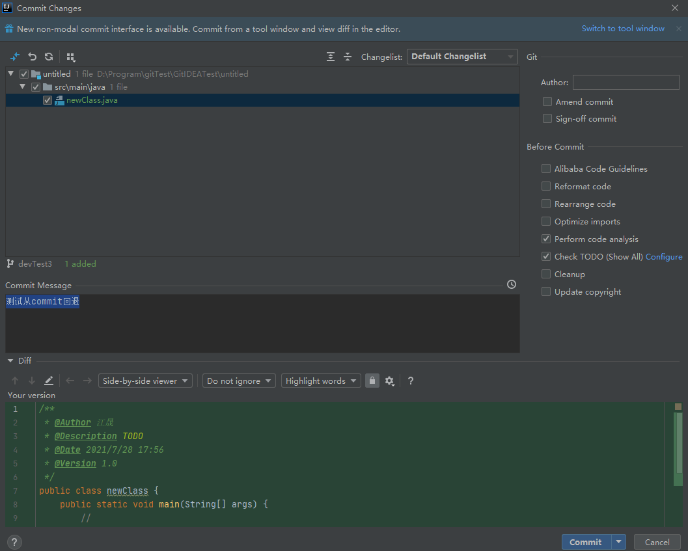

## 1.第一步拉分支下来 。

## 2.代码进行修改之后进行add

idea这边默认add

## 3.commit

然后进行提交：

## 4.从commit回退

然后 重要的是，reload 然后删除对应的文件

对应的红色文件要删除，怎么删除快呢？

点击commit

选中

然后OK了 已经从commit回退了。

然后 如果是修改的话，不是新增文件的话，记得选择rollback

## 5.push，没啥好说的就是

push 就行了

## 6.如何从push的版本回退

然后 强制提交

