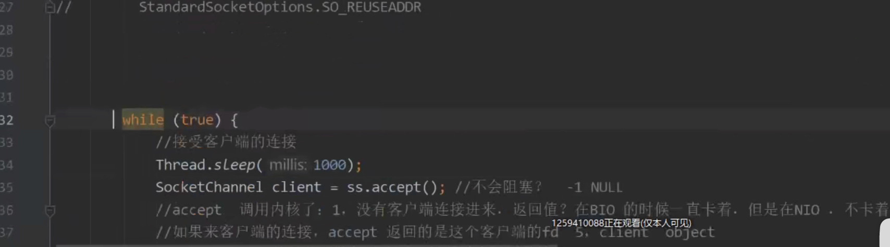

https://blog.csdn.net/XueyinGuo/article/details/113096163

# BIO

## BIO 阻塞IO

程序调用内核，卡住不动了。（等）

BIO的阻塞有两个地方：accept()和read()，并且BIO的并发只能通过多线程。

### 1.第一个阻塞点，建立连接监听客户端

内核里面给你

一直在这边卡着

### 2.有一个新的连接之后

又阻塞了，因为当完成了一个连接之后，要去创建线程，这个是异步的，所以一个连接之后，可以去监听别的连接了。

### 3.java new 一个线程的时候 就会触发内核的调用

堆栈 pc 独立，堆都是共享的
在新的线程之后，它会要去读取新的东西，会阻塞。
5 就是这个客户端 （3 是我们的服务器）

只有客户端发送了数据之后，才会继续下去

然后继续阻塞住。

外部的c会先和内核操作，通过listen的receivequeue来计数，等待上面来认领。 所以程序和内核，内核和内核会有交互。可以把内核想象成一个缓冲带。

https://www.bilibili.com/video/BV1H341127qB?p=22 
去这边去看

BIO模式的缺点：

每次连接，占用一个线程。CPU单位之间内每个线程轮一下。除了要跑进程的逻辑，还有一些其它的内核操作，当开的线程比较多多时候会比较浪费CPU资源。

核心缺点：blocking
   调用内核会accept 和 recive 发生阻塞，那必然要开很多线程去保持连接，那这就比较浪费资源。
那解决方案就得从内核的阻塞去做这个事情。就用内核的高级版本。然后就出现了NIO。内核提供了non blocking 不给你阻塞 掉了就返回

1.线程太多，资源创建线程的clone
2.核心问题：阻塞

# NIO

那解决方案就得从内核的阻塞去做这个事情。就用内核的高级版本。然后就出现了NIO。内核提供了non blocking 不给你阻塞 掉了就返回。
如果没有客户端，就是null；如果是有客户端的，返回一个客户端。客户端也设置为**非阻塞**的（accept不阻塞），然后还整了个**链表**去记录这些客户端的port。然后再写一个循环，遍历所有的客户端，把每个客户端尝试去读取一下。要么是对方发了，要么是没有发，读取也**不会阻塞**（receive不阻塞）。  这样就不会去创建很多线程了。

去查看内核调用：

这个4就是server，绑定9090 然后继续监听4。然后设置了一个非阻塞。

然后内核会立刻返回-1 表示没有链接，中间是不会阻塞的。

如果是得到了客户端，就会返回客户端。

### 优点：

这个时候，CPU的线程切换的那部分消耗就减少了。

### 弊端：

假设有1w个client链接，每次while循环，会有个n次（1W）的for循环，每次不一定都有数据去接收。而且receive那个操作是个系统调用，我们系统调用的成本是On，有效的调用可能只有m 比如 1，就会有9999次调用浪费了。（系统调用：int0x80 软中断 会有缓冲区的保存，堆栈从用户堆栈到了内核堆栈，方法的执行）

举个例子： 告诉收费站

BIO就是每个人（线程）去盯每一条路
NIO就是一个人去每一条路，循环去遍历

# 如何解决这个弊端？——多路复用器

给操作系统打个电话（select，poll，epoll），你把12345看一眼，哪里有数据，我去哪里找。那我的receive就去receive对应的路。

  （题外话：

不论是什么IO，最终都需要程序自己和内核读取数据。这些都是同步IO模型。就是程序自己去把数据搬过来（receive）。

那什么是异步的呢？AIO
程序不直接对内核进行操作，中间有个介质buffer，通过buffer和内核交互。只有windows的iocp是异步的。linux全部是同步IO。）

用一个打电话，电话去询问对应的状态，没有搬对应数据。这个电话机就是**多路复用器**。多路复用器把对应的状态返回回来之后，然后程序去读对应的有数据的地方。

优点：
1.减少了系统内核调用的次数

弊端：
1.每次都要传递大量的fd数据给内核。每次都要传个1w
2.每次都要重新遍历
fd 文件描述符，可以理解为socket

### Epoll

再加了电话之外，加个记事本，

参数就不需要重复传递了，直接通过wait 
去通过访问小本本。没次来个链接，小本本来个add增加个记录。 每次调用一次wait（），然后通过小本本去获取状态，然后程序自己去那数据。

对应函数 

epoll create ：创建这个小本本
epoll ctl：增加 删除 修改记录
epoll wait：每次循环，盯着小本本 epfd，给出一个空的指针，把事件丢进这个指针

