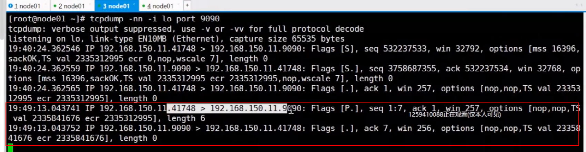

# 实验：

## 1.开启监听 等待别人链接

## 2.查看网络状态

## 3.查看对应的网络状态

目标地址是那个9090 且 来自任何的ip地址和任何的端口号，规则匹配上了，就把这个程序给nc管理。
里面还有接收和发送队列。

## 4.服务端启动后，那就要有客户端的链接，一旦有链接了才会有3次握手

这边开始tcp抓包 开始抓包的监听： 专门监听0号网卡的9090端口

但是因为是监听物理网卡，所以一台机子上是监听不到的。
看一下：

所以，我们是同一台机器，应该走这个环路
所以抓包的具体命令应该是：

## 5.正式开始连接

6.抓到了三次握手的包

## 7.查看网络的状态

分别是监听 服务端 客户端

完成了三次握手之后，有了连接之后，才会有了对应的数据交互。

然后在每个socket上都有各自的两个队列

数据把内核给sentq，然后内核给别人内核的recvq，内核把数据给对方的程序

## 8.测试数据发送

客户端 hello 一回车

tcp抓包

客户端41748给了9090，服务端要有数据包确认。

我服务端也可以发送数据给客户端：

抓包可以看到网络状态换了个方向

## 9.TCP总结

三次握手其实本质上是开辟了对应的资源。
计算机双端通信中，每一个socket都是一**四元组**：**自己地址 自己端口号 别人的地址 别人的端口号**。缺一不可
且每个socket都得**要有自己的队列**。

如果程序读取网络中的数据，其实是在读取本机的recvQueue。程序如果忙了，那信息就先放在recvQ里面。如果程序去读这个**队列为空**，要么就等待队列来数据（阻塞），要么就是循环轮询这个队列（非阻塞）。

内核和内核的交互，是TCP协议维护的，是内核级别的，顺序，完整，可靠。

## 10.内核和程序的交互

11.

举例子：

redis 是单线程还是多线程的。worker都是单线程的。
曾经的单核IO

Redis6之后 有了IOThread，数据搬运的过程充分利用了多核CPU，是并行搬运数据。之前是串行的。

这个IOThreads和IO多路复用器不是一个东西。

11.TCP的长短链接
