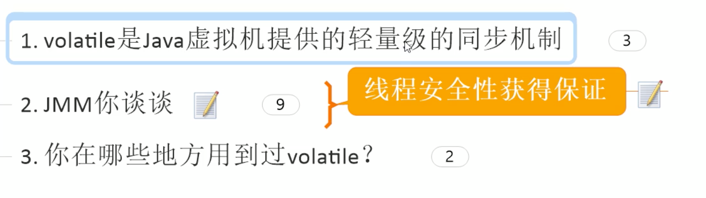

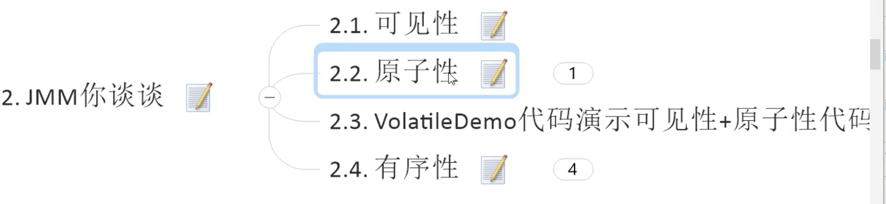

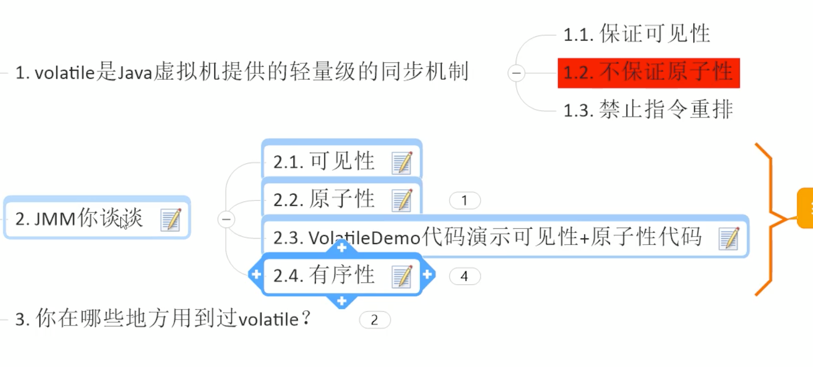

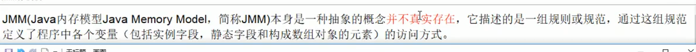

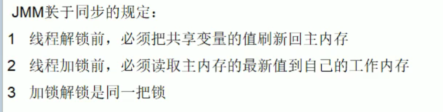

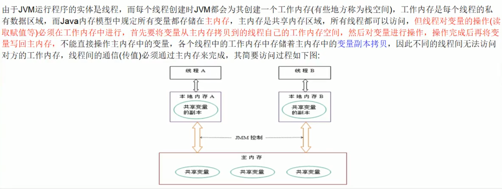

所有的变量都存在主内存中。
每个线程，都是去主内存那边进行拷贝一份，到自己的内存中。
然后，在自己的内存空间改掉之后，还要写回主内存。
这个时候，其他线程并不知道这个值被改了。这个时候，需要有个通知机制，这个就是jmm的通知机制，MESI缓存一致性协议。

本地内存 存着主内存的副本。

不同线程 不能访问对方的 变量。 线程之间的通信必须通过主内存完成。

JMM的可见性（通知机制）

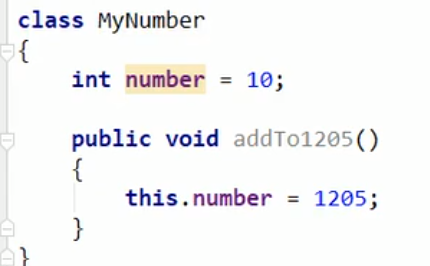

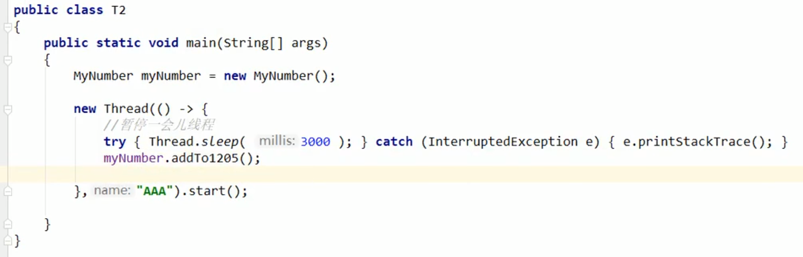

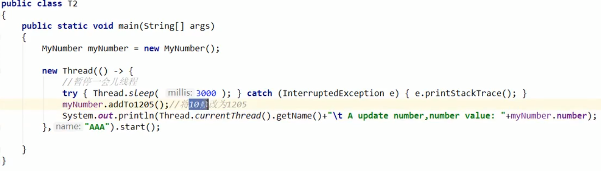

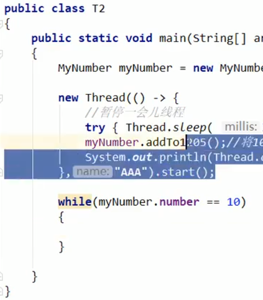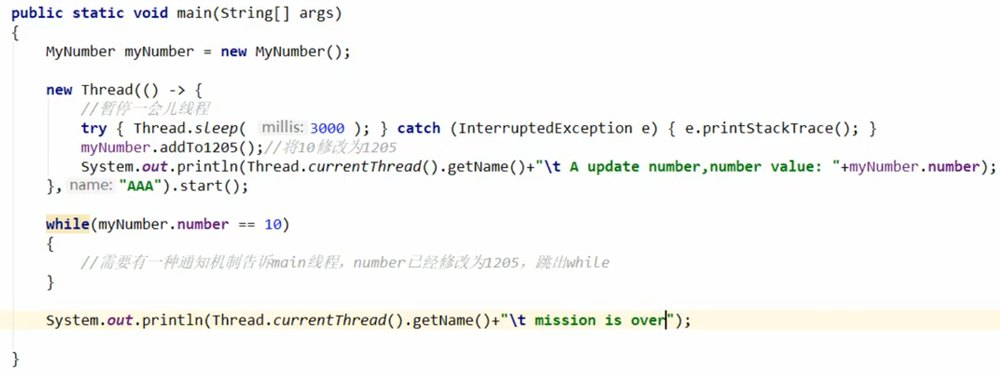

有个人应该告诉 main  我这边

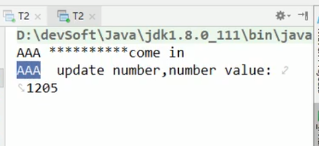

A线程修改了，写回了主内存，但是main线程不知道

所有加载  现有模版 静态先行 静态值加载一次

静态 >构造块>构造方法

## 有序性

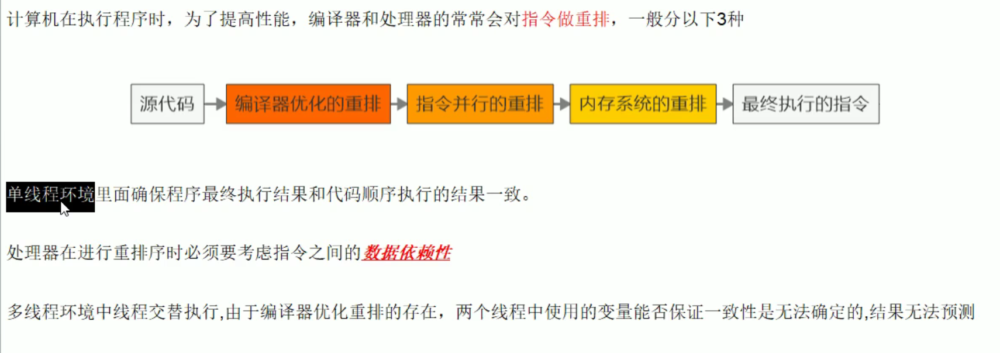

数据依赖性，先得有爹才能有我

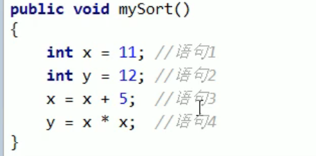

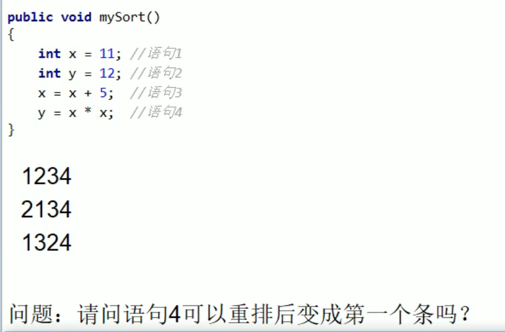

不可以

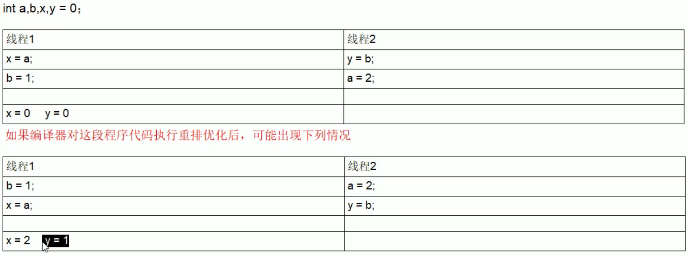

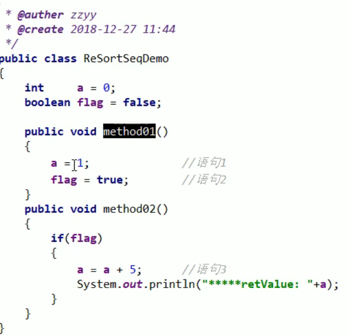

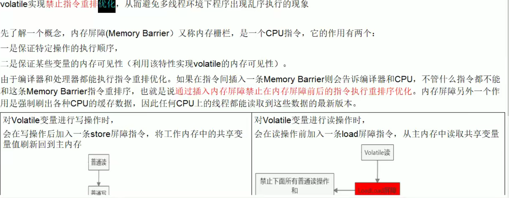

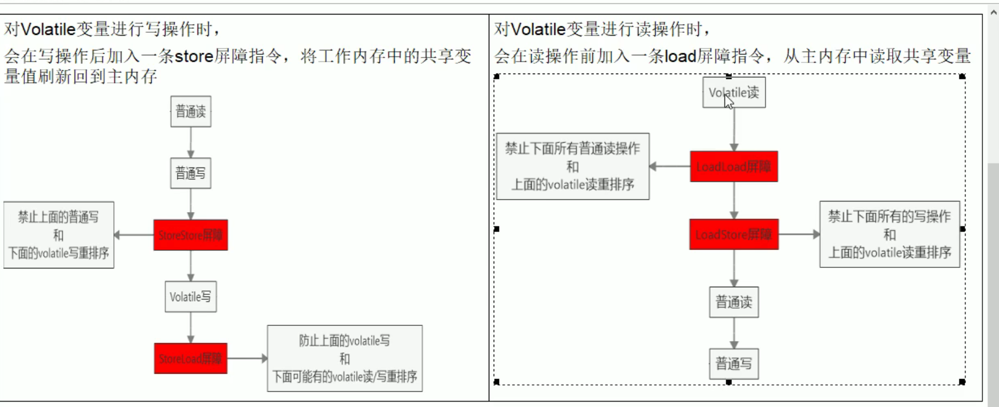

