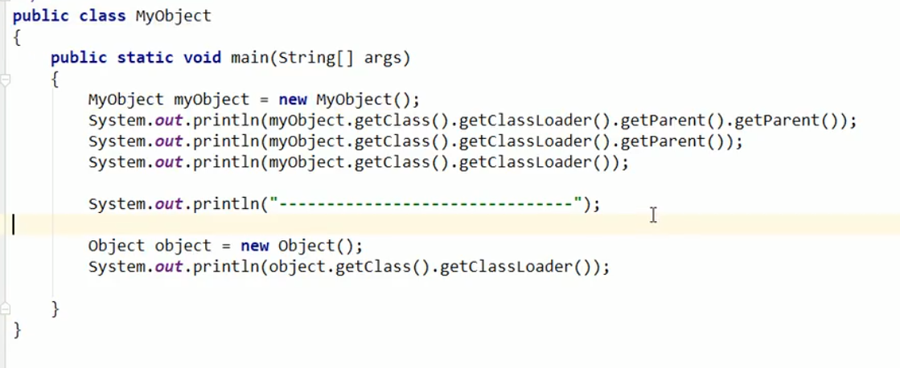
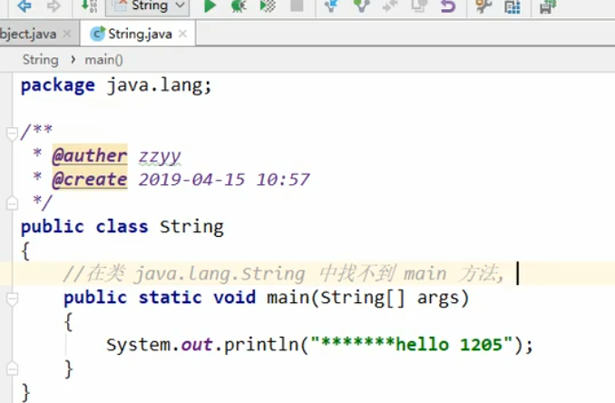
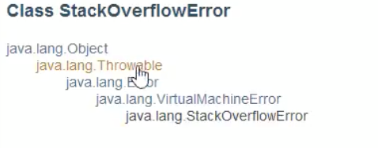
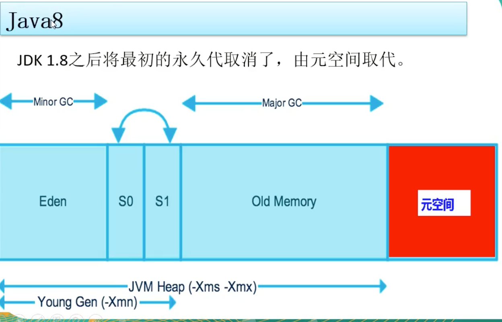
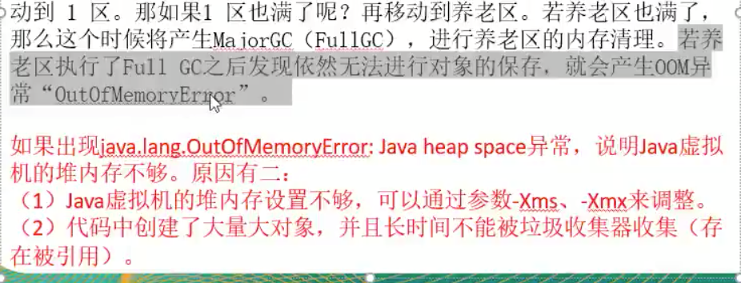

# JVM是什么？

方法区：是放类的描述信息 

ClassLoader有多种，经过它之后，小class变成了大Class，然后加载到了方法区。 它就是个快递员（快递员有多种，Loader有多种）

三瓶水能一样 三个car一样，来自同一个模版 但是不同的地址。

文件开头有特定的文件标识。 cafe babe

# 1.类加载器 3+1 

Bootstrap加载的是啥？

启动类加载器，

扩展类加载器加载的是什么？

object.class 反射 得到这个实例的模版

object.class.getClassLoader（） 去找到这个快递员 其实是BootStrap  返回的是null 因为是c++写 的

JDK自带的 走的是BootStrap（1.0）  java的扩展包是Extension （慢慢的把java内容扩展 用 Extension  比如是javax表）      我们自己定义的 是AppClassLoader  

扩展类加载器

慢慢的把java内容扩展 用 Extension  比如是javax表

用户自己定义的类加载器。 我定制化类的加载器。

## 类加载器的双亲委派机制

我爸是李刚 有事找我爹。

java说，你要用任何一个类都行 但是要用A。Class一个类 ，你得从头开始 一层一层找 找的到 你用 找不到 最后是classnotfound exception

java.lang.String 这个类一个个网上找 到了 Bootstrap 找到了  那先使用 先用了RT。jar里面的那个类

那个类里面没有main方法。

为了保证 我的源代码 不污染java的源代码 ：这就是沙箱机制 先找到 先使用

# 2.本地方法栈 本地方法接口 本地方法库

我们嘴巴上说的栈是哪一个？ 是java栈

多线程的时候 最底层是start0

java多线程不能start2次

会把多线程异常的

start0 是什么

 

只有方法的声明 没有实现

进程 线程级的东西 都是在操作系统的   见到native 需要别的系统的语言 来操作 借助第三方 

只要是native 方法 调用的都是 native 接口 放在的是 native method stack

方法的实现交给了底层的函数库

为什么有了native ，必须要留一块接口给c++妥协，

工作中这辈子可能用不到native

# 3.PC寄存器

pc寄存器就是一个指针 。是下一个要运行方法的地址

## 存储下一条指令的**地址**。灰色代表线程私有，内存占的比较少 几乎没有垃圾回收（基本就是几十k）

这边不会发生溢出。

pc就是能保证程序能回到原来执行的位置。存放的是下一条要执行指令的地址。

# 4.方法区

方法区 亮色 ：所有线程共享 。只要是亮色 说明这块存在垃圾回收 。其实方法区的垃圾回收不算多。

## 1.方法区存了类的结构信息。就是模版

Class 这个大class 就是方法区。比如就是 一辆车 里面 有各种方向盘 各种功能。或者是一瓶农夫山泉  都是来自同一个模版 。

## 2.方法区是规范，在不同虚拟机里面实现是不一样的，最典型的就是永久代和元空间

假设 规范是定义的一种抽象的概念

空调 k1 =格力空调 ()

List list=new ArrayList()

天上飞的理念 必然有落地的实现。汉堡 kfc m 德克士

Java7 f=new 永久代

​          f=new 元空间

## 3.实例变量存在堆空间中（是每个人独有的）

# 5.java栈（不存在垃圾回收）

## 5.1栈管运行 堆管存储

程序=算法+数据结构    程序=框架+业务逻辑

## 5.2堆栈存储哪些东西？

8种基本类型 对象引用变量 实例方法

**JAVA的方法：栈帧** 

main方法永远压在栈底

本地变量：就是那些形参 还有一些临时变量

栈操作：类似pc寄存器

栈帧数据：就是我们一个个方法

## 5.3栈帧里面存者哪些东西？

## 5.4递归调用

StackOverFlow

这个是错误 不是异常

Throwable 里面有Error 和Exception

## 5.5 栈 堆 方法区之间的关系

我怎么保证这两个不同的实例对象 拥有同一套模版呢？  java堆种存放访问类元数据的**地址**

这个模版在方法区

# 6.堆

## 6.1.堆里面有什么

堆空间物理上2个 ：新生和养老两个

堆空间逻辑上分为3个：新生  养老 元空间（java8）

## 6.2 顺序

### Eden：

不停的new 到了伊甸园区 的7成

触发GC=YGC（新生区的young区进行的GC）=轻量级GC

Eden基本全部清空（100-98）

活的2个变为幸存者0区

### （幸存者0区）S0=from 

第二波，又来了了100个   杀 剩下一个

现在有 2+1 个线程。3个老兵

产生了交换？？？？

## 如何从新生区变养老区？

一次次满了之后 活过了15次 没有宰了 说明是长期要使用的对象 会最后变成养老区

继续继续。长期 while（true） 死循环 都满了。最后养老区都满了

## Old满了 ：

Full GC=FGC=重量级GC

Full GC 多次发现养老区空间没办法腾出来

## JVM：OOM 堆内存溢出

## 6.3java传值机制

这个 age 是main的 基本类型传复印件

String 放在字符串常量池 在元空间

## 6.4heap->对象的生命周期->oom

幸存者0区 s0 from区

幸存者1区 s1 to区

### from区和to区的位置和名分不是固定的，每次GC后回交换。

【GC之后有交换 谁空谁是to。

具体的一个GC的流程：

只要产生了轻量级GC    复制  清空 互换

第一次 eden区的杀  要把活下来的 复制到 from区 年龄+1

又来了100个士兵  101个士兵。杀 101里面（对两个区域进行垃圾回收）  本来活的还是会活 这边剩下的100里面的一个 这两个要去那个空的to区

第二次 GC之后有交换 谁空谁是to  谁有对象 谁是from

第三次 GC …… 有个活过了两次的也死了  但没死的 年龄就+1。  把活的拷贝到空的地方。 from和eden清空 然后  这边 from 和 to 交换了

最后15次了 还活着 就到了老年代

## 永久代 元空间：

方法区 ：非堆内存   元空间 永久代 
是逻辑分区，但是物理上是不一样的。永久代 是方法区的一个实现。1.7的版本中，已经将原本放在永久代的字符串常量池移走。

永久代几乎没有垃圾回收，加载的是一切跟本的类元素 rt.jar包。Class Interface 的元素。不会被收。

# 7.堆参数调优入门

1.堆 逻辑上三块 物理上不算永久代 堆内存 参数 （-Xms。-Xmx） 初始化大小。max

（—xmn）基本不调整。

1.如何证明？

2.OOM怎么做的？

3.JVM堆内存 能到多少（物理内存16g） 四分之一

### Java8元空间不在虚拟机中，而是使用本机的**物理内存**   元空间大小仅受物理大小的影响。

为什么？因为

OOM总共有八种

问题：

1.如何查看CPU的核数？

Runtime.getRuntime.availableProcessors()

将这个 runtime区域 抽象化成了一个对象

不调整的时候，

一个最大总量（最大大小）    一个虚拟机内存总量（默认初始大小）

# idea怎么调参？

实际生产：初始化 和最大值 必须一样！ 避免内存忽高忽低产生停顿。

## 8.1老师讲解的堆内存结构是否正确？

##  8.2 OOM

new 1个G的对象

young区全杀光了 GC

养老区 fullGC 

JVM的意思 就是我死了 你不用收了 

# 9.垃圾回收算法

请你讲讲你对JVM的理解：

GC是什么

GC算法的总体概述：

GC不是三块区域一起杀

为什么 Full GC 比GC 慢 ？

之所以 Full GC 比你慢 因为养老区比新生区要大一倍 一个 1/3。一个2/3

## 9.1. GC四大算法（  总结：垃圾回收。分代收集算法）

### 9.1.1引用计数法（基本不会去用）

没有引用，就回收。

缺点：循环引用的问题 死锁。然后计数 也需要消耗资源

这个system.gc() 是手动调用GC 。平时我们是自动唤起GC

一个普通的main有几个线程？2个 main。gc （GC 开始的时候就就绪了）

system.gc()  就是手动开启  不是立刻执行

正常情况下 不要用system.GC 了。千万不要用

### 9.1.2 复制算法（用在存活率低的年轻代）

把 伊甸园区 和 from 区 拷贝到to 区

粗说两块： from =eden+from。   to

### 复制算法 优点：不会产生内存碎片。  缺点：浪费空间

from to 大小得是一样的 。因为得保证放得下。

Eden 和from->to:    gc 复制   清空  交换 

### 9.1.3   标记清除算法（用在老年代）

  

有没有解决空间浪费的问题？

复制算法（内存是膨胀的） 但标记清除算法是不需要膨胀的。

但是，会带来很多碎片。

速度相对慢，然后 会带来很多碎片。

优点：不需要额外的空间。 缺点：两次扫描 耗时严重  ；会产生内存碎片。

### 9.1.4 标记压缩算法（比标记清除多了一步整理碎片的功能）基本用在老年代

### 缺点：慢功出细活 效果最好 但是浪费时间。效率不高

最终 工作中：

### 

java9的G1 垃圾回收

