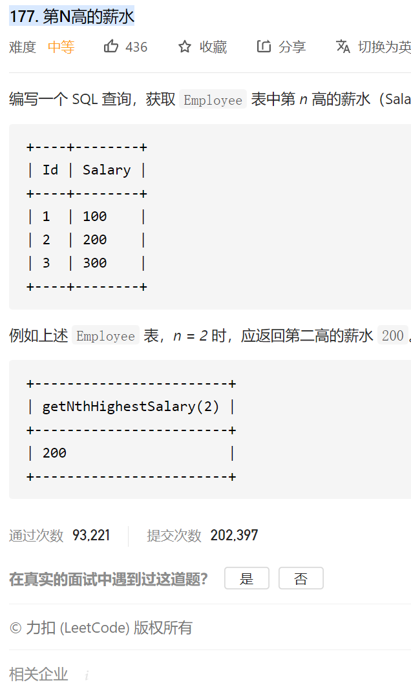

#### [177. 第N高的薪水](https://leetcode-cn.com/problems/nth-highest-salary/)




具体思路和第二高薪水是一样的，然后这边需要的是用sql函数的一个知识。回去查一下就知道了。

自己的代码：

```sql
CREATE FUNCTION getNthHighestSalary(N INT) RETURNS INT
BEGIN
 # Write your MySQL query statement below.
      declare realN INT;#声明临时变量
      set realN = N-1; #设定临时变量的值
  RETURN (
     select ifnull((select distinct Salary from Employee order by Salary desc limit realN,1) ,null)
  );
END
```

