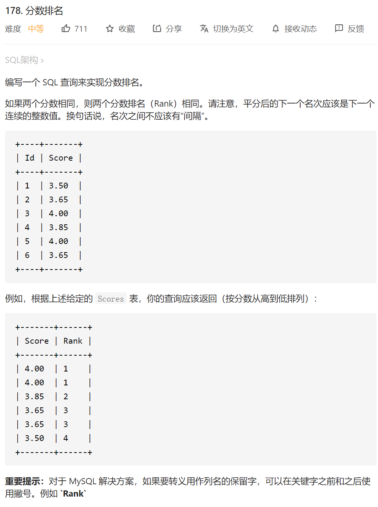
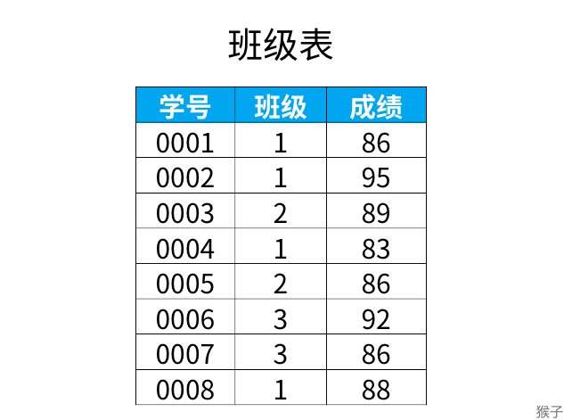
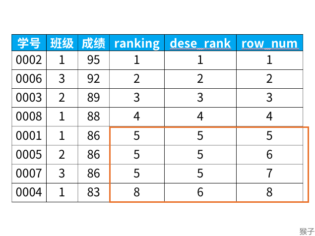
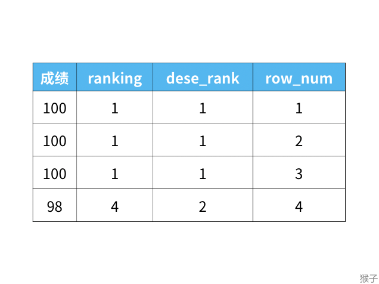

#### [178. 分数排名](https://leetcode-cn.com/problems/rank-scores/)



方法1：类似自连接表

最后的结果包含两个部分，第一部分是降序排列的分数，第二部分是每个分数对应的排名。

第一部分不难写：

```
select a.Score as Score
from Scores a
order by a.Score DESC
```

比较难的是第二部分。假设现在给你一个分数X，如何算出它的排名Rank呢？
我们可以先提取出大于等于X的所有分数集合H，将H去重后的元素个数就是X的排名。比如你考了99分，但最高的就只有99分，那么去重之后集合H里就只有99一个元素，个数为1，因此你的Rank为1。
先提取集合H：

```
select b.Score from Scores b where b.Score >= X;
```

而从结果的角度来看，第二部分的Rank是对应第一部分的分数来的，所以这里的X就是上面的a.Score，把两部分结合在一起为：

```java
select a.Score as Score,
(select count(distinct b.Score) from Scores b where b.Score >= a.Score) as Rank
from Scores a
order by a.Score DESC
```


方法2：窗口函数（经典排名问题）

下图是"班级"表中的内容，记录了每个学生所在班级，和对应的成绩。



现在需要按成绩来排名，如果两个分数相同，那么排名要是并列的。

正常排名是1，2，3，4，但是现在前3名是并列的名次，排名结果是：1，1，1，2。

【解题思路】

1.涉及到排名问题，可以使用窗口函数

2.专用窗口函数rank, dense_rank, row_number有什么区别呢？

它们的区别我举个例子，你们一下就能看懂：

```
select *,
   rank() over (order by 成绩 desc) as ranking,
   dense_rank() over (order by 成绩 desc) as dese_rank,
   row_number() over (order by 成绩 desc) as row_num
from 班级

```

得到结果：



从上面的结果可以看出：
1）rank函数：这个例子中是5位，5位，5位，8位，也就是如果有并列名次的行，会占用下一名次的位置。比如正常排名是1，2，3，4，但是现在前3名是并列的名次，结果是：1，1，1，4。

2）dense_rank函数：这个例子中是5位，5位，5位，6位，也就是如果有并列名次的行，不占用下一名次的位置。比如正常排名是1，2，3，4，但是现在前3名是并列的名次，结果是：1，1，1，2。

3）row_number函数：这个例子中是5位，6位，7位，8位，也就是不考虑并列名次的情况。比如前3名是并列的名次，排名是正常的1，2，3，4。

这三个函数的区别如下：



根据题目要求的排名规则，这里我们使用dense_rank函数。所以，最终的sql语句是：

```
select *,
   dense_rank() over (order by 成绩 desc) as dese_rank
from 班级
```

涉及到排名的问题，都可以使用窗口函数来解决。记住rank, dense_rank, row_number排名的区别。

回到本题，参考答案：

```
select score, 
       dense_rank() over(order by Score desc) as Ranking
from Scores;
```

注意，mysql版本8已至此窗口函数这个功能，虽然在leetcode上运行不成功，可能的原因是后台的mysql数据库版本不是最新的。